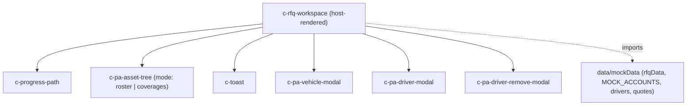

# 2026 Personal Auto Renewal — Flow Package

A self-contained, copy-paste bundle of the **Personal Auto Guided RFQ** screen (`c-rfq-workspace`) and everything it needs, so it can be dropped into another LWC version of the app to replace this screen.

This bundle is **scoped to the wizard only** — it does NOT include the surrounding app chrome (top nav, Slack drawer, intake modal, Agentforce pill). The host app is responsible for routing to the workspace and handling its events.

---

## 1. Overview

The screen is a 3-step guided wizard for renewing a Personal Auto policy:

1. **Add & Assign Assets** — schedule of vehicles + drivers (roster). Add vehicles (modal), Upload CSV (mock bulk import), assign existing drivers / create new drivers inline, delete assets.
2. **Policy Coverages** — a 3-level nested coverage tree: Policy + mandatory Personal Umbrella → per-vehicle coverages (comp/coll/rental) → per-driver coverages (AD&D, Medical Payments, Crisis Response).
3. **Market Routing (Review & Submit)** — an Agentforce summary recap, a natural-language routing-strategy input, the target carrier set, and Submit to Markets.

A vertical progress tracker (`c-progress-path`) on the left reflects step state, and a workspace-scoped toast (`c-toast`) surfaces inline confirmations.

### Dependency graph



The Review step's "Agentforce Summary" and carrier pills are inline markup in `c-rfq-workspace` (not separate components).

### Component inventory

| `c-` tag | Module folder | Role |
| --- | --- | --- |
| `c-rfq-workspace` | `c/rfqWorkspace` | Wizard host: step state, all handlers, the 3 step sections + submitted view |
| `c-progress-path` | `c/progressPath` | Left vertical step tracker (clickable completed steps) |
| `c-pa-asset-tree` | `c/paAssetTree` | Dual-mode tree: `roster` (Step 1) and `coverages` (Step 2) |
| `c-pa-vehicle-modal` | `c/paVehicleModal` | "Add Vehicle" SLDS create dialog |
| `c-pa-driver-modal` | `c/paDriverModal` | "Add New Driver to Household" SLDS create dialog |
| `c-pa-driver-remove-modal` | `c/paDriverRemoveModal` | Context-aware unassign/delete confirm dialog |
| `c-toast` | `c/toast` | Transient top-right notification |

---

## 2. Parent contract

The host renders the workspace and supplies a `context` object + handles three events.

### Input — `@api context`

`c-rfq-workspace` reads these keys off `context` (all optional; sensible fallbacks come from `rfqData`):

| Key | Type | Effect |
| --- | --- | --- |
| `applicationName` | string | Title shown in the header |
| `accountId` | string | Resolves the account from `MOCK_ACCOUNTS` |
| `accountName` | string | Account label in header / summary |
| `priorPolicyValue` | string | `'none'` ⇒ manual-entry mode (blank roster); otherwise pre-loads from `rfqData.lineItems` + `drivers` |
| `renewalMode` | string | `'straight_through'` ⇒ skip the wizard, mark all steps complete, fire `risksubmitted`, land on the submitted view |
| `launchedFromAccount` | boolean | Controls the return route on Save Draft / Return |
| `tabLabel` | string | Breadcrumb leaf label |

### Output — events (all `bubbles: true, composed: true`)

| Event | `detail` | When |
| --- | --- | --- |
| `navigate` | `{ route }` | Save Draft & Close / Return to dashboard. `route` is `'account-record-page'` or `'run-my-day'` |
| `policybound` | (passthrough) | Not emitted by the wizard itself; reserved for the bind flow if you wire one |
| `risksubmitted` | `{ accountName, applicationName, routingStrategy?, message, assetPayload? }` | Submit to Markets (and straight-through). `assetPayload` is the full Policy → Vehicle → Driver coverage tree |

---

## 3. Install manifest

1. **Recreate the LWC modules.** Under your `src/modules/` (or namespace) root, create one folder per component using the Module folder names from the inventory table, each with its `.html`, `.js`, and (where present) `.css` from Section 4.

   ```text
   src/modules/
     c/
       rfqWorkspace/        rfqWorkspace.{html,js,css}
       progressPath/        progressPath.{html,js,css}
       paAssetTree/         paAssetTree.{html,js,css}
       paVehicleModal/      paVehicleModal.{html,js,css}
       paDriverModal/       paDriverModal.{html,js,css}
       paDriverRemoveModal/ paDriverRemoveModal.{html,js,css}
       toast/               toast.{html,js,css}
     data/
       mockData/            mockData.js   (must export rfqData, MOCK_ACCOUNTS, drivers, quotes)
   ```

2. **Data module.** `c-rfq-workspace` imports `{ rfqData, MOCK_ACCOUNTS, drivers, quotes } from 'data/mockData'`. Provide a `data/mockData` module exporting at least those four (Section 5). If your target uses a different alias, update the import at the top of `rfqWorkspace.js`.

3. **SLDS stylesheet.** The components use SLDS class names and `--slds-g-*` global styling hooks. Load the SLDS 2 stylesheet once at the app shell (already present in this app's `index.html`):

   ```html
   <link
     rel="stylesheet"
     href="https://cdnjs.cloudflare.com/ajax/libs/design-system/2.21.1/styles/salesforce-lightning-design-system.min.css"
   />
   ```

4. **Design tokens.** The CSS also references `--cumulus-*` custom properties + the `Inter` font. Include the `tokens.css` / `overrides.css` from Section 6 as a global stylesheet (and the Inter `@import`/`<link>` if you want the exact type).

5. **Mount it.** Render `<c-rfq-workspace>` from your route/host and handle its events — see the wiring example in Section 7.

---

## 4. Component Source (verbatim)

### c-rfq-workspace — `c/rfqWorkspace`

#### rfqWorkspace.html

```html
<template>
  <div class="page">
    <header class="head">
      <div>
        <h1 class="title">{appName}</h1>
        <p class="meta">
          {accountName} · Effective {effectiveLabel} · Response by {deadlineLabel}
        </p>
      </div>
    </header>

    <div class="layout">
      <c-progress-path
        active-step={activeStep}
        onstepselect={handleStepSelect}
      ></c-progress-path>

      <main class="workspace">
        <!-- ── GUIDED RFQ WIZARD (intake captured upstream in the modal) ── -->
        <template lwc:if={isWizard}>
          <!-- ── STEP 1: Schedule of Vehicles (asset tree + global actions) ── -->
          <section class={vehiclesSectionClass} data-step="vehicles">
            <div class="card-surface">
              <header class="block-head">
                <div>
                  <h2>
                    <span class="step-mark">1</span>
                    Add &amp; Assign Assets
                  </h2>
                  <p>{vehiclesIntro}</p>
                </div>
                <span class="status-pill ready">{participantsStatusLabel}</span>
              </header>

              <!-- Global action header: aligns with standard Salesforce
                   list-view headers — title left, button group right. -->
              <div class="asset-tree-head slds-grid slds-grid_align-spread slds-p-bottom_medium">
                <div class="asset-tree-head__title">
                  <h3>Schedule of Vehicles ({vehiclesCount})</h3>
                  <p>Add assets one at a time or upload a CSV to bulk-import the schedule.</p>
                </div>
                <div class="slds-button-group asset-tree-head__actions" role="group">
                  <button
                    class="slds-button slds-button_neutral asset-tree-head__button"
                    type="button"
                    onclick={handleUploadCsvClick}
                    disabled={isCsvProcessing}
                  >
                    <svg
                      class="slds-button__icon slds-button__icon_left"
                      viewBox="0 0 52 52"
                      aria-hidden="true"
                      focusable="false"
                    >
                      <path d="M27.6 39.6h-5.2c-2.5 0-4.5 2-4.5 4.5v2.4c0 .8.6 1.5 1.5 1.5h11.2c.9 0 1.5-.7 1.5-1.5v-2.4c0-2.5-2-4.5-4.5-4.5zM43 23h-2c-.8 0-1.5.7-1.5 1.5V42c0 .6-.4 1-1 1H13.5c-.6 0-1-.4-1-1V24.5c0-.8-.7-1.5-1.5-1.5H9c-.8 0-1.5.7-1.5 1.5V46c0 .8.7 1.5 1.5 1.5h34c.8 0 1.5-.7 1.5-1.5V24.5c0-.8-.7-1.5-1.5-1.5zM26.7 4.7l-9.4 9.5c-.6.6-.6 1.5 0 2.1l1.4 1.4c.6.6 1.6.6 2.1 0l4-4c.4-.4 1-.1 1 .4V34c0 .8.7 1.5 1.5 1.5h2c.8 0 1.5-.7 1.5-1.5V14.1c0-.5.6-.8 1-.4l4 4c.6.6 1.6.6 2.1 0l1.4-1.4c.6-.6.6-1.5 0-2.1l-9.5-9.5c-.7-.6-1.6-.6-2.1 0z"/>
                    </svg>
                    Upload CSV
                  </button>
                  <button
                    class="slds-button slds-button_brand asset-tree-head__button"
                    type="button"
                    onclick={handleAddAsset}
                    disabled={isCsvProcessing}
                  >
                    <svg
                      class="slds-button__icon slds-button__icon_left"
                      viewBox="0 0 52 52"
                      aria-hidden="true"
                      focusable="false"
                    >
                      <path d="M48 22H30V4c0-1.1-.9-2-2-2h-4c-1.1 0-2 .9-2 2v18H4c-1.1 0-2 .9-2 2v4c0 1.1.9 2 2 2h18v18c0 1.1.9 2 2 2h4c1.1 0 2-.9 2-2V30h18c1.1 0 2-.9 2-2v-4c0-1.1-.9-2-2-2z"/>
                    </svg>
                    Add Asset
                  </button>
                </div>
              </div>

              <!-- Hidden file input — triggered programmatically by the
                   "Upload CSV" button. Resets after each selection so the
                   same file can be re-uploaded. -->
              <input
                type="file"
                accept=".csv,text/csv"
                class="asset-tree-file-input"
                aria-hidden="true"
                tabindex="-1"
                onchange={handleFileUpload}
              />

              <!-- Tree container — position: relative so the spinner can
                   overlay the tree without blocking the page header or
                   footer continue row. -->
              <div class="asset-tree-wrap">
                <c-pa-asset-tree
                  mode="roster"
                  vehicles={vehicleView}
                  drivers={driverView}
                  assignments={vehicleAssignments}
                  onassigndriver={handleAssignDriver}
                  oncreatedriverrequest={handleCreateDriverRequest}
                  onremovedriverrequest={handleRemoveDriverRequest}
                  onremovevehiclerequest={handleRemoveVehicleRequest}
                ></c-pa-asset-tree>

                <template lwc:if={isCsvProcessing}>
                  <div class="asset-tree-spinner-overlay" role="alert" aria-busy="true">
                    <div class="asset-tree-spinner">
                      <span class="ring"></span>
                      <span class="ring r2"></span>
                      <span class="ring r3"></span>
                    </div>
                    <p class="asset-tree-spinner-text">
                      Importing assets from CSV…
                    </p>
                  </div>
                </template>
              </div>

              <template lwc:if={isOnVehiclesStep}>
                <footer class="continue-row">
                  <span class="hint">{vehiclesHint}</span>
                  <div class="continue-row__actions">
                    <button class="ghost" onclick={handleSaveDraftAndClose} type="button">
                      Save Draft &amp; Close
                    </button>
                    <button
                      class="continue"
                      onclick={confirmVehicles}
                      type="button"
                      disabled={continueVehiclesDisabled}
                    >
                      Continue to Configure Coverages →
                    </button>
                  </div>
                </footer>
              </template>
            </div>
          </section>

          <!-- ── STEP 2: Asset Coverages — Policy → Vehicle → Driver ── -->
          <section class={coveragesSectionClass} data-step="coverages">
            <div class="card-surface">
              <header class="block-head">
                <div>
                  <h2>
                    <span class="step-mark">2</span>
                    Configure Coverages
                  </h2>
                  <p>
                    Policy-wide limits at the top, then per-vehicle and
                    per-driver coverages — the markets see the full
                    Policy → Vehicle → Driver hierarchy.
                  </p>
                </div>
              </header>

              <c-pa-asset-tree
                mode="coverages"
                vehicles={vehicleView}
                drivers={driverView}
                assignments={vehicleAssignments}
                policy-limits={policyLimits}
                vehicle-coverages={vehicleCoverages}
                driver-coverages={driverCoverages}
                onpolicychange={handlePolicyLimitsChange}
                onvehiclecovchange={handleVehicleCoverageChange}
                ondrivercovchange={handleDriverCoverageChange}
                onassigndriver={handleAssignDriver}
                oncreatedriverrequest={handleCreateDriverRequest}
                onremovedriverrequest={handleRemoveDriverRequest}
              ></c-pa-asset-tree>

              <template lwc:if={isOnCoveragesStep}>
                <footer class="continue-row">
                  <span class="hint">Asset hierarchy mapped · ready for review</span>
                  <div class="continue-row__actions">
                    <button class="ghost" onclick={handleSaveDraftAndClose} type="button">
                      Save Draft &amp; Close
                    </button>
                    <button class="continue" onclick={confirmCoverages} type="button">
                      Confirm Coverages →
                    </button>
                  </div>
                </footer>
              </template>
            </div>
          </section>

          <!-- ── STEP 3: Review & Publish ──────────────────────── -->
          <template lwc:if={isOnReviewStep}>
            <section class="block">
              <div class="card-surface review-card">
                <div class="review-head">
                  <h2>
                    <span class="step-mark">3</span>
                    Review &amp; Submit
                  </h2>
                  <span class="status-pill ready">Ready</span>
                </div>

                <div class="af-summary" role="region" aria-label="Agentforce summary">
                  <div class="af-summary__head">
                    <span class="af-summary__pill">
                      <span class="af-summary__spark" aria-hidden="true">
                        <svg viewBox="0 0 13 13"><path fill="currentColor" d="M8.86791 6.77738L7.03536 7.68928C6.48478 7.96366 6.03946 8.40751 5.76418 8.95626L4.84925 10.7827C4.7197 11.0437 4.34456 11.0437 4.21501 10.7827L3.30008 8.95626C3.02479 8.40751 2.57947 7.96366 2.0289 7.68928L0.196345 6.77738C-0.0654483 6.64826 -0.0654483 6.27436 0.196345 6.14524L2.0289 5.23334C2.57947 4.95896 3.02479 4.51512 3.30008 3.96636L4.21501 2.13987C4.34456 1.87894 4.7197 1.87894 4.84925 2.13987L5.76418 3.96636C6.03946 4.51512 6.48478 4.95896 7.03536 5.23334L8.86791 6.14524C9.12971 6.27436 9.12971 6.64826 8.86791 6.77738ZM12.865 10.8392L12.0796 10.4465C11.8421 10.3308 11.6532 10.1372 11.5344 9.90313L11.1404 9.12035C11.0864 9.00737 10.9245 9.00737 10.8678 9.12035L10.4738 9.90313C10.3577 10.1398 10.1634 10.3281 9.92858 10.4465L9.1432 10.8392C9.02985 10.893 9.02985 11.0544 9.1432 11.1109L9.92858 11.5037C10.1661 11.6193 10.355 11.813 10.4738 12.047L10.8678 12.8298C10.9218 12.9428 11.0837 12.9428 11.1404 12.8298L11.5344 12.047C11.6505 11.8103 11.8448 11.622 12.0796 11.5037L12.865 11.1109C12.9783 11.0571 12.9783 10.8957 12.865 10.8392ZM12.865 1.80363L12.0796 1.41089C11.8421 1.29522 11.6532 1.10154 11.5344 0.867516L11.1404 0.0847341C11.0864 -0.0282447 10.9245 -0.0282447 10.8678 0.0847341L10.4738 0.867516C10.3577 1.10423 10.1634 1.29253 9.92858 1.41089L9.1432 1.80363C9.02985 1.85742 9.02985 2.01882 9.1432 2.07531L9.92858 2.46805C10.1661 2.58372 10.355 2.7774 10.4738 3.01142L10.8678 3.7942C10.9218 3.90718 11.0837 3.90718 11.1404 3.7942L11.5344 3.01142C11.6505 2.77471 11.8448 2.58641 12.0796 2.46805L12.865 2.07531C12.9783 2.02151 12.9783 1.86011 12.865 1.80363Z"/></svg>
                      </span>
                      Agentforce Summary
                    </span>
                    <span class="af-summary__badge">AI generated</span>
                  </div>

                  <p class="af-summary__intro">
                    I've assembled the submission package for {accountName}. Here's a
                    quick recap before it goes out to the markets.
                  </p>

                  <ul class="af-summary__list">
                    <li class="af-summary__item">
                      <span class="af-summary__check" aria-hidden="true">
                        <svg viewBox="0 0 24 24"><path fill="currentColor" d="M9 16.17L4.83 12l-1.42 1.41L9 19 21 7l-1.41-1.41z"/></svg>
                      </span>
                      <div class="af-summary__row">
                        <span class="af-summary__key">RFQ Context</span>
                        <span class="af-summary__val">Personal Auto · {accountName}</span>
                      </div>
                    </li>
                    <li class="af-summary__item">
                      <span class="af-summary__check" aria-hidden="true">
                        <svg viewBox="0 0 24 24"><path fill="currentColor" d="M9 16.17L4.83 12l-1.42 1.41L9 19 21 7l-1.41-1.41z"/></svg>
                      </span>
                      <div class="af-summary__row">
                        <span class="af-summary__key">Vehicles &amp; Drivers</span>
                        <span class="af-summary__val">{participantsLabel}</span>
                      </div>
                    </li>
                    <li class="af-summary__item">
                      <span class="af-summary__check" aria-hidden="true">
                        <svg viewBox="0 0 24 24"><path fill="currentColor" d="M9 16.17L4.83 12l-1.42 1.41L9 19 21 7l-1.41-1.41z"/></svg>
                      </span>
                      <div class="af-summary__row">
                        <span class="af-summary__key">Asset Coverages</span>
                        <span class="af-summary__val">{reviewCoverageSummary}</span>
                      </div>
                    </li>
                  </ul>
                </div>

                <div class="routing-block">
                  <div class="routing-head">
                    <span class="routing-af-pill">
                      <span class="spark" aria-hidden="true"><svg class="spark-svg" viewBox="0 0 13 13" aria-hidden="true"><path fill="currentColor" d="M8.86791 6.77738L7.03536 7.68928C6.48478 7.96366 6.03946 8.40751 5.76418 8.95626L4.84925 10.7827C4.7197 11.0437 4.34456 11.0437 4.21501 10.7827L3.30008 8.95626C3.02479 8.40751 2.57947 7.96366 2.0289 7.68928L0.196345 6.77738C-0.0654483 6.64826 -0.0654483 6.27436 0.196345 6.14524L2.0289 5.23334C2.57947 4.95896 3.02479 4.51512 3.30008 3.96636L4.21501 2.13987C4.34456 1.87894 4.7197 1.87894 4.84925 2.13987L5.76418 3.96636C6.03946 4.51512 6.48478 4.95896 7.03536 5.23334L8.86791 6.14524C9.12971 6.27436 9.12971 6.64826 8.86791 6.77738ZM12.865 10.8392L12.0796 10.4465C11.8421 10.3308 11.6532 10.1372 11.5344 9.90313L11.1404 9.12035C11.0864 9.00737 10.9245 9.00737 10.8678 9.12035L10.4738 9.90313C10.3577 10.1398 10.1634 10.3281 9.92858 10.4465L9.1432 10.8392C9.02985 10.893 9.02985 11.0544 9.1432 11.1109L9.92858 11.5037C10.1661 11.6193 10.355 11.813 10.4738 12.047L10.8678 12.8298C10.9218 12.9428 11.0837 12.9428 11.1404 12.8298L11.5344 12.047C11.6505 11.8103 11.8448 11.622 12.0796 11.5037L12.865 11.1109C12.9783 11.0571 12.9783 10.8957 12.865 10.8392ZM12.865 1.80363L12.0796 1.41089C11.8421 1.29522 11.6532 1.10154 11.5344 0.867516L11.1404 0.0847341C11.0864 -0.0282447 10.9245 -0.0282447 10.8678 0.0847341L10.4738 0.867516C10.3577 1.10423 10.1634 1.29253 9.92858 1.41089L9.1432 1.80363C9.02985 1.85742 9.02985 2.01882 9.1432 2.07531L9.92858 2.46805C10.1661 2.58372 10.355 2.7774 10.4738 3.01142L10.8678 3.7942C10.9218 3.90718 11.0837 3.90718 11.1404 3.7942L11.5344 3.01142C11.6505 2.77471 11.8448 2.58641 12.0796 2.46805L12.865 2.07531C12.9783 2.02151 12.9783 1.86011 12.865 1.80363Z"/></svg></span>
                      Agentforce Routing
                    </span>
                    <span class="optional-tag">Optional</span>
                  </div>
                  <label class="routing-label" for="routing">Describe your routing strategy</label>
                  <input
                    id="routing"
                    class="slds-input routing-input"
                    type="text"
                    placeholder='e.g. "Route to Travelers and Safeco — skip Progressive for the young driver"'
                    value={routingStrategy}
                    oninput={updateRoutingStrategy}
                  />
                  <p class="routing-help">
                    Agentforce will use this to prioritize the carriers in your
                    target set. Leave blank to use the default order.
                  </p>
                </div>

                <div class="carrier-logos">
                  <span class="carrier-logos-meta">Markets in target set:</span>
                  <template for:each={reviewCarriers} for:item="c">
                    <span class="carrier-logo" key={c.id} style={c.style}>
                      <span class="carrier-logo-initial">{c.initial}</span>
                      <span class="carrier-logo-name">{c.name}</span>
                    </span>
                  </template>
                </div>

                <footer class="continue-row">
                  <span class="hint">Submission package ready · Agentforce will route to the target market set</span>
                  <div class="continue-row__actions">
                    <button class="ghost" onclick={handleSaveDraftAndClose} type="button">
                      Save Draft &amp; Close
                    </button>
                    <button class="continue" onclick={submitToMarkets} type="button">
                      Submit to Markets →
                    </button>
                  </div>
                </footer>
              </div>
            </section>
          </template>
        </template>

        <!-- ── SUBMITTED (success view after Submit to Markets) ───────── -->
        <template lwc:if={isSubmitted}>
          <section class="submitted-page">
            <div class="submitted-check" aria-hidden="true">
              <svg viewBox="0 0 24 24">
                <path fill="currentColor" d="M9 16.17L4.83 12l-1.42 1.41L9 19 21 7l-1.41-1.41z"/>
              </svg>
            </div>
            <div class="submitted-eyebrow">RFQ PUBLISHED · ASYNC RESPONSE</div>
            <h2 class="submitted-title">RFQ Submitted successfully</h2>
            <p class="submitted-sub">
              You can safely close this window. Agentforce will notify you
              via Slack when quotes are returned.
            </p>
            <div class="submitted-meta">
              <span class="submitted-meta-row">
                <strong>Application</strong> {appName}
              </span>
              <span class="submitted-meta-row">
                <strong>Insured</strong> {accountName}
              </span>
              <span class="submitted-meta-row">
                <strong>Sent to</strong> Travelers · Safeco · Progressive
              </span>
            </div>
            <footer class="submitted-foot">
              <button class="brand solid" type="button" onclick={handleReturnToDashboard}>
                Return to Account →
              </button>
            </footer>
          </section>
        </template>
      </main>
    </div>

    <c-toast
      message={localToastMessage}
      kind={localToastKind}
      visible={localToastVisible}
      ondismiss={handleLocalToastDismiss}
    ></c-toast>

    <c-pa-vehicle-modal
      open={addVehicleModalOpen}
      onsave={handleVehicleModalSave}
      oncancel={handleVehicleModalCancel}
    ></c-pa-vehicle-modal>

    <c-pa-driver-modal
      open={addDriverModalOpen}
      vehicle-name={pendingDriverVehicleName}
      onsave={handleDriverModalSave}
      oncancel={handleDriverModalCancel}
    ></c-pa-driver-modal>

    <c-pa-driver-remove-modal
      open={removeDriverModal.open}
      driver-name={removeDriverModal.driverName}
      vehicle-name={removeDriverModal.vehicleName}
      other-vehicle-names={removeDriverModal.otherVehicleNames}
      onunassign={handleRemoveDriverUnassign}
      ondelete={handleRemoveDriverDelete}
      oncancel={handleRemoveDriverModalCancel}
    ></c-pa-driver-remove-modal>
  </div>
</template>

```

#### rfqWorkspace.js

```javascript
import { LightningElement, api, track } from 'lwc';
import {
  rfqData,
  MOCK_ACCOUNTS,
  drivers,
  quotes
} from 'data/mockData';

function initials(name = '') {
  return name
    .split(/\s+/)
    .map((p) => p[0])
    .slice(0, 2)
    .join('')
    .toUpperCase();
}

function fmtDate(iso) {
  if (!iso) return '—';
  try {
    return new Date(iso).toLocaleDateString('en-US', {
      year: 'numeric',
      month: 'short',
      day: '2-digit'
    });
  } catch (e) {
    return iso;
  }
}

// Intake moved out of the wizard into c-rfq-intake-modal. The wizard now
// runs three steps: Vehicles & Drivers → Asset Coverages → Review & Publish.
// Driver assignment happens inline in the asset tree (roster + coverages
// modes), so it's no longer a standalone step. Coverages is asset-aware
// (Policy → Vehicle → Driver).
const STEP_ORDER = ['vehicles', 'coverages', 'review'];
const VALID_VIEWS = ['wizard', 'submitted'];
const MODE_STRAIGHT = 'straight_through';

function readInitialView() {
  if (typeof window === 'undefined') return 'wizard';
  const param = new URLSearchParams(window.location.search).get('view');
  if (param && VALID_VIEWS.includes(param)) return param;
  return 'wizard';
}

function readInitialCompleted() {
  const base = {
    vehicles: false,
    coverages: false,
    review: false
  };
  if (typeof window === 'undefined') return base;
  const params = new URLSearchParams(window.location.search);
  const step = params.get('step');
  const view = params.get('view');
  if (view === 'submitted') {
    STEP_ORDER.forEach((id) => (base[id] = true));
    return base;
  }
  if (!step) return base;
  const target = STEP_ORDER.indexOf(step);
  if (target <= 0) return base;
  STEP_ORDER.slice(0, target).forEach((id) => (base[id] = true));
  return base;
}

// Mock CSV payload — three vehicles + one driver each. Used by the
// handleFileUpload simulation so a "real" CSV doesn't need to be parsed
// for the demo. Each vehicle/driver gets a deterministic-ish id at
// import time so the asset tree, assignment map, and coverage maps stay
// in sync.
const CSV_MOCK_VEHICLES = [
  {
    name: '2023 Ford F-150 XLT',
    vin: '1FTFW1ET4DFC10312',
    use: 'Commute',
    annualMileage: '10,500 mi/yr',
    driver: {
      name: 'Michael Reyes',
      dl: 'FL-R702-MVK',
      mvrStatus: 'Clean Record',
      incidents: 0
    }
  },
  {
    name: '2022 Chevy Silverado 1500 LT',
    vin: '3GCUKREC0FG280111',
    use: 'Business',
    annualMileage: '18,000 mi/yr',
    driver: {
      name: 'Sarah Patel',
      dl: 'FL-P834-MVK',
      mvrStatus: '1 Incident',
      incidents: 1
    }
  },
  {
    name: '2024 Tesla Model 3 LR',
    vin: '5YJ3E1EA7PF555082',
    use: 'Pleasure',
    annualMileage: '8,000 mi/yr',
    driver: {
      name: 'Aiden Cole',
      dl: 'FL-C501-MVK',
      mvrStatus: 'Clean Record',
      incidents: 0
    }
  }
];

const CSV_PROCESSING_MS = 1500;
const TOAST_DISMISS_MS = 4500;

// Pre-seeded policy limits (top of Asset Coverages — applies to the policy,
// not any single vehicle): BI, PD, UM. Sourced from the prior policy.
function seedPolicyLimits() {
  const liab = rfqData.coverages.find((c) => c.coverageKey === 'pa_liability');
  return {
    biLimit: liab?.attributes?.biLimit || '$250,000 / $500,000',
    pdLimit: liab?.attributes?.pdLimit || '$100,000',
    umLimit: '$100,000 / $300,000',
    // Personal Umbrella Liability — mandatory at the policy level.
    umbrellaLimit: '$1,000,000',
    umUmbrella: false
  };
}

// Physical-damage deductible defaults — inherited by every vehicle (prior
// policy when shopping, or as starting values for a manually-added vehicle).
const PHYS_COV = rfqData.coverages.find((c) => c.coverageKey === 'pa_physical');
const DEFAULT_COMP_DED = PHYS_COV?.attributes?.compDed || '$500';
const DEFAULT_COLL_DED = PHYS_COV?.attributes?.collDed || '$1,000';
// Rental reimbursement is vehicle-level (tied to the car). Declined by
// default so the broker opts in per vehicle.
const DEFAULT_RENTAL = 'Decline';

// Normalize a raw mockData line item into the read-only vehicle row view.
function mapVehicleRow(li) {
  return {
    id: li.id,
    name: li.name,
    vin: li.attributes?.vin || '',
    use: li.attributes?.use || '',
    annualMileage: li.attributes?.annualMileage
      ? `${li.attributes.annualMileage.toLocaleString()} mi/yr`
      : '',
    garaging: li.attributes?.garaging || ''
  };
}

// Normalize a raw driver into the row view (initials + MVR chip class).
function mapDriverRow(d) {
  return {
    ...d,
    initials: initials(d.name),
    chipClass: d.incidents === 0 ? 'mvr-chip clean' : 'mvr-chip flagged'
  };
}

// Pre-seeded per-vehicle coverages — every vehicle inherits the physical-
// damage deductibles, but each can diverge in Step 3.
function seedVehicleCoverages(vehicleRows) {
  const out = {};
  vehicleRows.forEach((veh) => {
    out[veh.id] = {
      compDed: DEFAULT_COMP_DED,
      collDed: DEFAULT_COLL_DED,
      rentalReimb: DEFAULT_RENTAL
    };
  });
  return out;
}

// Driver→vehicle map, taken from each driver's existing `assignedVehicleId`.
// Editable in Step 2. Manually-added drivers start unassigned.
function seedVehicleAssignments(vehicleRows, driverRows) {
  const out = {};
  vehicleRows.forEach((veh) => {
    out[veh.id] = [];
  });
  driverRows.forEach((d) => {
    if (!d.assignedVehicleId) return;
    if (!out[d.assignedVehicleId]) out[d.assignedVehicleId] = [];
    out[d.assignedVehicleId].push(d.id);
  });
  return out;
}

// Per-(vehicle, driver) coverage defaults — one entry per assigned pair.
function seedDriverCoverages(assignments) {
  const out = {};
  Object.entries(assignments).forEach(([vehId, driverIds]) => {
    out[vehId] = {};
    driverIds.forEach((dId) => {
      out[vehId][dId] = {
        addBenefit: false,
        medPay: '$5,000',
        crisisResponse: false
      };
    });
  });
  return out;
}

// Initial active-tab map — the "Vehicle Coverage" tab is active for every
// vehicle by default; switches to a driver tab when the user clicks one.
function seedActiveTabs(vehicleRows) {
  const out = {};
  vehicleRows.forEach((veh) => {
    out[veh.id] = 'vehicle';
  });
  return out;
}

export default class RfqWorkspace extends LightningElement {
  @api context;

  @track view = readInitialView();
  @track completed = readInitialCompleted();

  // ── Vehicles & Drivers — editable roster (Step 1) ───────────────
  // Seeded in connectedCallback: from the prior policy when shopping, or
  // empty for "None / Manual Entry" so the user builds the roster by hand.
  @track vehicleRows = [];
  @track driverRows = [];

  // ── Asset-level coverage state ──────────────────────────────────
  // Top-of-page (policy) limits applied across every vehicle.
  @track policyLimits = seedPolicyLimits();
  // Driver-→-vehicle assignments captured in Step 2 (seeded below).
  @track vehicleAssignments = {};
  // Per-vehicle deductibles set under each vehicle's "Vehicle Coverage" tab.
  @track vehicleCoverages = {};
  // Per-(vehicle, driver) coverage flags set under driver tabs.
  @track driverCoverages = {};
  // Retained for CSV-ingest parity; coverage editing now lives in the
  // c-pa-asset-tree expand/collapse tree rather than scoped tabs.
  @track activeTabByVehicle = {};

  // Review & Publish — natural-language routing strategy.
  @track routingStrategy = '';

  // ── Schedule of Vehicles — Add Asset / Upload CSV state ──────────
  // isCsvProcessing drives the spinner overlay over c-pa-asset-tree
  // while the mock digestion timer is running. The local toast is
  // owned by the workspace (scoped to the wizard), so the global
  // app-level toast keeps its lifecycle for risk/policy events.
  @track isCsvProcessing = false;
  @track localToastVisible = false;
  @track localToastMessage = '';
  @track localToastKind = 'success';

  // ── Add Vehicle / Create Driver / Remove Driver modals ───────────
  @track addVehicleModalOpen = false;
  @track addDriverModalOpen = false;
  @track removeDriverModal = {
    open: false,
    vehicleId: null,
    driverId: null,
    driverName: '',
    vehicleName: '',
    otherVehicleNames: []
  };
  // Remembers which vehicle a freshly-created driver auto-assigns to.
  _pendingDriverVehicleId = null;

  _csvTimer = null;
  _toastTimer = null;

  applicationId = rfqData.id;

  connectedCallback() {
    // Seed the roster. "None / Manual Entry" starts blank so the broker
    // adds vehicles + drivers via the buttons; otherwise pre-load from the
    // prior (Travelers) policy. Assignment/coverage maps derive from rows.
    const manual = this.isManualEntry;
    const vehicleRows = manual ? [] : rfqData.lineItems.map(mapVehicleRow);
    const driverRows = manual ? [] : drivers.map(mapDriverRow);
    this.vehicleRows = vehicleRows;
    this.driverRows = driverRows;
    const assignments = seedVehicleAssignments(vehicleRows, driverRows);
    this.vehicleAssignments = assignments;
    this.vehicleCoverages = seedVehicleCoverages(vehicleRows);
    this.driverCoverages = seedDriverCoverages(assignments);
    this.activeTabByVehicle = seedActiveTabs(vehicleRows);

    // The renewal path is now chosen in the Intake modal and forwarded via
    // context. Straight-Through skips the wizard entirely: mark every step
    // complete, fire risksubmitted (which pops the Slack drawer with the
    // Compare Quotes action), and drop straight into the submitted view.
    if (this.context?.renewalMode === MODE_STRAIGHT) {
      this.completed = {
        vehicles: true,
        coverages: true,
        review: true
      };
      this.view = 'submitted';
      Promise.resolve().then(() => {
        this.dispatchEvent(
          new CustomEvent('risksubmitted', {
            detail: {
              accountName: this.accountName,
              applicationName: this.appName,
              message:
                'Straight-through renewal initiated with Travelers. Click Compare Quotes in Slack to review the incumbent terms and bind.'
            },
            bubbles: true,
            composed: true
          })
        );
      });
    }
  }

  // ── View flags ───────────────────────────────────────────────────
  get isWizard() {
    return this.view === 'wizard';
  }
  get isSubmitted() {
    return this.view === 'submitted';
  }

  // ── Step flags (one true at a time while in the wizard) ─────────
  get isOnVehiclesStep() {
    return !this.completed.vehicles && this.isWizard;
  }
  get isOnCoveragesStep() {
    return (
      this.completed.vehicles &&
      !this.completed.coverages &&
      this.isWizard
    );
  }
  get isOnReviewStep() {
    return (
      this.completed.vehicles &&
      this.completed.coverages &&
      !this.completed.review &&
      this.isWizard
    );
  }

  // ── Section CSS classes (halo the current step) ─────────────────
  get vehiclesSectionClass() {
    return this.isOnVehiclesStep ? 'block is-current' : 'block';
  }
  get coveragesSectionClass() {
    return this.isOnCoveragesStep ? 'block is-current' : 'block';
  }

  get activeStep() {
    return STEP_ORDER.find((id) => !this.completed[id]) || 'review';
  }

  get readyToSubmit() {
    return this.completed.vehicles && this.completed.coverages;
  }

  get submitDisabled() {
    return !this.readyToSubmit;
  }

  get submitLabel() {
    if (this.readyToSubmit) return 'Submit to Markets';
    const remaining = STEP_ORDER.slice(0, 2).filter(
      (id) => !this.completed[id]
    ).length;
    return `Complete ${remaining} step${remaining === 1 ? '' : 's'} to submit`;
  }

  // ── Account / app / context derivation ──────────────────────────
  get appName() {
    return this.context?.applicationName || rfqData.applicationName;
  }

  get account() {
    const id = this.context?.accountId || rfqData.accountId;
    return MOCK_ACCOUNTS.find((a) => a.id === id) || rfqData.account;
  }

  get accountName() {
    return this.context?.accountName || this.account?.name || rfqData.account?.name;
  }

  get accountIndustry() {
    return this.account?.industry || rfqData.account?.industry;
  }

  get effectiveLabel() {
    return fmtDate(rfqData.effectiveDate);
  }

  get deadlineLabel() {
    return fmtDate(rfqData.responseDeadline);
  }

  get launchedFromAccount() {
    return !!this.context?.launchedFromAccount;
  }

  get breadcrumbItems() {
    const items = [
      { label: 'Accounts', href: '#accounts', isLink: true },
      { label: this.accountName, href: '#account', isLink: true },
      { label: this.context?.tabLabel || 'New RFQ', href: null, isLink: false }
    ];
    return items.map((item, idx) => ({
      ...item,
      key: `crumb-${idx}`,
      hasSeparator: idx < items.length - 1,
      linkClass: item.isLink ? 'sf-breadcrumb-link' : 'sf-breadcrumb-current'
    }));
  }

  // ── Step 1: Vehicles & Drivers (pre-loaded, or built manually) ──
  // "None / Manual Entry" from the intake modal → start with a blank roster.
  get isManualEntry() {
    return this.context?.priorPolicyValue === 'none';
  }

  get vehicleView() {
    return this.vehicleRows;
  }

  get driverView() {
    return this.driverRows;
  }

  get vehiclesCount() {
    return this.vehicleRows.length;
  }

  get driversCount() {
    return this.driverRows.length;
  }

  get participantsLabel() {
    return `${this.vehiclesCount} vehicle${this.vehiclesCount === 1 ? '' : 's'} + ${this.driversCount} driver${this.driversCount === 1 ? '' : 's'} matched`;
  }

  // Copy + status pill adapt to the manual-entry vs pre-loaded path.
  get vehiclesIntro() {
    return this.isManualEntry
      ? 'Manual entry — add the vehicles and drivers for this RFQ using the buttons below.'
      : 'Pre-loaded from the 2025 Travelers policy. Edit per-row if anything has changed.';
  }

  get participantsStatusLabel() {
    const prefix = this.isManualEntry ? 'Manual entry' : 'Pre-loaded';
    return `${prefix} · ${this.participantsLabel}`;
  }

  get hasNoVehicles() {
    return this.vehicleRows.length === 0;
  }

  get hasNoDrivers() {
    return this.driverRows.length === 0;
  }

  // Need at least one vehicle and one driver before leaving Step 1.
  get canContinueVehicles() {
    return this.vehicleRows.length > 0 && this.driverRows.length > 0;
  }

  get continueVehiclesDisabled() {
    return !this.canContinueVehicles;
  }

  get vehiclesHint() {
    return this.canContinueVehicles
      ? this.participantsLabel
      : 'Add at least one vehicle and one driver to continue.';
  }

  // ── Add Asset / Upload CSV (global tree actions) ─────────────────
  // handleAddAsset opens the SLDS Add Vehicle modal. The actual append
  // happens in appendVehicleFromForm once the broker saves the form.
  handleAddAsset() {
    this.addVehicleModalOpen = true;
  }

  // Legacy alias — preserves existing call sites that expect the old
  // "Add Vehicle" name. Routes through the modal trigger.
  handleAddVehicle() {
    this.handleAddAsset();
  }

  handleVehicleModalCancel() {
    this.addVehicleModalOpen = false;
  }

  handleVehicleModalSave(event) {
    const vehicle = event?.detail?.vehicle;
    if (vehicle) this.appendVehicleFromForm(vehicle);
    this.addVehicleModalOpen = false;
    this.showLocalToast('Vehicle added to the schedule.', 'success');
  }

  // Append a single vehicle (from the modal) and keep the assignment +
  // coverage maps in sync so Steps 2-3 immediately render the new asset.
  appendVehicleFromForm(vehicle) {
    const id = `veh-new-${Date.now()}`;
    const row = {
      id,
      name: vehicle.name || 'New Vehicle (Pending Details)',
      vin: vehicle.vin || 'Pending',
      use: vehicle.use || 'Commute',
      annualMileage: vehicle.annualMileage || 'Mileage TBD',
      garaging: ''
    };
    this.vehicleRows = [...this.vehicleRows, row];
    this.vehicleCoverages = {
      ...this.vehicleCoverages,
      [id]: {
        compDed: DEFAULT_COMP_DED,
        collDed: DEFAULT_COLL_DED,
        rentalReimb: DEFAULT_RENTAL
      }
    };
    this.vehicleAssignments = { ...this.vehicleAssignments, [id]: [] };
    this.activeTabByVehicle = { ...this.activeTabByVehicle, [id]: 'vehicle' };
  }

  // ── Assign / Create / Remove driver (asset-tree flows) ───────────
  // Assign an existing driver to a vehicle: append to the assignment
  // bucket and seed the (vehicle, driver) coverage row.
  handleAssignDriver(event) {
    const { vehicleId, driverId } = event.detail || {};
    if (!vehicleId || !driverId) return;
    const current = this.vehicleAssignments[vehicleId] || [];
    if (current.includes(driverId)) return;
    this.vehicleAssignments = {
      ...this.vehicleAssignments,
      [vehicleId]: [...current, driverId]
    };
    const vehBucket = { ...(this.driverCoverages[vehicleId] || {}) };
    if (!vehBucket[driverId]) {
      vehBucket[driverId] = {
        addBenefit: false,
        medPay: '$5,000',
        crisisResponse: false
      };
    }
    this.driverCoverages = { ...this.driverCoverages, [vehicleId]: vehBucket };
    const veh = this.vehicleRows.find((v) => v.id === vehicleId);
    this.showLocalToast(
      `Driver assigned to ${veh?.name || 'vehicle'}.`,
      'success'
    );
  }

  // "+ Create New Driver" picked inside a vehicle's assign popover —
  // remember which vehicle to auto-assign to, then open the modal.
  handleCreateDriverRequest(event) {
    this._pendingDriverVehicleId = event.detail?.vehicleId || null;
    this.addDriverModalOpen = true;
  }

  handleDriverModalCancel() {
    this._pendingDriverVehicleId = null;
    this.addDriverModalOpen = false;
  }

  // Create the new driver, add to the roster, then auto-assign to the
  // vehicle whose popover launched the flow.
  handleDriverModalSave(event) {
    const driver = event?.detail?.driver;
    const vehicleId = this._pendingDriverVehicleId;
    if (driver) {
      const id = `drv-new-${Date.now()}`;
      const veh = this.vehicleRows.find((v) => v.id === vehicleId);
      const row = mapDriverRow({
        id,
        name: driver.name || 'New Driver',
        dl: driver.dl || 'Pending',
        assignedVehicleId: vehicleId || null,
        assignedVehicle: veh?.name || 'Unassigned',
        mvrStatus: driver.mvrStatus || 'Clean Record',
        incidents: driver.incidents || 0
      });
      this.driverRows = [...this.driverRows, row];
      if (vehicleId) {
        this.handleAssignDriver({ detail: { vehicleId, driverId: id } });
      }
    }
    this._pendingDriverVehicleId = null;
    this.addDriverModalOpen = false;
  }

  get pendingDriverVehicleName() {
    const veh = this.vehicleRows.find(
      (v) => v.id === this._pendingDriverVehicleId
    );
    return veh?.name || '';
  }

  // Delete a whole asset (vehicle) from the schedule — prunes its
  // assignment bucket and every coverage entry. Drivers stay on the
  // roster (they may be assigned to other vehicles).
  handleRemoveVehicleRequest(event) {
    const { vehicleId } = event.detail || {};
    if (!vehicleId) return;
    const veh = this.vehicleRows.find((v) => v.id === vehicleId);
    this.vehicleRows = this.vehicleRows.filter((v) => v.id !== vehicleId);

    const nextAssign = { ...this.vehicleAssignments };
    delete nextAssign[vehicleId];
    this.vehicleAssignments = nextAssign;

    const nextCov = { ...this.vehicleCoverages };
    delete nextCov[vehicleId];
    this.vehicleCoverages = nextCov;

    const nextDriverCov = { ...this.driverCoverages };
    delete nextDriverCov[vehicleId];
    this.driverCoverages = nextDriverCov;

    const nextTabs = { ...this.activeTabByVehicle };
    delete nextTabs[vehicleId];
    this.activeTabByVehicle = nextTabs;

    this.showLocalToast(`${veh?.name || 'Vehicle'} removed from the schedule.`, 'success');
  }

  // X on a driver chip → open the context-aware confirm modal. Surface
  // any other vehicles the driver is also assigned to.
  handleRemoveDriverRequest(event) {
    const { vehicleId, driverId } = event.detail || {};
    if (!vehicleId || !driverId) return;
    const driver = this.driverRows.find((d) => d.id === driverId);
    const veh = this.vehicleRows.find((v) => v.id === vehicleId);
    const otherVehicleNames = this.vehicleRows
      .filter(
        (v) =>
          v.id !== vehicleId &&
          (this.vehicleAssignments[v.id] || []).includes(driverId)
      )
      .map((v) => v.name);
    this.removeDriverModal = {
      open: true,
      vehicleId,
      driverId,
      driverName: driver?.name || 'this driver',
      vehicleName: veh?.name || 'this vehicle',
      otherVehicleNames
    };
  }

  handleRemoveDriverModalCancel() {
    this.removeDriverModal = { ...this.removeDriverModal, open: false };
  }

  // Unassign from this vehicle only — drop from the assignment bucket
  // and prune the (vehicle, driver) coverage row.
  handleRemoveDriverUnassign() {
    const { vehicleId, driverId } = this.removeDriverModal;
    if (vehicleId && driverId) {
      const bucket = (this.vehicleAssignments[vehicleId] || []).filter(
        (id) => id !== driverId
      );
      this.vehicleAssignments = {
        ...this.vehicleAssignments,
        [vehicleId]: bucket
      };
      const cov = { ...this.driverCoverages };
      if (cov[vehicleId]) {
        cov[vehicleId] = { ...cov[vehicleId] };
        delete cov[vehicleId][driverId];
        this.driverCoverages = cov;
      }
    }
    this.removeDriverModal = { ...this.removeDriverModal, open: false };
    this.showLocalToast('Driver unassigned from vehicle.', 'success');
  }

  // Delete from the policy roster — unassign everywhere and remove the
  // driver row + every (vehicle, driver) coverage entry.
  handleRemoveDriverDelete() {
    const { driverId } = this.removeDriverModal;
    if (driverId) {
      this.driverRows = this.driverRows.filter((d) => d.id !== driverId);
      const nextAssign = {};
      Object.entries(this.vehicleAssignments).forEach(([vId, ids]) => {
        nextAssign[vId] = (ids || []).filter((id) => id !== driverId);
      });
      this.vehicleAssignments = nextAssign;
      const nextCov = {};
      Object.entries(this.driverCoverages).forEach(([vId, bucket]) => {
        const copy = { ...(bucket || {}) };
        delete copy[driverId];
        nextCov[vId] = copy;
      });
      this.driverCoverages = nextCov;
    }
    this.removeDriverModal = { ...this.removeDriverModal, open: false };
    this.showLocalToast('Driver removed from policy.', 'success');
  }

  // Programmatically opens the hidden CSV file picker. Buttons stay on
  // the canonical SLDS button-group; only the <input type="file"> is
  // visually hidden so the SLDS chrome remains consistent.
  handleUploadCsvClick() {
    if (this.isCsvProcessing) return;
    const input = this.template.querySelector('input[type="file"]');
    if (input) input.click();
  }

  // Mock CSV digestion — for the demo we don't actually parse the file;
  // we just block the tree with a spinner for 1.5s and inject the three
  // mocked vehicles + their drivers into the existing state arrays.
  handleFileUpload(event) {
    const input = event?.target;
    const file = input?.files?.[0];
    if (!file) return;
    // Reset so re-selecting the same file fires `change` again.
    input.value = '';
    this.startCsvDigestion();
  }

  startCsvDigestion() {
    if (this._csvTimer) clearTimeout(this._csvTimer);
    this.isCsvProcessing = true;
    this._csvTimer = setTimeout(() => {
      this._csvTimer = null;
      this.ingestCsvMockPayload();
      this.isCsvProcessing = false;
      this.showLocalToast(
        `Success: ${CSV_MOCK_VEHICLES.length} assets and coverages imported from CSV.`,
        'success'
      );
    }, CSV_PROCESSING_MS);
  }

  // Append the mock vehicles + per-vehicle driver assignment + the
  // default coverage maps in a single state batch so the asset tree
  // re-renders once with the full payload.
  ingestCsvMockPayload() {
    const stamp = Date.now();
    const newVehicles = [];
    const newDrivers = [];
    const newCoverages = { ...this.vehicleCoverages };
    const newAssignments = { ...this.vehicleAssignments };
    const newActiveTabs = { ...this.activeTabByVehicle };
    const newDriverCov = { ...this.driverCoverages };

    CSV_MOCK_VEHICLES.forEach((seed, i) => {
      const vehId = `veh-csv-${stamp}-${i}`;
      newVehicles.push({
        id: vehId,
        name: seed.name,
        vin: seed.vin,
        use: seed.use,
        annualMileage: seed.annualMileage,
        garaging: ''
      });
      newCoverages[vehId] = {
        compDed: DEFAULT_COMP_DED,
        collDed: DEFAULT_COLL_DED,
        rentalReimb: DEFAULT_RENTAL
      };
      newActiveTabs[vehId] = 'vehicle';
      newDriverCov[vehId] = { ...(newDriverCov[vehId] || {}) };

      const driverIds = [];
      if (seed.driver) {
        const dId = `drv-csv-${stamp}-${i}`;
        newDrivers.push(
          mapDriverRow({
            id: dId,
            name: seed.driver.name,
            dl: seed.driver.dl,
            assignedVehicleId: vehId,
            assignedVehicle: seed.name,
            mvrStatus: seed.driver.mvrStatus || 'Clean Record',
            incidents: seed.driver.incidents || 0
          })
        );
        driverIds.push(dId);
        newDriverCov[vehId][dId] = {
          addBenefit: false,
          medPay: '$5,000',
          crisisResponse: false
        };
      }
      newAssignments[vehId] = driverIds;
    });

    this.vehicleRows = [...this.vehicleRows, ...newVehicles];
    this.driverRows = [...this.driverRows, ...newDrivers];
    this.vehicleCoverages = newCoverages;
    this.vehicleAssignments = newAssignments;
    this.activeTabByVehicle = newActiveTabs;
    this.driverCoverages = newDriverCov;
  }

  // ── Local toast (workspace-scoped) ───────────────────────────────
  showLocalToast(message, kind = 'success') {
    this.localToastMessage = message;
    this.localToastKind = kind;
    this.localToastVisible = true;
    if (this._toastTimer) clearTimeout(this._toastTimer);
    this._toastTimer = setTimeout(() => {
      this.localToastVisible = false;
      this._toastTimer = null;
    }, TOAST_DISMISS_MS);
  }

  handleLocalToastDismiss() {
    this.localToastVisible = false;
    if (this._toastTimer) {
      clearTimeout(this._toastTimer);
      this._toastTimer = null;
    }
  }

  disconnectedCallback() {
    if (this._csvTimer) clearTimeout(this._csvTimer);
    if (this._toastTimer) clearTimeout(this._toastTimer);
  }

  handleAddDriver() {
    const id = `drv-manual-${Date.now()}`;
    const n = this.driverRows.length + 1;
    const row = mapDriverRow({
      id,
      name: `New Driver ${n}`,
      dl: 'Pending',
      assignedVehicleId: null,
      assignedVehicle: 'Unassigned',
      mvrStatus: 'Clean Record',
      incidents: 0
    });
    this.driverRows = [...this.driverRows, row];
  }

  confirmVehicles() {
    if (!this.canContinueVehicles) return;
    this.completed = { ...this.completed, vehicles: true };
  }

  // ── Step 2: Asset Coverages (Policy → Vehicle → Driver) ─────────
  // c-pa-asset-tree (coverages mode) dispatches three event kinds; each
  // is a shallow merge into the matching state slice so the child stays
  // a controlled view.
  handlePolicyLimitsChange(event) {
    const { key, value } = event.detail || {};
    if (!key) return;
    this.policyLimits = { ...this.policyLimits, [key]: value };
  }

  handleVehicleCoverageChange(event) {
    const { vehicleId, key, value } = event.detail || {};
    if (!vehicleId || !key) return;
    const current = this.vehicleCoverages[vehicleId] || {};
    this.vehicleCoverages = {
      ...this.vehicleCoverages,
      [vehicleId]: { ...current, [key]: value }
    };
  }

  handleDriverCoverageChange(event) {
    const { vehicleId, driverId, key, value } = event.detail || {};
    if (!vehicleId || !driverId || !key) return;
    const vehBucket = { ...(this.driverCoverages[vehicleId] || {}) };
    vehBucket[driverId] = { ...(vehBucket[driverId] || {}), [key]: value };
    this.driverCoverages = {
      ...this.driverCoverages,
      [vehicleId]: vehBucket
    };
  }

  confirmCoverages() {
    this.completed = {
      ...this.completed,
      vehicles: true,
      coverages: true
    };
  }

  // ── Step 3: Review & Publish ────────────────────────────────────
  get reviewCarriers() {
    return quotes.map((q) => ({
      id: q.id,
      name: q.carrierName,
      initial: q.carrierName.charAt(0),
      style: `--carrier-accent: ${q.carrierAccent}`
    }));
  }

  get reviewCoverageSummary() {
    return `BI ${this.policyLimits.biLimit} · PD ${this.policyLimits.pdLimit} · UM ${this.policyLimits.umLimit} · Umbrella ${this.policyLimits.umbrellaLimit}`;
  }

  // Final JSON payload — the asset-level hierarchy (Policy → Vehicle →
  // Driver) that markets receive. Mirrors the SLDS-shaped UI exactly.
  buildAssetPayload() {
    return {
      policy: { ...this.policyLimits },
      vehicles: this.vehicleRows.map((veh) => ({
        id: veh.id,
        name: veh.name,
        coverage: this.vehicleCoverages[veh.id] || {},
        drivers: (this.vehicleAssignments[veh.id] || []).map((dId) => {
          const d = this.driverRows.find((x) => x.id === dId);
          return {
            id: dId,
            name: d?.name || dId,
            coverage: this.driverCoverages[veh.id]?.[dId] || {}
          };
        })
      }))
    };
  }

  updateRoutingStrategy(event) {
    this.routingStrategy = event.target.value;
  }

  submitToMarkets() {
    this.completed = {
      ...this.completed,
      vehicles: true,
      coverages: true,
      review: true
    };
    const baseMsg = 'RFQ submitted to markets. Agentforce will notify you via Slack when quotes return.';
    const msg = this.routingStrategy
      ? `${baseMsg} Routing strategy: ${this.routingStrategy}`
      : baseMsg;
    this.dispatchEvent(
      new CustomEvent('risksubmitted', {
        detail: {
          accountName: this.accountName,
          applicationName: this.appName,
          routingStrategy: this.routingStrategy || null,
          message: msg,
          // Asset-level payload — the markets see policy limits, then a
          // structured per-vehicle/per-driver coverage tree.
          assetPayload: this.buildAssetPayload()
        },
        bubbles: true,
        composed: true
      })
    );
    this.view = 'submitted';
    requestAnimationFrame(() => {
      if (typeof window !== 'undefined') {
        window.scrollTo({ top: 0, behavior: 'smooth' });
      }
    });
  }

  handleReturnToDashboard() {
    const returnRoute = this.launchedFromAccount
      ? 'account-record-page'
      : 'run-my-day';
    this.dispatchEvent(
      new CustomEvent('navigate', {
        detail: { route: returnRoute },
        bubbles: true,
        composed: true
      })
    );
  }

  // Progress-path navigation — re-open a previously completed step. Steps
  // after the target revert to incomplete so the user re-confirms forward;
  // all captured data (rows, assignments, coverages) is preserved.
  handleStepSelect(event) {
    const target = event.detail?.stepId;
    const idx = STEP_ORDER.indexOf(target);
    if (idx < 0) return;
    const next = {};
    STEP_ORDER.forEach((id, i) => {
      next[id] = i < idx;
    });
    this.completed = next;
    if (this.view !== 'wizard') this.view = 'wizard';
    requestAnimationFrame(() => {
      const el = this.template.querySelector(`[data-step="${target}"]`);
      if (el) el.scrollIntoView({ behavior: 'smooth', block: 'start' });
    });
  }

  handleBreadcrumbClick(event) {
    event.preventDefault();
    this.dispatchEvent(
      new CustomEvent('navigate', {
        detail: { route: 'account-record-page' },
        bubbles: true,
        composed: true
      })
    );
  }

  handleSaveDraftAndClose() {
    this.dispatchEvent(
      new CustomEvent('navigate', {
        detail: { route: this.launchedFromAccount ? 'account-record-page' : 'run-my-day' },
        bubbles: true,
        composed: true
      })
    );
  }
}

```

#### rfqWorkspace.css

```css
.page {
  max-width: 1280px;
  margin: 0 auto;
  padding: 32px 24px 40px;
  display: flex;
  flex-direction: column;
  gap: 22px;
}

/* ── Salesforce-style breadcrumb (account-launched only) ────── */
.sf-breadcrumbs {
  margin: -16px -24px 0;
  padding: 8px 24px;
  background: #f3f3f3;
  border-bottom: 1px solid #d8dde6;
  font-family: 'Salesforce Sans', 'Helvetica Neue', Helvetica, Arial, sans-serif;
}

.sf-breadcrumbs-list {
  list-style: none;
  margin: 0;
  padding: 0;
  display: flex;
  align-items: center;
  flex-wrap: wrap;
  gap: 4px;
  font-size: 12px;
}

.sf-breadcrumb {
  display: inline-flex;
  align-items: center;
  gap: 4px;
}

.sf-breadcrumb-link {
  color: #0070d2;
  text-decoration: none;
  font-weight: 600;
}

.sf-breadcrumb-link:hover {
  text-decoration: underline;
}

.sf-breadcrumb-current {
  color: #3e3e3c;
  font-weight: 600;
}

.sf-breadcrumb-sep {
  color: #b0adab;
  font-size: 14px;
  font-weight: 400;
  padding: 0 2px;
}

.head {
  display: flex;
  justify-content: space-between;
  align-items: flex-end;
  gap: 20px;
  flex-wrap: wrap;
}

.eyebrow {
  font-size: 11px;
  font-weight: 600;
  letter-spacing: 0.18em;
  color: var(--cumulus-muted);
}

.title {
  margin: 6px 0;
  font-size: 28px;
  font-weight: 700;
  letter-spacing: -0.02em;
  color: var(--cumulus-ink);
}

.meta {
  margin: 0;
  font-size: 13.5px;
  color: var(--cumulus-muted);
}

.head-cta {
  display: flex;
  gap: 8px;
}

/* SLDS 2 neutral button — rounded rectangle (radius-border-2), not a pill.
   Matches the Upload CSV / list-view header buttons. */
.ghost {
  background: var(--slds-g-color-surface-container-1, #fff);
  border: var(--slds-g-sizing-border-1, 1px) solid
    var(--slds-g-color-border-2, #5c5c5c);
  color: var(--slds-g-color-on-surface-2, #2e2e2e);
  border-radius: var(--slds-g-radius-border-2, 0.5rem);
  padding: 9px 16px;
  font-weight: var(--slds-g-font-weight-6, 600);
  font-size: 13px;
  cursor: pointer;
  transition: background-color 120ms ease, border-color 120ms ease;
}
.ghost.small { padding: 6px 12px; font-size: 12px; }
.ghost:hover { background: var(--slds-g-color-surface-container-3, #e5e5e5); }

.brand {
  background: linear-gradient(135deg, #7c3aed, #0070d2);
  color: #fff;
  border: 0;
  border-radius: 999px;
  padding: 10px 20px;
  font-weight: 600;
  font-size: 13.5px;
  cursor: pointer;
  display: inline-flex;
  align-items: center;
  gap: 6px;
  box-shadow: 0 6px 18px rgba(124, 58, 237, 0.22);
}
.brand:hover { filter: brightness(1.05); }

/* SLDS brand solid — primary user action variant. The ✨ sparkle in the
   label is the AI-assist annotation; the button itself stays canonical SLDS. */
.brand.solid {
  background: var(--cumulus-brand);
  box-shadow: 0 4px 12px rgba(0, 112, 210, 0.22);
}
.brand.solid:hover {
  background: var(--cumulus-brand-dark);
  filter: none;
}

/* SLDS 2 agentic sparkle — flat (no glow) per SLDS 2 spec. */
.spark { display: inline-flex; align-items: center; justify-content: center; }
.spark-svg { width: 1.333em; height: 1.333em; }

/* ── 30/70 layout ────────────────────────── */
.layout {
  display: grid;
  grid-template-columns: 280px minmax(0, 1fr);
  gap: 24px;
  align-items: flex-start;
}

.workspace {
  display: flex;
  flex-direction: column;
  gap: 20px;
}

/* ── Blocks ──────────────────────────────── */
.block {
  display: flex;
  flex-direction: column;
  gap: 14px;
  position: relative;
  transition: transform 200ms ease;
}

.block.is-current {
  transform: translateZ(0);
}

.block.is-current > .card-surface,
.block.is-current c-census-drop-zone {
  box-shadow: 0 0 0 2px rgba(0, 112, 210, 0.18),
    0 14px 36px rgba(0, 112, 210, 0.08);
  border-radius: var(--cumulus-radius-lg);
}

.card-surface {
  background: var(--cumulus-surface);
  border: 1px solid var(--cumulus-border);
  border-radius: var(--cumulus-radius-lg);
  box-shadow: var(--cumulus-shadow-card);
  padding: 22px 24px;
  display: flex;
  flex-direction: column;
  gap: 16px;
}

.card-surface.compact { padding: 16px 20px; gap: 0; flex-direction: row; align-items: center; }

.block-head {
  display: flex;
  justify-content: space-between;
  align-items: center;
  gap: 12px;
}

.block-head.plain {
  padding: 0;
}

.block-head h2 {
  margin: 0;
  font-size: 15px;
  font-weight: 600;
  color: var(--cumulus-ink);
  letter-spacing: -0.01em;
  display: inline-flex;
  align-items: center;
  gap: 10px;
}

.step-mark {
  width: 22px;
  height: 22px;
  border-radius: 999px;
  background: rgba(15, 23, 42, 0.06);
  color: var(--cumulus-ink-2);
  font-size: 11px;
  font-weight: 700;
  display: inline-flex;
  align-items: center;
  justify-content: center;
}

.block.is-current .step-mark {
  background: var(--cumulus-brand);
  color: #fff;
  box-shadow: 0 0 0 3px var(--cumulus-brand-light);
}

.current-tag {
  font-size: 11px;
  font-weight: 700;
  letter-spacing: 0.06em;
  text-transform: none;
  padding: 4px 10px;
  border-radius: 999px;
  background: var(--cumulus-brand-light);
  color: var(--cumulus-brand);
}

.block-head p {
  margin: 4px 0 0;
  font-size: 12.5px;
  color: var(--cumulus-muted);
}

.account-badge {
  padding: 6px 12px;
  border-radius: 999px;
  background: var(--cumulus-brand-light);
  color: var(--cumulus-brand);
  font-size: 12px;
  font-weight: 600;
}

/* ── Prior policy card ──────────────────── */
.prior-policy {
  display: flex;
  justify-content: space-between;
  align-items: center;
  gap: 16px;
}

.kicker {
  font-size: 10.5px;
  font-weight: 600;
  letter-spacing: 0.14em;
  color: var(--cumulus-muted);
  text-transform: none;
}

.prior-title {
  font-size: 15px;
  font-weight: 600;
  color: var(--cumulus-ink);
  margin-top: 4px;
}

.prior-meta {
  font-size: 12.5px;
  color: var(--cumulus-muted);
  margin-top: 2px;
}

.status-pill {
  font-size: 11px;
  font-weight: 600;
  padding: 4px 10px;
  border-radius: 999px;
  background: rgba(15, 23, 42, 0.06);
  color: var(--cumulus-ink-2);
}

.status-pill.ready {
  background: var(--cumulus-success-light);
  color: var(--cumulus-success);
}

.status-pill.ready.prominent {
  font-size: 12px;
  padding: 6px 12px;
  border: 1px solid rgba(46, 132, 74, 0.32);
  display: inline-flex;
  align-items: center;
  gap: 6px;
  box-shadow: 0 4px 12px rgba(46, 132, 74, 0.12);
}

.status-pill.ready.prominent svg {
  width: 12px;
  height: 12px;
}

/* ── Coverages anchor (smooth-scroll target) ── */
.coverages-anchor {
  position: relative;
  top: -80px;
  height: 0;
  pointer-events: none;
}

/* ── Coverages SLDS accordion ──────────────── */
.cov-accordion {
  list-style: none;
  margin: 4px 0 0;
  padding: 0;
  display: flex;
  flex-direction: column;
  gap: 10px;
}

.cov-accordion .slds-accordion__list-item {
  list-style: none;
}

.cov-accordion .slds-accordion__section {
  background: #fafbfc;
  border: 1px solid var(--cumulus-divider);
  border-radius: var(--cumulus-radius);
  overflow: hidden;
  transition: box-shadow 160ms ease, border-color 160ms ease;
}

.cov-accordion .slds-accordion__section.slds-is-open {
  background: #fff;
  border-color: var(--cumulus-border);
  box-shadow: 0 1px 2px rgba(15, 23, 42, 0.04);
}

.cov-accordion .slds-accordion__summary {
  display: flex;
  align-items: center;
  justify-content: space-between;
  gap: 12px;
  padding: 12px 16px;
}

.cov-accordion .slds-accordion__summary-action {
  background: transparent;
  border: 0;
  padding: 0;
  display: inline-flex;
  align-items: center;
  gap: 10px;
  cursor: pointer;
  font-family: var(--cumulus-font);
  color: var(--cumulus-ink);
}

.cov-accordion .slds-accordion__summary-action-icon {
  width: 14px;
  height: 14px;
  color: var(--cumulus-muted);
  transition: transform 220ms ease, color 120ms ease;
}

.cov-accordion .slds-is-open .slds-accordion__summary-action-icon {
  transform: rotate(90deg);
  color: var(--cumulus-brand);
}

.cov-accordion .slds-accordion__summary-heading {
  margin: 0;
  font-size: 13.5px;
  font-weight: 700;
  letter-spacing: -0.005em;
  color: var(--cumulus-ink);
}

.cov-sec-meta {
  font-size: 11.5px;
  color: var(--cumulus-muted);
}

.cov-accordion .slds-accordion__content {
  padding: 8px 18px 18px;
  border-top: 1px solid var(--cumulus-divider);
}

.cov-accordion .slds-accordion__section:not(.slds-is-open) .slds-accordion__content {
  display: none;
}

/* ── 2-column form grid ────────────────────── */
.cov-grid-2 {
  display: grid;
  grid-template-columns: 1fr 1fr;
  gap: 14px 18px;
  padding-top: 8px;
}

.cov-grid-2 .slds-form-element__label {
  display: block;
  font-size: 11px;
  font-weight: 700;
  letter-spacing: 0.06em;
  text-transform: none;
  color: var(--cumulus-muted);
  margin-bottom: 4px;
}

.cov-grid-2 .slds-select {
  width: 100%;
  appearance: none;
  -webkit-appearance: none;
  background-color: #fff;
  background-image: url("data:image/svg+xml,%3Csvg xmlns='http://www.w3.org/2000/svg' viewBox='0 0 24 24' fill='%23706e6b'%3E%3Cpath d='M7 10l5 5 5-5z'/%3E%3C/svg%3E");
  background-repeat: no-repeat;
  background-position: right 10px center;
  background-size: 16px 16px;
  border: 1px solid var(--cumulus-border);
  border-radius: 8px;
  padding: 10px 32px 10px 12px;
  font-size: 13px;
  color: var(--cumulus-ink);
  font-family: var(--cumulus-font);
  font-weight: 500;
  cursor: pointer;
  transition: border-color 120ms ease, box-shadow 120ms ease;
}

.cov-grid-2 .slds-select:focus,
.cov-grid-2 .slds-select:hover {
  border-color: var(--cumulus-brand);
  outline: none;
  box-shadow: 0 0 0 3px var(--cumulus-brand-light);
}

/* ── Bulk toggle row ───────────────────────── */
.bulk-toggle-row {
  display: flex;
  justify-content: flex-end;
  padding: 4px 0 12px;
  border-bottom: 1px dashed var(--cumulus-divider);
  margin-bottom: 12px;
}

.bulk-toggle-row .slds-checkbox_toggle {
  display: inline-flex;
  align-items: center;
  gap: 12px;
  cursor: pointer;
}

.bulk-toggle-row .slds-checkbox_toggle input {
  position: absolute;
  opacity: 0;
  pointer-events: none;
}

.bulk-toggle-row .slds-checkbox_faux_container {
  position: relative;
  display: inline-flex;
  align-items: center;
  gap: 6px;
}

.bulk-toggle-row .slds-checkbox_faux {
  display: inline-block;
  width: 36px;
  height: 20px;
  border-radius: 999px;
  background: rgba(15, 23, 42, 0.18);
  position: relative;
  transition: background 160ms ease;
}

.bulk-toggle-row .slds-checkbox_faux::after {
  content: '';
  position: absolute;
  top: 2px;
  left: 2px;
  width: 16px;
  height: 16px;
  border-radius: 999px;
  background: #fff;
  box-shadow: 0 1px 2px rgba(15, 23, 42, 0.2);
  transition: transform 160ms ease;
}

.bulk-toggle-row .slds-checkbox_toggle input:checked + .slds-checkbox_faux_container .slds-checkbox_faux {
  background: var(--cumulus-brand);
}

.bulk-toggle-row .slds-checkbox_toggle input:checked + .slds-checkbox_faux_container .slds-checkbox_faux::after {
  transform: translateX(16px);
}

.bulk-toggle-row .slds-checkbox_on,
.bulk-toggle-row .slds-checkbox_off {
  font-size: 11px;
  font-weight: 600;
  letter-spacing: 0.04em;
  text-transform: none;
  color: var(--cumulus-muted);
}

.bulk-toggle-row .slds-checkbox_toggle input:checked ~ .slds-checkbox_faux_container .slds-checkbox_off,
.bulk-toggle-row .slds-checkbox_toggle input:not(:checked) ~ .slds-checkbox_faux_container .slds-checkbox_on {
  display: none;
}

.bulk-toggle-row .bulk-toggle-label {
  font-size: 12.5px;
  font-weight: 600;
  color: var(--cumulus-ink-2);
  text-transform: none;
  letter-spacing: 0;
  margin-bottom: 0;
}

/* ── Per-vehicle stacked groups ────────────── */
.per-vehicle-stack {
  display: flex;
  flex-direction: column;
  gap: 14px;
  padding-top: 6px;
}

.per-vehicle-group {
  background: #fafbfc;
  border: 1px solid var(--cumulus-divider);
  border-radius: var(--cumulus-radius);
  padding: 12px 14px;
}

.per-vehicle-head {
  display: flex;
  align-items: center;
  gap: 10px;
  padding-bottom: 8px;
  margin-bottom: 8px;
  border-bottom: 1px solid var(--cumulus-divider);
}

.per-vehicle-head .vehicle-icon {
  width: 28px;
  height: 28px;
  border-radius: 8px;
  background: var(--cumulus-brand-light);
  color: var(--cumulus-brand);
  display: inline-flex;
  align-items: center;
  justify-content: center;
  flex-shrink: 0;
}

.per-vehicle-head .vehicle-icon svg { width: 16px; height: 16px; }

.per-vehicle-title {
  font-size: 13px;
  font-weight: 600;
  color: var(--cumulus-ink);
}

/* ── Driver list (section 3) ───────────────── */
.driver-list {
  list-style: none;
  margin: 4px 0 12px;
  padding: 0;
  display: flex;
  flex-direction: column;
  gap: 6px;
}

.driver-row {
  display: flex;
  align-items: center;
  gap: 12px;
  background: #fff;
  border: 1px solid var(--cumulus-border);
  border-radius: var(--cumulus-radius);
  padding: 10px 12px;
}

.driver-row .row-icon {
  width: 32px;
  height: 32px;
  border-radius: 8px;
  display: inline-flex;
  align-items: center;
  justify-content: center;
  flex-shrink: 0;
}

.driver-row .driver-avatar {
  background: linear-gradient(135deg, #7c3aed, #0070d2);
  color: #fff;
  font-size: 11.5px;
  font-weight: 700;
}

.driver-row .row-body {
  flex: 1;
  min-width: 0;
}

.driver-row .row-title {
  font-size: 13.5px;
  font-weight: 600;
  color: var(--cumulus-ink);
}

.driver-row .row-meta {
  font-size: 11.5px;
  color: var(--cumulus-muted);
  margin-top: 2px;
  display: inline-flex;
  align-items: center;
  gap: 6px;
}

.driver-row .dl {
  font-family: ui-monospace, SFMono-Regular, Menlo, monospace;
  font-size: 11px;
}

.driver-row .dot-sep { opacity: 0.5; }

.driver-row .mvr-chip {
  display: inline-flex;
  align-items: center;
  padding: 4px 10px;
  border-radius: 999px;
  font-size: 11px;
  font-weight: 600;
  letter-spacing: 0.02em;
}

.driver-row .mvr-chip.clean {
  background: var(--cumulus-success-light);
  color: var(--cumulus-success);
}

.driver-row .mvr-chip.flagged {
  background: var(--cumulus-warning-light);
  color: var(--cumulus-warning);
}

.driver-note {
  display: flex;
  align-items: flex-start;
  gap: 10px;
  padding: 12px 14px;
  background: linear-gradient(135deg, #eef4ff 0%, #f1ecff 100%);
  border: 1px solid rgba(124, 58, 237, 0.18);
  border-radius: var(--cumulus-radius);
  font-size: 12.5px;
  color: var(--cumulus-ink-2);
  line-height: 1.55;
}

.driver-note .note-icon {
  flex-shrink: 0;
  width: 18px;
  height: 18px;
  border-radius: 999px;
  background: var(--cumulus-purple);
  color: #fff;
  font-size: 11px;
  font-weight: 700;
  font-style: italic;
  display: inline-flex;
  align-items: center;
  justify-content: center;
}

@media (max-width: 760px) {
  .cov-grid-2 { grid-template-columns: 1fr; }
  .bulk-toggle-row { justify-content: flex-start; }
  .bulk-toggle-row .slds-checkbox_toggle { flex-direction: row-reverse; }
}

/* ════════════════════════════════════════════════════════════════════
   STEP 4 — BIND POLICY
   ════════════════════════════════════════════════════════════════════ */

.bind-page {
  display: flex;
  flex-direction: column;
  gap: 18px;
  padding-bottom: 24px;
}

.bind-head {
  display: flex;
  justify-content: space-between;
  align-items: flex-start;
  gap: 16px;
  flex-wrap: wrap;
  padding: 8px 4px 0;
}

.bind-title {
  margin: 4px 0 0;
  font-size: 22px;
  font-weight: 700;
  letter-spacing: -0.01em;
  color: var(--cumulus-ink);
}

.bind-meta {
  margin: 6px 0 0;
  font-size: 13px;
  color: var(--cumulus-muted);
  max-width: 560px;
}

.bind-carrier-pill {
  display: flex;
  flex-direction: column;
  align-items: flex-end;
  gap: 4px;
  background: linear-gradient(135deg, #f0f9ff 0%, #eef4ff 100%);
  border: 1px solid rgba(0, 112, 210, 0.25);
  border-radius: var(--cumulus-radius);
  padding: 10px 14px;
  box-shadow: 0 2px 6px rgba(0, 112, 210, 0.08);
}

.bind-carrier-label {
  font-size: 10.5px;
  font-weight: 700;
  letter-spacing: 0.12em;
  text-transform: none;
  color: var(--cumulus-brand);
}

.bind-carrier-value {
  font-size: 13px;
  font-weight: 600;
  color: var(--cumulus-ink);
}

/* ── Bind card (shared chrome for all 3 sections) ─────────────── */
.bind-card {
  background: var(--cumulus-surface);
  border: 1px solid var(--cumulus-border);
  border-radius: var(--cumulus-radius-lg);
  box-shadow: var(--cumulus-shadow-card);
  padding: 20px 24px;
  display: flex;
  flex-direction: column;
  gap: 14px;
}

.bind-card-head {
  display: flex;
  justify-content: space-between;
  align-items: flex-start;
  gap: 12px;
}

.bind-card-head h3 {
  margin: 0;
  font-size: 14.5px;
  font-weight: 700;
  color: var(--cumulus-ink);
  letter-spacing: -0.005em;
}

.bind-card-head p {
  margin: 4px 0 0;
  font-size: 12.5px;
  color: var(--cumulus-muted);
}

/* ── Section 1 — Subjectivities ───────────────────────────────── */
.subj-counter {
  display: inline-flex;
  align-items: center;
  gap: 6px;
  padding: 4px 12px;
  border-radius: 999px;
  background: rgba(15, 23, 42, 0.06);
  color: var(--cumulus-ink-2);
  font-size: 11.5px;
  font-weight: 700;
}

.subj-counter.is-ready {
  background: var(--cumulus-success-light);
  color: var(--cumulus-success);
}

.subj-counter svg {
  width: 12px;
  height: 12px;
}

.subj-list {
  list-style: none;
  margin: 0;
  padding: 0;
  display: flex;
  flex-direction: column;
  gap: 6px;
}

.subj-row {
  display: flex;
  align-items: center;
  justify-content: space-between;
  gap: 12px;
  padding: 12px 14px;
  background: #fafbfc;
  border: 1px solid var(--cumulus-divider);
  border-radius: var(--cumulus-radius);
  transition: background 120ms ease, border-color 120ms ease;
}

.subj-row.is-checked {
  background: var(--cumulus-success-light);
  border-color: rgba(46, 132, 74, 0.35);
}

.subj-label {
  display: flex;
  align-items: center;
  gap: 10px;
  cursor: pointer;
  flex: 1;
  font-family: var(--cumulus-font);
}

.subj-checkbox {
  position: absolute;
  width: 1px;
  height: 1px;
  opacity: 0;
  pointer-events: none;
}

.subj-faux {
  width: 18px;
  height: 18px;
  border-radius: 5px;
  border: 1.5px solid rgba(15, 23, 42, 0.3);
  background: #fff;
  position: relative;
  flex-shrink: 0;
  transition: background 120ms ease, border-color 120ms ease;
}

.subj-checkbox:checked + .subj-faux {
  background: var(--cumulus-success);
  border-color: var(--cumulus-success);
}

.subj-checkbox:checked + .subj-faux::after {
  content: '';
  position: absolute;
  top: 2px;
  left: 6px;
  width: 4px;
  height: 9px;
  border: solid #fff;
  border-width: 0 2px 2px 0;
  transform: rotate(45deg);
}

.subj-text {
  font-size: 13.5px;
  color: var(--cumulus-ink);
  font-weight: 500;
}

.subj-row.is-checked .subj-text {
  color: var(--cumulus-success);
  font-weight: 600;
}

.subj-required {
  font-size: 10.5px;
  font-weight: 700;
  letter-spacing: 0.06em;
  text-transform: none;
  color: var(--cumulus-muted);
  padding: 3px 8px;
  border-radius: 999px;
  background: rgba(15, 23, 42, 0.05);
}

.subj-row.is-checked .subj-required {
  background: transparent;
  color: var(--cumulus-success);
}

/* ── Section 2 — Payment ──────────────────────────────────────── */
.payment-grid {
  display: grid;
  grid-template-columns: repeat(4, minmax(0, 1fr));
  gap: 12px;
}

.pay-card {
  background: #fafbfc;
  border: 2px solid var(--cumulus-divider);
  border-radius: var(--cumulus-radius);
  padding: 14px 14px 12px;
  display: flex;
  flex-direction: column;
  gap: 4px;
  align-items: flex-start;
  cursor: pointer;
  font-family: var(--cumulus-font);
  text-align: left;
  transition: border-color 140ms ease, background 140ms ease, transform 140ms ease;
}

.pay-card:hover {
  background: #fff;
  border-color: rgba(0, 112, 210, 0.25);
}

.pay-card.is-selected {
  background: linear-gradient(180deg, #fff 0%, var(--cumulus-brand-light) 100%);
  border-color: var(--cumulus-brand);
  box-shadow: 0 4px 12px rgba(0, 112, 210, 0.12);
}

.pay-card-radio {
  width: 14px;
  height: 14px;
  border-radius: 999px;
  border: 2px solid var(--cumulus-muted);
  background: #fff;
  position: relative;
  margin-bottom: 4px;
}

.pay-card.is-selected .pay-card-radio {
  border-color: var(--cumulus-brand);
}

.pay-card.is-selected .pay-card-radio::after {
  content: '';
  position: absolute;
  inset: 2px;
  border-radius: 999px;
  background: var(--cumulus-brand);
}

.pay-card-label {
  font-size: 13px;
  font-weight: 700;
  color: var(--cumulus-ink);
}

.pay-card-amount {
  font-size: 18px;
  font-weight: 700;
  color: var(--cumulus-ink);
  letter-spacing: -0.01em;
}

.pay-card.is-selected .pay-card-amount {
  color: var(--cumulus-brand);
}

.pay-card-per {
  font-size: 11px;
  font-weight: 500;
  color: var(--cumulus-muted);
  margin-left: 4px;
}

.pay-card-desc {
  font-size: 11px;
  color: var(--cumulus-muted);
}

.payment-method {
  display: flex;
  flex-direction: column;
  gap: 6px;
  margin-top: 8px;
  padding-top: 12px;
  border-top: 1px dashed var(--cumulus-divider);
}

.payment-method-label {
  font-size: 11px;
  font-weight: 700;
  letter-spacing: 0.06em;
  text-transform: none;
  color: var(--cumulus-muted);
}

.payment-method-select {
  max-width: 280px;
  appearance: none;
  -webkit-appearance: none;
  background-color: #fff;
  background-image: url("data:image/svg+xml,%3Csvg xmlns='http://www.w3.org/2000/svg' viewBox='0 0 24 24' fill='%23706e6b'%3E%3Cpath d='M7 10l5 5 5-5z'/%3E%3C/svg%3E");
  background-repeat: no-repeat;
  background-position: right 10px center;
  background-size: 16px 16px;
  border: 1px solid var(--cumulus-border);
  border-radius: 8px;
  padding: 9px 32px 9px 12px;
  font-size: 13px;
  color: var(--cumulus-ink);
  font-family: var(--cumulus-font);
  cursor: pointer;
}

.payment-method-select:focus { outline: none; border-color: var(--cumulus-brand); box-shadow: 0 0 0 3px var(--cumulus-brand-light); }

/* ── Section 3 — Additions ────────────────────────────────────── */
.additions-block {
  display: flex;
  flex-direction: column;
  gap: 8px;
  padding: 8px 0;
}

.additions-block + .additions-block {
  border-top: 1px dashed var(--cumulus-divider);
  padding-top: 16px;
}

.additions-row-head {
  display: flex;
  justify-content: space-between;
  align-items: center;
}

.additions-row-label {
  font-size: 11.5px;
  font-weight: 700;
  letter-spacing: 0.06em;
  text-transform: none;
  color: var(--cumulus-muted);
}

.ai-chip-list {
  list-style: none;
  margin: 0;
  padding: 0;
  display: flex;
  flex-wrap: wrap;
  gap: 8px;
}

.ai-chip {
  display: inline-flex;
  align-items: center;
  gap: 8px;
  padding: 6px 6px 6px 12px;
  border-radius: 999px;
  background: var(--cumulus-brand-light);
  border: 1px solid rgba(0, 112, 210, 0.22);
  font-size: 12px;
  color: var(--cumulus-ink-2);
}

.ai-chip-name {
  font-weight: 600;
  color: var(--cumulus-ink);
}

.ai-chip-rel {
  color: var(--cumulus-muted);
  font-size: 11px;
}

.ai-chip-remove {
  border: 0;
  background: transparent;
  width: 18px;
  height: 18px;
  border-radius: 999px;
  color: var(--cumulus-muted);
  font-size: 14px;
  line-height: 1;
  cursor: pointer;
  display: inline-flex;
  align-items: center;
  justify-content: center;
}

.ai-chip-remove:hover {
  background: rgba(15, 23, 42, 0.08);
  color: var(--cumulus-danger);
}

.ai-chip-empty {
  font-size: 12px;
  color: var(--cumulus-muted);
  font-style: italic;
}

.uw-notes {
  width: 100%;
  border: 1px solid var(--cumulus-border);
  border-radius: 8px;
  padding: 10px 12px;
  font-family: var(--cumulus-font);
  font-size: 13px;
  color: var(--cumulus-ink);
  background: #fff;
  resize: vertical;
  min-height: 90px;
  transition: border-color 120ms ease, box-shadow 120ms ease;
}

.uw-notes:focus {
  outline: none;
  border-color: var(--cumulus-brand);
  box-shadow: 0 0 0 3px var(--cumulus-brand-light);
}

/* ── Bind CTA bar ─────────────────────────────────────────────── */
.bind-cta-bar {
  display: flex;
  justify-content: space-between;
  align-items: center;
  gap: 12px;
  padding: 14px 8px 0;
}

.bind-cta {
  padding: 12px 24px;
  font-size: 14px;
  font-weight: 700;
}

.bind-cta:disabled {
  background: rgba(15, 23, 42, 0.08);
  color: rgba(15, 23, 42, 0.45);
  cursor: not-allowed;
  box-shadow: none;
}

.bind-cta .lock {
  display: inline-flex;
  align-items: center;
  justify-content: center;
  width: 14px;
  height: 14px;
  margin-right: 4px;
}

.bind-cta .lock svg { width: 14px; height: 14px; }

/* ── Binding overlay (transient) ──────────────────────────────── */
.binding-overlay {
  display: flex;
  align-items: center;
  justify-content: center;
  padding: 80px 20px;
}

.binding-card {
  background: var(--cumulus-surface);
  border: 1px solid var(--cumulus-border);
  border-radius: var(--cumulus-radius-lg);
  box-shadow: var(--cumulus-shadow-soft);
  padding: 40px 48px;
  display: flex;
  flex-direction: column;
  align-items: center;
  gap: 16px;
  max-width: 520px;
  text-align: center;
  animation: pulse 1.6s ease-in-out infinite;
}

@keyframes pulse {
  0%, 100% { opacity: 0.7; transform: scale(1); }
  50%      { opacity: 1;   transform: scale(1.005); }
}

.binding-spinner {
  position: relative;
  width: 44px;
  height: 44px;
}

.binding-spinner .ring {
  position: absolute;
  inset: 0;
  border-radius: 999px;
  border: 3px solid transparent;
  border-top-color: var(--cumulus-brand);
  animation: spin 1s linear infinite;
}

.binding-spinner .r2 { border-top-color: var(--cumulus-purple); animation-delay: 0.18s; opacity: 0.65; inset: 5px; }
.binding-spinner .r3 { border-top-color: var(--cumulus-brand); animation-delay: 0.36s; opacity: 0.35; inset: 10px; }

@keyframes spin { to { transform: rotate(360deg); } }

.binding-title {
  margin: 4px 0 0;
  font-size: 18px;
  font-weight: 700;
  color: var(--cumulus-ink);
  letter-spacing: -0.01em;
}

.binding-sub {
  margin: 0;
  font-size: 13px;
  color: var(--cumulus-muted);
  line-height: 1.5;
}

.binding-sub code {
  background: rgba(15, 23, 42, 0.06);
  padding: 1px 6px;
  border-radius: 4px;
  font-size: 12px;
  color: var(--cumulus-ink-2);
}

/* ── Bound success view ───────────────────────────────────────── */
.bound-page {
  display: flex;
  flex-direction: column;
  gap: 18px;
  padding: 16px 4px 24px;
}

.bound-head {
  display: flex;
  flex-direction: column;
  align-items: center;
  text-align: center;
  gap: 8px;
  background: linear-gradient(180deg, #f0fdf4 0%, #fff 80%);
  border: 1px solid rgba(46, 132, 74, 0.22);
  border-radius: var(--cumulus-radius-lg);
  padding: 32px 24px 28px;
  box-shadow: var(--cumulus-shadow-card);
}

.bound-check {
  width: 56px;
  height: 56px;
  border-radius: 999px;
  background: var(--cumulus-success);
  color: #fff;
  display: inline-flex;
  align-items: center;
  justify-content: center;
  box-shadow: 0 0 0 8px var(--cumulus-success-light);
}

.bound-check svg { width: 28px; height: 28px; }

.bound-title {
  margin: 6px 0 0;
  font-size: 24px;
  font-weight: 700;
  letter-spacing: -0.02em;
  color: var(--cumulus-ink);
}

.bound-sub {
  margin: 6px 0 0;
  font-size: 14px;
  color: var(--cumulus-ink-2);
  max-width: 480px;
  line-height: 1.5;
}

.bound-summary {
  background: var(--cumulus-surface);
  border: 1px solid var(--cumulus-border);
  border-radius: var(--cumulus-radius-lg);
  box-shadow: var(--cumulus-shadow-card);
  padding: 8px 20px;
  display: grid;
  grid-template-columns: 1fr 1fr;
  column-gap: 24px;
  row-gap: 0;
}

.bound-row {
  display: flex;
  justify-content: space-between;
  align-items: center;
  padding: 12px 0;
  border-bottom: 1px solid var(--cumulus-divider);
  font-size: 13.5px;
}

.bound-row:nth-last-child(-n+2) {
  border-bottom: 0;
}

.bound-row-key {
  color: var(--cumulus-muted);
}

.bound-row-val {
  font-weight: 600;
  color: var(--cumulus-ink);
}

.bound-row-val.mono {
  font-family: ui-monospace, SFMono-Regular, Menlo, monospace;
  font-size: 12.5px;
}

.bound-status {
  display: inline-block;
  padding: 3px 10px;
  border-radius: 999px;
  background: var(--cumulus-success-light);
  color: var(--cumulus-success);
  font-size: 11.5px;
  font-weight: 700;
  letter-spacing: 0.04em;
}

.bound-slack-preview {
  background: var(--cumulus-surface);
  border: 1px solid var(--cumulus-border);
  border-radius: var(--cumulus-radius-lg);
  box-shadow: var(--cumulus-shadow-card);
  padding: 16px 18px;
}

.bound-slack-head {
  display: flex;
  justify-content: space-between;
  align-items: baseline;
  padding-bottom: 8px;
  margin-bottom: 12px;
  border-bottom: 1px solid var(--cumulus-divider);
}

.bound-slack-channel {
  font-weight: 700;
  font-size: 13.5px;
  color: var(--cumulus-ink);
}

.bound-slack-meta {
  font-size: 11px;
  color: var(--cumulus-muted);
}

.bound-slack-msg {
  display: flex;
  gap: 12px;
}

.bound-slack-avatar {
  width: 32px;
  height: 32px;
  border-radius: 8px;
  background: var(--cumulus-brand);
  color: #fff;
  font-size: 11px;
  font-weight: 700;
  display: inline-flex;
  align-items: center;
  justify-content: center;
  flex-shrink: 0;
}

.bound-slack-body { flex: 1; min-width: 0; }

.bound-slack-author {
  font-size: 12px;
  font-weight: 700;
  color: var(--cumulus-ink);
  margin-bottom: 4px;
}

.bound-slack-text {
  font-size: 13px;
  color: var(--cumulus-ink-2);
  line-height: 1.5;
}

.bound-slack-text strong { color: var(--cumulus-ink); }

.bound-cta-bar {
  display: flex;
  justify-content: flex-end;
  gap: 10px;
  padding: 4px 8px;
}

@media (max-width: 760px) {
  .payment-grid { grid-template-columns: 1fr 1fr; }
  .bound-summary { grid-template-columns: 1fr; }
  .bind-cta-bar { flex-direction: column-reverse; align-items: stretch; }
  .bind-cta { width: 100%; justify-content: center; }
}

/* ── Legacy coverage grid (no longer used in the accordion path,
   kept defensive for older preview URLs) ─────────────────────── */
.cov-grid {
  width: 100%;
  border-collapse: collapse;
  font-size: 13px;
}

.cov-grid th {
  text-align: left;
  font-size: 11px;
  font-weight: 600;
  letter-spacing: 0.04em;
  text-transform: none;
  color: var(--cumulus-muted);
  padding: 10px 14px;
  border-bottom: 1px solid var(--cumulus-divider);
}

.cov-grid td {
  padding: 14px;
  border-bottom: 1px solid var(--cumulus-divider);
  color: var(--cumulus-ink-2);
}

.cov-grid tbody tr:last-child td { border-bottom: 0; }

.cov-grid code {
  font-size: 12px;
  background: rgba(15, 23, 42, 0.05);
  padding: 2px 6px;
  border-radius: 6px;
  color: var(--cumulus-ink-2);
}

.right { text-align: right; }

/* ── Continue row ───────────────────────── */
.continue-row {
  display: flex;
  justify-content: space-between;
  align-items: center;
  padding-top: 14px;
  border-top: 1px dashed var(--cumulus-divider);
  gap: 12px;
}

/* Action group inside the per-step footer — pairs the secondary
   "Save Draft & Close" ghost button with the primary "Continue"
   brand button so they sit together at each step. */
.continue-row__actions {
  display: inline-flex;
  align-items: center;
  gap: 8px;
  flex-shrink: 0;
}

.hint {
  font-size: 12.5px;
  color: var(--cumulus-success);
  font-weight: 600;
  display: inline-flex;
  align-items: center;
  gap: 6px;
}

.hint::before {
  content: '✓';
  font-weight: 700;
}

/* SLDS brand solid — flow-progression CTA. User-initiated; the AI-guided
   journey is conveyed by the section halo + current-step indicators, not
   the button color. */
.continue {
  display: inline-flex;
  align-items: center;
  gap: 8px;
  padding: 9px 18px;
  border-radius: var(--slds-g-radius-border-2, 0.5rem);
  border: var(--slds-g-sizing-border-1, 1px) solid
    var(--slds-g-color-border-accent-1, #066afe);
  background: var(--slds-g-color-accent-container-1, #066afe);
  color: var(--slds-g-color-on-accent-1, #fff);
  font-weight: var(--slds-g-font-weight-6, 600);
  font-size: 13px;
  cursor: pointer;
  transition: background-color 120ms ease, border-color 120ms ease;
}

.continue:hover {
  background: var(--slds-g-color-accent-container-2, #0250d9);
  border-color: var(--slds-g-color-border-accent-2, #0250d9);
}

.continue:active {
  background: var(--slds-g-color-accent-container-3, #022ac0);
  border-color: var(--slds-g-color-border-accent-3, #022ac0);
}

.continue:disabled,
.continue:disabled:hover {
  background: var(--slds-g-color-disabled-container-1, #e5e5e5);
  border-color: var(--slds-g-color-border-disabled-1, #757575);
  color: var(--slds-g-color-on-disabled-1, #757575);
  cursor: not-allowed;
}

/* ── Header submit (disabled state) ─────── */
.head .brand:disabled,
.head .brand.solid:disabled {
  background: rgba(15, 23, 42, 0.08);
  color: rgba(15, 23, 42, 0.5);
  cursor: not-allowed;
  box-shadow: none;
}

/* ── Review card ────────────────────────── */
.review-card {
  border-color: rgba(0, 112, 210, 0.25);
  background: linear-gradient(180deg, #fff 0%, #f7fbff 100%);
}

.review-head {
  display: flex;
  justify-content: space-between;
  align-items: center;
}

.review-list {
  list-style: none;
  margin: 0;
  padding: 0;
  display: flex;
  flex-direction: column;
  gap: 8px;
}

.review-list li {
  display: flex;
  align-items: center;
  gap: 10px;
  font-size: 13.5px;
  color: var(--cumulus-ink-2);
}

/* ── Agentforce summary (Review & Submit) ─────────────────────── */
.af-summary {
  margin-top: var(--slds-g-spacing-1, 0.25rem);
  padding: var(--slds-g-spacing-var-4, 1rem);
  background: linear-gradient(135deg, #f6f3ff 0%, #eef4ff 100%);
  border: var(--slds-g-sizing-border-1, 1px) solid rgba(124, 58, 237, 0.18);
  border-radius: var(--slds-g-radius-border-3, 0.75rem);
  display: flex;
  flex-direction: column;
  gap: var(--slds-g-spacing-3, 0.75rem);
}

.af-summary__head {
  display: flex;
  align-items: center;
  justify-content: space-between;
  gap: var(--slds-g-spacing-2, 0.5rem);
}

.af-summary__pill {
  display: inline-flex;
  align-items: center;
  gap: var(--slds-g-spacing-1, 0.25rem);
  padding: 4px 10px 4px 8px;
  border-radius: var(--slds-g-radius-border-pill, 15rem);
  background: var(--cumulus-purple-light, #f1ecff);
  color: var(--cumulus-purple, #7c3aed);
  font-size: var(--slds-g-font-scale-neg-1, 0.75rem);
  font-weight: var(--slds-g-font-weight-7, 700);
}

.af-summary__spark {
  display: inline-flex;
  align-items: center;
  justify-content: center;
  width: 14px;
  height: 14px;
  color: var(--cumulus-purple, #7c3aed);
}
.af-summary__spark svg { width: 14px; height: 14px; }

.af-summary__badge {
  font-size: var(--slds-g-font-scale-neg-2, 0.625rem);
  font-weight: var(--slds-g-font-weight-7, 700);
  letter-spacing: 0.06em;
  text-transform: uppercase;
  color: var(--cumulus-purple, #7c3aed);
  background: rgba(124, 58, 237, 0.1);
  padding: 2px 8px;
  border-radius: var(--slds-g-radius-border-pill, 15rem);
}

.af-summary__intro {
  margin: 0;
  font-size: var(--slds-g-font-scale-1, 0.875rem);
  color: var(--slds-g-color-on-surface-2, #2e2e2e);
  line-height: var(--slds-g-font-lineheight-4, 1.5);
}

.af-summary__list {
  list-style: none;
  margin: 0;
  padding: 0;
  display: flex;
  flex-direction: column;
  gap: var(--slds-g-spacing-2, 0.5rem);
}

.af-summary__item {
  display: flex;
  align-items: flex-start;
  gap: var(--slds-g-spacing-3, 0.75rem);
  padding: var(--slds-g-spacing-var-3, 0.75rem)
    var(--slds-g-spacing-var-4, 1rem);
  background: var(--slds-g-color-surface-container-1, #ffffff);
  border: var(--slds-g-sizing-border-1, 1px) solid
    var(--slds-g-color-border-1, #c9c9c9);
  border-radius: var(--slds-g-radius-border-2, 0.5rem);
}

.af-summary__check {
  flex-shrink: 0;
  width: 20px;
  height: 20px;
  margin-top: 1px;
  border-radius: var(--slds-g-radius-border-circle, 50%);
  background: var(--slds-g-color-success-1, #056764);
  color: var(--slds-g-color-on-accent-1, #ffffff);
  display: inline-flex;
  align-items: center;
  justify-content: center;
}
.af-summary__check svg { width: 12px; height: 12px; }

.af-summary__row {
  display: flex;
  flex-direction: column;
  gap: 2px;
  min-width: 0;
}

.af-summary__key {
  font-size: var(--slds-g-font-scale-neg-2, 0.625rem);
  font-weight: var(--slds-g-font-weight-7, 700);
  letter-spacing: 0.06em;
  text-transform: uppercase;
  color: var(--slds-g-color-on-surface-1, #5c5c5c);
}

.af-summary__val {
  font-size: var(--slds-g-font-scale-1, 0.875rem);
  color: var(--slds-g-color-on-surface-3, #03234d);
}

.review-list .check {
  width: 22px;
  height: 22px;
  border-radius: 999px;
  background: var(--cumulus-success);
  color: #fff;
  font-weight: 700;
  display: inline-flex;
  align-items: center;
  justify-content: center;
  font-size: 12px;
}

.brand.wide {
  width: 100%;
  justify-content: center;
}

/* ════════════════════════════════════════════════════════════════════
   STEP 1 — INTAKE (smart-locked SLDS dropdowns + renewal radios)
   ════════════════════════════════════════════════════════════════════ */
.intake-locked-grid {
  display: grid;
  grid-template-columns: 1fr 1fr;
  gap: 12px 16px;
  margin-top: 4px;
}

.intake-locked-grid .slds-col.slds-size_1-of-1 {
  grid-column: 1 / -1;
}

.intake-form-element .slds-form-element__label {
  display: block;
  font-size: 11px;
  font-weight: 700;
  letter-spacing: 0.06em;
  text-transform: none;
  color: var(--cumulus-muted);
  margin-bottom: 4px;
}

.intake-form-element .slds-select {
  width: 100%;
  appearance: none;
  -webkit-appearance: none;
  background-color: #f4f6f9;
  background-image: url("data:image/svg+xml,%3Csvg xmlns='http://www.w3.org/2000/svg' viewBox='0 0 24 24' fill='%23706e6b'%3E%3Cpath d='M7 10l5 5 5-5z'/%3E%3C/svg%3E");
  background-repeat: no-repeat;
  background-position: right 10px center;
  background-size: 16px 16px;
  border: 1px solid var(--cumulus-border);
  border-radius: 8px;
  padding: 10px 32px 10px 12px;
  font-size: 13.5px;
  font-weight: 600;
  color: var(--cumulus-ink);
  font-family: var(--cumulus-font);
  cursor: not-allowed;
  opacity: 1;
}

.intake-form-element .slds-select:disabled {
  cursor: not-allowed;
  color: var(--cumulus-ink);
  border-color: rgba(0, 112, 210, 0.22);
  background-color: linear-gradient(180deg, #f7fbff 0%, #eef4ff 100%);
  background-color: #f7fbff;
}

.intake-lock-help {
  margin: 6px 0 0;
  font-size: 11.5px;
  color: var(--cumulus-muted);
  display: inline-flex;
  align-items: center;
  gap: 6px;
  font-family: var(--cumulus-font);
}

.intake-lock-help .lock-icon {
  font-size: 12px;
  filter: grayscale(1) opacity(0.7);
}

/* ── Renewal branch (radio cards) ─────────────────────────────── */
.renewal-branch {
  border: 0;
  padding: 0;
  margin: 16px 0 0;
  display: flex;
  flex-direction: column;
  gap: 8px;
}

.renewal-branch-legend {
  font-size: 11px;
  font-weight: 700;
  letter-spacing: 0.06em;
  text-transform: none;
  color: var(--cumulus-muted);
  margin-bottom: 8px;
  padding: 0;
}

.renewal-radio {
  display: flex;
  align-items: flex-start;
  gap: 12px;
  padding: 14px 16px;
  background: #fafbfc;
  border: 2px solid var(--cumulus-divider);
  border-radius: var(--cumulus-radius);
  cursor: pointer;
  font-family: var(--cumulus-font);
  transition: border-color 140ms ease, background 140ms ease, box-shadow 140ms ease;
}

.renewal-radio:hover {
  background: #fff;
  border-color: rgba(0, 112, 210, 0.3);
}

.renewal-radio.is-selected {
  background: linear-gradient(180deg, #fff 0%, var(--cumulus-brand-light) 100%);
  border-color: var(--cumulus-brand);
  box-shadow: 0 4px 12px rgba(0, 112, 210, 0.14);
}

.renewal-radio input[type='radio'] {
  position: absolute;
  width: 1px;
  height: 1px;
  opacity: 0;
  pointer-events: none;
}

.renewal-radio-faux {
  width: 18px;
  height: 18px;
  border-radius: 999px;
  border: 2px solid var(--cumulus-muted);
  background: #fff;
  margin-top: 3px;
  flex-shrink: 0;
  position: relative;
}

.renewal-radio.is-selected .renewal-radio-faux {
  border-color: var(--cumulus-brand);
}

.renewal-radio.is-selected .renewal-radio-faux::after {
  content: '';
  position: absolute;
  inset: 2px;
  border-radius: 999px;
  background: var(--cumulus-brand);
}

.renewal-radio-body {
  display: flex;
  flex-direction: column;
  gap: 4px;
  min-width: 0;
}

.renewal-radio-title {
  font-size: 13.5px;
  font-weight: 700;
  color: var(--cumulus-ink);
}

.renewal-radio-detail {
  font-size: 12px;
  color: var(--cumulus-muted);
  line-height: 1.5;
}

/* ════════════════════════════════════════════════════════════════════
   STEP 2 — VEHICLES & DRIVERS (pre-loaded summary)
   ════════════════════════════════════════════════════════════════════ */
.vd-grid {
  display: grid;
  grid-template-columns: 1fr 1fr;
  gap: 16px;
  padding-top: 4px;
}

.vd-col {
  background: #fafbfc;
  border: 1px solid var(--cumulus-divider);
  border-radius: var(--cumulus-radius);
  padding: 12px;
}

.vd-col-head {
  display: flex;
  justify-content: space-between;
  align-items: center;
  padding: 0 4px 10px;
  border-bottom: 1px solid var(--cumulus-divider);
  margin-bottom: 8px;
}

.vd-col-title {
  font-size: 12px;
  font-weight: 700;
  letter-spacing: 0.04em;
  text-transform: none;
  color: var(--cumulus-ink);
}

.vd-list {
  list-style: none;
  margin: 0;
  padding: 0;
  display: flex;
  flex-direction: column;
  gap: 6px;
}

.vd-empty {
  padding: 14px;
  border: 1px dashed var(--cumulus-divider);
  border-radius: 10px;
  font-size: 12.5px;
  color: var(--cumulus-muted);
  text-align: center;
}
.vd-empty strong {
  color: var(--cumulus-ink);
  font-weight: 600;
}

.vd-row {
  display: flex;
  align-items: center;
  gap: 12px;
  background: #fff;
  border: 1px solid var(--cumulus-border);
  border-radius: var(--cumulus-radius);
  padding: 10px 12px;
}

.vd-row-icon {
  width: 32px;
  height: 32px;
  border-radius: 8px;
  display: inline-flex;
  align-items: center;
  justify-content: center;
  flex-shrink: 0;
}

.vd-row-icon_vehicle {
  background: var(--cumulus-brand-light);
  color: var(--cumulus-brand);
}

.vd-row-icon_vehicle svg {
  width: 18px;
  height: 18px;
}

/* SLDS 2 Avatar — solid accent surface (no decorative gradient) and
   the canonical circular shape via --slds-g-radius-border-circle. */
.vd-row-avatar {
  background: var(--slds-g-color-accent-1, #0070d2);
  color: var(--slds-g-color-on-accent-1, #fff);
  font-size: 11.5px;
  font-weight: 700;
  border-radius: var(--slds-g-radius-border-circle, 999px);
}

.vd-row-body {
  flex: 1;
  min-width: 0;
}

.vd-row-title {
  font-size: 13.5px;
  font-weight: 600;
  color: var(--cumulus-ink);
}

.vd-row-meta {
  font-size: 11.5px;
  color: var(--cumulus-muted);
  margin-top: 2px;
  display: inline-flex;
  align-items: center;
  gap: 6px;
}

.vd-row-meta .dl {
  font-family: ui-monospace, SFMono-Regular, Menlo, monospace;
  font-size: 11px;
}

.vd-row-meta .dot-sep {
  opacity: 0.5;
}

.vd-row .mvr-chip {
  display: inline-flex;
  align-items: center;
  padding: 4px 10px;
  border-radius: 999px;
  font-size: 11px;
  font-weight: 600;
  flex-shrink: 0;
}

.vd-row .mvr-chip.clean {
  background: var(--cumulus-success-light);
  color: var(--cumulus-success);
}

.vd-row .mvr-chip.flagged {
  background: var(--cumulus-warning-light);
  color: var(--cumulus-warning);
}

@media (max-width: 760px) {
  .vd-grid { grid-template-columns: 1fr; }
  .intake-locked-grid { grid-template-columns: 1fr; }
}

/* ════════════════════════════════════════════════════════════════════
   STEP 1 — SCHEDULE OF VEHICLES (global action header + spinner)
   Replaces the legacy two-column Vehicles | Drivers grid with a single
   asset-tree visualisation. Header aligns with standard SLDS list-view
   headers; the spinner overlays the tree only so the user can still see
   the page header and footer continue row while the mock CSV digests.
   ════════════════════════════════════════════════════════════════════ */

.asset-tree-head {
  display: flex;
  align-items: flex-start;
  justify-content: space-between;
  gap: var(--slds-g-spacing-4, 1rem);
  padding-bottom: var(--slds-g-spacing-var-4, 1rem);
  border-bottom: 1px solid var(--slds-g-color-border-1, #c9c9c9);
}

.asset-tree-head__title {
  min-width: 0;
  display: flex;
  flex-direction: column;
  gap: 2px;
}

.asset-tree-head__title h3 {
  margin: 0;
  font-size: var(--slds-g-font-scale-2, 1rem);
  font-weight: 700;
  color: var(--slds-g-color-on-surface-3, #03234d);
  letter-spacing: -0.005em;
}

.asset-tree-head__title p {
  margin: 0;
  font-size: var(--slds-g-font-scale-neg-1, 0.75rem);
  color: var(--slds-g-color-on-surface-1, #5c5c5c);
  line-height: var(--slds-g-font-lineheight-4, 1.5);
}

/* ── SLDS 2 button-group (re-declared inside shadow DOM) ───────── */
.asset-tree-head__actions.slds-button-group {
  display: inline-flex;
  align-items: center;
  flex-shrink: 0;
}

/* SLDS 2 button — base. Hooks per the SLDS 2 Buttons / Typography /
   Borders / Spacing / Density specs. Geometry: 2rem (32px) high,
   density-aware horizontal padding, 1px solid border, 0.5rem radius
   on the button-group ends. */
.asset-tree-head__button.slds-button {
  display: inline-flex;
  align-items: center;
  gap: var(--slds-g-spacing-var-2, 0.5rem);
  padding: 0 var(--slds-g-spacing-var-inline-4, 1rem);
  height: 2rem;
  font-family: var(--cumulus-font);
  font-size: var(--slds-g-font-scale-1, 0.875rem);
  font-weight: var(--slds-g-font-weight-6, 600);
  line-height: var(--slds-g-font-lineheight-2, 1.25);
  border-width: var(--slds-g-sizing-border-1, 1px);
  border-style: solid;
  border-color: var(--slds-g-color-border-2, #5c5c5c);
  cursor: pointer;
  transition: background-color 120ms ease, border-color 120ms ease,
    color 120ms ease;
}

/* Button-group ends share the SLDS 2 radius-border-2 (0.5rem). Middle
   buttons stay squared; the left edge of each subsequent button is
   pulled by -1 sizing-border so the two strokes collapse into one. */
.asset-tree-head__actions .asset-tree-head__button:first-child {
  border-top-left-radius: var(--slds-g-radius-border-2, 0.5rem);
  border-bottom-left-radius: var(--slds-g-radius-border-2, 0.5rem);
  border-top-right-radius: 0;
  border-bottom-right-radius: 0;
}
.asset-tree-head__actions .asset-tree-head__button:last-child {
  border-top-right-radius: var(--slds-g-radius-border-2, 0.5rem);
  border-bottom-right-radius: var(--slds-g-radius-border-2, 0.5rem);
  border-top-left-radius: 0;
  border-bottom-left-radius: 0;
  margin-left: calc(var(--slds-g-sizing-border-1, 1px) * -1);
}

/* ── Neutral variant — surface-container-1, on-surface-2, border-2.
   Hover bumps the surface container one step; active uses the brand
   border-accent-1 to read as the SLDS 2 "pressed" treatment. */
.asset-tree-head__button.slds-button_neutral {
  background-color: var(--slds-g-color-surface-container-1, #ffffff);
  color: var(--slds-g-color-on-surface-2, #2e2e2e);
}
.asset-tree-head__button.slds-button_neutral:hover:not([disabled]) {
  background-color: var(--slds-g-color-surface-container-3, #e5e5e5);
}
.asset-tree-head__button.slds-button_neutral:active:not([disabled]) {
  background-color: var(--slds-g-color-surface-container-3, #e5e5e5);
  border-color: var(--slds-g-color-border-accent-1, #066afe);
  color: var(--slds-g-color-accent-1, #066afe);
}

/* ── Brand variant — accent-container-1 -> -2 (hover) -> -3 (active),
   border tracks the same accent ramp, text always on-accent-1. */
.asset-tree-head__button.slds-button_brand {
  background-color: var(--slds-g-color-accent-container-1, #066afe);
  border-color: var(--slds-g-color-border-accent-1, #066afe);
  color: var(--slds-g-color-on-accent-1, #ffffff);
}
.asset-tree-head__button.slds-button_brand:hover:not([disabled]) {
  background-color: var(--slds-g-color-accent-container-2, #0250d9);
  border-color: var(--slds-g-color-border-accent-2, #0250d9);
}
.asset-tree-head__button.slds-button_brand:active:not([disabled]) {
  background-color: var(--slds-g-color-accent-container-3, #022ac0);
  border-color: var(--slds-g-color-border-accent-3, #022ac0);
}

/* ── Disabled — SLDS 2 disabled tokens (no opacity hack). Applies to
   both variants so the button-group reads as a single disabled bar. */
.asset-tree-head__button.slds-button[disabled],
.asset-tree-head__button.slds-button[disabled]:hover,
.asset-tree-head__button.slds-button[disabled]:active {
  background-color: var(--slds-g-color-disabled-container-1, #e5e5e5);
  border-color: var(--slds-g-color-border-disabled-1, #757575);
  color: var(--slds-g-color-on-disabled-1, #757575);
  cursor: not-allowed;
}

/* ── Focus ring — SLDS 2 spec: 2px solid border-accent-1, 2px offset. */
.asset-tree-head__button.slds-button:focus-visible {
  outline: var(--slds-g-sizing-border-2, 2px) solid
    var(--slds-g-color-border-accent-1, #066afe);
  outline-offset: var(--slds-g-sizing-1, 0.125rem);
}

/* ── slds-button__icon — canonical 1rem (16px) box, currentColor fill
   so the glyph inherits the button text color across every state. */
.asset-tree-head__button .slds-button__icon {
  width: var(--slds-g-sizing-5, 1rem);
  height: var(--slds-g-sizing-5, 1rem);
  fill: currentColor;
  flex-shrink: 0;
  display: inline-block;
}

.asset-tree-head__button .slds-button__icon_left {
  margin-right: var(--slds-g-spacing-var-2, 0.5rem);
}

/* ── Hidden file input (visually hidden but still focusable for a11y) — */
.asset-tree-file-input {
  position: absolute;
  width: 1px;
  height: 1px;
  padding: 0;
  margin: -1px;
  overflow: hidden;
  clip: rect(0 0 0 0);
  white-space: nowrap;
  border: 0;
}

/* ── Tree container + spinner overlay ──────────────────────────── */
.asset-tree-wrap {
  position: relative;
}

.asset-tree-spinner-overlay {
  position: absolute;
  inset: 0;
  display: flex;
  flex-direction: column;
  align-items: center;
  justify-content: center;
  gap: var(--slds-g-spacing-3, 0.75rem);
  background: rgba(255, 255, 255, 0.85);
  backdrop-filter: blur(2px);
  -webkit-backdrop-filter: blur(2px);
  border-radius: var(--slds-g-radius-border-3, 0.75rem);
  z-index: 5;
  animation: asset-tree-fade-in 160ms ease-out;
}

@keyframes asset-tree-fade-in {
  from { opacity: 0; }
  to   { opacity: 1; }
}

.asset-tree-spinner {
  position: relative;
  width: 40px;
  height: 40px;
}

.asset-tree-spinner .ring {
  position: absolute;
  inset: 0;
  border-radius: var(--slds-g-radius-border-circle, 999px);
  border: 3px solid transparent;
  border-top-color: var(--slds-g-color-accent-1, #066afe);
  animation: asset-tree-spin 1s linear infinite;
}

.asset-tree-spinner .r2 {
  border-top-color: var(--slds-g-color-accent-2, #0250d9);
  animation-delay: 0.18s;
  opacity: 0.65;
  inset: 4px;
}

.asset-tree-spinner .r3 {
  border-top-color: var(--slds-g-color-accent-3, #022ac0);
  animation-delay: 0.36s;
  opacity: 0.4;
  inset: 8px;
}

@keyframes asset-tree-spin {
  to { transform: rotate(360deg); }
}

.asset-tree-spinner-text {
  margin: 0;
  font-size: var(--slds-g-font-scale-1, 0.875rem);
  font-weight: 600;
  color: var(--slds-g-color-on-surface-3, #03234d);
  letter-spacing: -0.005em;
}

@media (max-width: 640px) {
  .asset-tree-head {
    flex-direction: column;
    align-items: stretch;
  }
  .asset-tree-head__actions.slds-button-group {
    width: 100%;
  }
  .asset-tree-head__actions .asset-tree-head__button {
    flex: 1 1 50%;
    justify-content: center;
  }
}

/* ════════════════════════════════════════════════════════════════════
   STEP 4 — REVIEW & PUBLISH (routing input + carrier logos)
   ════════════════════════════════════════════════════════════════════ */
/* ── Agentforce routing strategy panel ─────────────────────────── */
.routing-block {
  margin-top: var(--slds-g-spacing-4, 1rem);
  padding: var(--slds-g-spacing-var-4, 1rem);
  background: linear-gradient(135deg, #f6f3ff 0%, #eef4ff 100%);
  border: var(--slds-g-sizing-border-1, 1px) solid rgba(124, 58, 237, 0.18);
  border-radius: var(--slds-g-radius-border-3, 0.75rem);
  display: flex;
  flex-direction: column;
  gap: var(--slds-g-spacing-2, 0.5rem);
}

.routing-head {
  display: flex;
  align-items: center;
  justify-content: space-between;
  gap: var(--slds-g-spacing-2, 0.5rem);
}

/* Agentforce AI pill — matches the in-house agentic chrome (purple). */
.routing-af-pill {
  display: inline-flex;
  align-items: center;
  gap: var(--slds-g-spacing-1, 0.25rem);
  padding: 4px 10px 4px 8px;
  border-radius: var(--slds-g-radius-border-pill, 15rem);
  background: var(--cumulus-purple-light, #f1ecff);
  color: var(--cumulus-purple, #7c3aed);
  font-size: var(--slds-g-font-scale-neg-1, 0.75rem);
  font-weight: var(--slds-g-font-weight-6, 600);
}

.routing-af-pill .spark {
  display: inline-flex;
  align-items: center;
  justify-content: center;
  width: 14px;
  height: 14px;
  color: var(--cumulus-purple, #7c3aed);
}
.routing-af-pill .spark-svg { width: 14px; height: 14px; }

.routing-label {
  font-size: var(--slds-g-font-scale-1, 0.875rem);
  font-weight: var(--slds-g-font-weight-6, 600);
  color: var(--slds-g-color-on-surface-3, #03234d);
  font-family: var(--cumulus-font);
}

.optional-tag {
  font-size: var(--slds-g-font-scale-neg-2, 0.625rem);
  font-weight: var(--slds-g-font-weight-7, 700);
  letter-spacing: 0.06em;
  text-transform: uppercase;
  color: var(--slds-g-color-on-surface-1, #5c5c5c);
  background: var(--slds-g-color-surface-container-3, #e5e5e5);
  padding: 2px 8px;
  border-radius: var(--slds-g-radius-border-pill, 15rem);
}

.routing-input {
  width: 100%;
  box-sizing: border-box;
  padding: 9px var(--slds-g-spacing-var-inline-3, 0.75rem);
  border: var(--slds-g-sizing-border-1, 1px) solid
    var(--slds-g-color-border-2, #5c5c5c);
  border-radius: var(--slds-g-radius-border-2, 0.5rem);
  background: var(--slds-g-color-surface-container-1, #fff);
  font-family: var(--cumulus-font);
  font-size: var(--slds-g-font-scale-1, 0.875rem);
  color: var(--slds-g-color-on-surface-3, #03234d);
  transition: border-color 120ms ease, box-shadow 120ms ease;
}

.routing-input::placeholder {
  color: var(--slds-g-color-on-surface-1, #5c5c5c);
}

.routing-input:focus {
  outline: none;
  border-color: var(--slds-g-color-border-accent-1, #066afe);
  box-shadow: 0 0 0 var(--slds-g-sizing-1, 2px)
    var(--slds-g-color-brand-base-90, #d6e6ff);
}

.routing-help {
  margin: 0;
  font-size: var(--slds-g-font-scale-neg-1, 0.75rem);
  color: var(--slds-g-color-on-surface-1, #5c5c5c);
  font-style: italic;
}

/* ── Carrier pills (SLDS 2 — surface-container-1 + border-1 + pill) ── */
.carrier-logos {
  display: flex;
  align-items: center;
  flex-wrap: wrap;
  gap: var(--slds-g-spacing-2, 0.5rem);
  margin-top: var(--slds-g-spacing-4, 1rem);
  padding-top: var(--slds-g-spacing-var-4, 1rem);
  border-top: var(--slds-g-sizing-border-1, 1px) solid
    var(--slds-g-color-border-1, #c9c9c9);
}

.carrier-logos-meta {
  font-size: var(--slds-g-font-scale-neg-1, 0.75rem);
  font-weight: var(--slds-g-font-weight-6, 600);
  color: var(--slds-g-color-on-surface-1, #5c5c5c);
  margin-right: var(--slds-g-spacing-1, 0.25rem);
}

.carrier-logo {
  display: inline-flex;
  align-items: center;
  gap: var(--slds-g-spacing-2, 0.5rem);
  padding: 4px 12px 4px 5px;
  background: var(--slds-g-color-surface-container-1, #fff);
  border: var(--slds-g-sizing-border-1, 1px) solid
    var(--slds-g-color-border-1, #c9c9c9);
  border-radius: var(--slds-g-radius-border-pill, 15rem);
  font-size: var(--slds-g-font-scale-1, 0.875rem);
  font-weight: var(--slds-g-font-weight-6, 600);
  color: var(--slds-g-color-on-surface-2, #2e2e2e);
}

.carrier-logo-initial {
  width: 24px;
  height: 24px;
  border-radius: var(--slds-g-radius-border-circle, 50%);
  background: var(--carrier-accent, var(--slds-g-color-accent-1, #066afe));
  color: var(--slds-g-color-on-accent-1, #fff);
  display: inline-flex;
  align-items: center;
  justify-content: center;
  font-size: var(--slds-g-font-scale-neg-1, 0.75rem);
  font-weight: var(--slds-g-font-weight-7, 700);
}

/* ════════════════════════════════════════════════════════════════════
   SUBMITTED — post Submit-to-Markets success screen
   ════════════════════════════════════════════════════════════════════ */
.submitted-page {
  display: flex;
  flex-direction: column;
  align-items: center;
  text-align: center;
  gap: 12px;
  background: linear-gradient(180deg, #f0fdf4 0%, #fff 70%);
  border: 1px solid rgba(46, 132, 74, 0.22);
  border-radius: var(--cumulus-radius-lg);
  padding: 48px 32px 40px;
  box-shadow: var(--cumulus-shadow-card);
}

.submitted-check {
  width: 64px;
  height: 64px;
  border-radius: 999px;
  background: var(--cumulus-success);
  color: #fff;
  display: inline-flex;
  align-items: center;
  justify-content: center;
  box-shadow: 0 0 0 10px var(--cumulus-success-light);
  margin-bottom: 4px;
}

.submitted-check svg { width: 32px; height: 32px; }

.submitted-eyebrow {
  font-size: 11px;
  font-weight: 700;
  letter-spacing: 0.18em;
  color: var(--cumulus-success);
}

.submitted-title {
  margin: 4px 0 0;
  font-size: 26px;
  font-weight: 700;
  letter-spacing: -0.02em;
  color: var(--cumulus-ink);
}

.submitted-sub {
  margin: 6px 0 4px;
  font-size: 14.5px;
  color: var(--cumulus-ink-2);
  max-width: 520px;
  line-height: 1.55;
}

.submitted-meta {
  display: flex;
  flex-direction: column;
  gap: 4px;
  background: #fff;
  border: 1px solid var(--cumulus-divider);
  border-radius: var(--cumulus-radius);
  padding: 14px 22px;
  margin-top: 12px;
  width: 100%;
  max-width: 520px;
}

.submitted-meta-row {
  display: flex;
  justify-content: space-between;
  align-items: baseline;
  gap: 16px;
  font-size: 13px;
  color: var(--cumulus-ink-2);
}

.submitted-meta-row strong {
  color: var(--cumulus-muted);
  font-weight: 600;
  font-size: 11px;
  text-transform: none;
  letter-spacing: 0.06em;
}

.submitted-foot {
  margin-top: 16px;
}

@media (max-width: 980px) {
  .layout { grid-template-columns: 1fr; }
}

```

### c-progress-path — `c/progressPath`

#### progressPath.html

```html
<template>
  <nav class="path">
    <div class="path-head">RFQ Progress</div>
    <ol class="path-steps">
      <template for:each={steps} for:item="step" for:index="idx">
        <li key={step.id} class={step.className}>
          <button
            type="button"
            class="step-trigger"
            data-step-id={step.id}
            disabled={step.disabled}
            aria-current={step.ariaCurrent}
            title={step.triggerTitle}
            onclick={handleStepClick}
          >
            <span class="bullet">
              <template lwc:if={step.done}>
                <svg viewBox="0 0 24 24" aria-hidden="true">
                  <path fill="currentColor" d="M9 16.17L4.83 12l-1.42 1.41L9 19 21 7l-1.41-1.41z"/>
                </svg>
              </template>
              <template lwc:else>
                <span>{step.num}</span>
              </template>
            </span>
            <span class="step-text">
              <span class="step-label">{step.label}</span>
              <span class="step-meta">{step.meta}</span>
            </span>
          </button>
        </li>
      </template>
    </ol>
  </nav>
</template>

```

#### progressPath.js

```javascript
import { LightningElement, api } from 'lwc';

// Default step labels — Personal Auto wizard. Intake now lives in the
// Intake modal (c-rfq-intake-modal), so the wizard starts at Vehicles &
// Drivers. The EB wizard overrides via the @api stepDefs prop with its own
// labels (Employee Census, Rules & Contributions, etc.).
const DEFAULT_STEP_DEFS = [
  { id: 'vehicles', label: 'Schedule of Vehicles', meta: 'Roster & Assignments' },
  { id: 'coverages', label: 'Policy Coverages', meta: 'Limits & Deductibles' },
  { id: 'review', label: 'Market Routing', meta: 'Review & Submit' }
];

export default class ProgressPath extends LightningElement {
  @api activeStep = 'vehicles';
  @api stepDefs;

  get effectiveStepDefs() {
    return Array.isArray(this.stepDefs) && this.stepDefs.length > 0
      ? this.stepDefs
      : DEFAULT_STEP_DEFS;
  }

  get steps() {
    const defs = this.effectiveStepDefs;
    const idx = defs.findIndex((s) => s.id === this.activeStep);
    return defs.map((step, i) => {
      const done = i < idx;
      const current = i === idx;
      let className = 'step';
      if (done) className += ' is-done';
      if (current) className += ' is-current';
      // SLDS progress-indicator interaction: only completed steps are
      // navigable. Current + upcoming steps stay non-interactive.
      const clickable = done;
      if (clickable) className += ' is-clickable';
      return {
        ...step,
        num: i + 1,
        done,
        current,
        clickable,
        disabled: !clickable,
        ariaCurrent: current ? 'step' : null,
        triggerTitle: clickable ? `Go back to ${step.label}` : step.label,
        className
      };
    });
  }

  // Completed steps fire `stepselect`; the parent workspace re-opens that
  // step (and leaves later steps to be re-confirmed).
  handleStepClick(event) {
    const stepId = event.currentTarget.dataset.stepId;
    if (!stepId) return;
    this.dispatchEvent(
      new CustomEvent('stepselect', {
        detail: { stepId },
        bubbles: true,
        composed: true
      })
    );
  }
}

```

#### progressPath.css

```css
.path {
  background: var(--cumulus-surface);
  border: 1px solid var(--cumulus-border);
  border-radius: var(--cumulus-radius-lg);
  box-shadow: var(--cumulus-shadow-card);
  padding: 18px 16px 8px;
  position: sticky;
  top: 80px;
}

.path-head {
  font-size: 11px;
  font-weight: 600;
  letter-spacing: 0.14em;
  color: var(--cumulus-muted);
  text-transform: none;
  padding: 0 6px 12px;
  border-bottom: 1px solid var(--cumulus-divider);
}

.path-steps {
  list-style: none;
  margin: 0;
  padding: 8px 0;
  display: flex;
  flex-direction: column;
}

.step {
  position: relative;
  display: block;
  padding: 12px 6px;
}

.step:not(:last-child)::before {
  content: '';
  position: absolute;
  left: 19px;
  top: 36px;
  bottom: -4px;
  width: 2px;
  background: var(--cumulus-divider);
  z-index: 0;
}

.step.is-done::before { background: var(--cumulus-brand); }

/* SLDS interactive step — the whole row is a button. Completed steps are
   navigable; current + upcoming steps render the same but are disabled. */
.step-trigger {
  position: relative;
  z-index: 1;
  display: flex;
  align-items: flex-start;
  gap: 12px;
  width: 100%;
  margin: 0;
  padding: 0;
  border: 0;
  background: transparent;
  font-family: inherit;
  text-align: left;
  border-radius: 8px;
  cursor: default;
}

.step.is-clickable .step-trigger {
  cursor: pointer;
}
.step.is-clickable .step-trigger:hover .step-label {
  color: var(--cumulus-brand);
  text-decoration: underline;
}
.step.is-clickable .step-trigger:hover .bullet {
  box-shadow: 0 0 0 4px var(--cumulus-brand-light);
}
.step-trigger:focus-visible {
  outline: 2px solid var(--cumulus-brand);
  outline-offset: 2px;
}

.bullet {
  position: relative;
  z-index: 1;
  width: 26px;
  height: 26px;
  flex-shrink: 0;
  border-radius: 999px;
  background: #fff;
  border: 2px solid var(--cumulus-divider);
  display: inline-flex;
  align-items: center;
  justify-content: center;
  font-size: 12px;
  font-weight: 700;
  color: var(--cumulus-muted);
}

.step.is-current .bullet {
  background: var(--cumulus-brand);
  border-color: var(--cumulus-brand);
  color: #fff;
  box-shadow: 0 0 0 4px var(--cumulus-brand-light);
}

.step.is-done .bullet {
  background: var(--cumulus-brand);
  border-color: var(--cumulus-brand);
  color: #fff;
}

.bullet svg { width: 12px; height: 12px; }

.step-text {
  display: flex;
  flex-direction: column;
  gap: 2px;
  padding-top: 2px;
}

.step-label {
  font-size: 13.5px;
  font-weight: 600;
  color: var(--cumulus-muted);
}

.step.is-current .step-label { color: var(--cumulus-ink); }
.step.is-done .step-label { color: var(--cumulus-ink-2); }

.step-meta {
  font-size: 11.5px;
  color: var(--cumulus-muted);
}

```

### c-pa-asset-tree — `c/paAssetTree`

#### paAssetTree.html

```html
<template>
  <div class="pa-asset-tree">
    <!-- ═══════════════════════════════════════════════════════════════
         Root level: Policy-Level Coverages + mandatory Umbrella.
         Rendered in coverages mode only.
         ═══════════════════════════════════════════════════════════════ -->
    <template lwc:if={isCoverages}>
      <article class="slds-card pa-asset-tree__policy">
        <header class="pa-asset-tree__policy-head">
          <span class="pa-asset-tree__policy-icon" aria-hidden="true">
            <svg viewBox="0 0 24 24">
              <path fill="currentColor" d="M12 2L4 5v6c0 5 3.4 9.7 8 11 4.6-1.3 8-6 8-11V5l-8-3zm0 10h7c-.5 4-3.4 7.6-7 8.6V12H5V6.5l7-2.6V12z"/>
            </svg>
          </span>
          <h3 class="pa-asset-tree__policy-title">Policy-Level Coverages</h3>
        </header>

        <div class="pa-asset-tree__policy-grid">
          <div class="slds-form-element">
            <label class="slds-form-element__label" for="pa-tree-bi">Bodily Injury</label>
            <div class="slds-select_container">
              <select class="slds-select" id="pa-tree-bi" data-key="biLimit" onchange={handlePolicyChange}>
                <template for:each={policyView.biOptions} for:item="opt">
                  <option key={opt.value} value={opt.value} selected={opt.selected}>{opt.label}</option>
                </template>
              </select>
            </div>
          </div>

          <div class="slds-form-element">
            <label class="slds-form-element__label" for="pa-tree-pd">Property Damage</label>
            <div class="slds-select_container">
              <select class="slds-select" id="pa-tree-pd" data-key="pdLimit" onchange={handlePolicyChange}>
                <template for:each={policyView.pdOptions} for:item="opt">
                  <option key={opt.value} value={opt.value} selected={opt.selected}>{opt.label}</option>
                </template>
              </select>
            </div>
          </div>

          <div class="slds-form-element">
            <label class="slds-form-element__label" for="pa-tree-um">Uninsured Motorist</label>
            <div class="slds-select_container">
              <select class="slds-select" id="pa-tree-um" data-key="umLimit" onchange={handlePolicyChange}>
                <template for:each={policyView.umOptions} for:item="opt">
                  <option key={opt.value} value={opt.value} selected={opt.selected}>{opt.label}</option>
                </template>
              </select>
            </div>
          </div>
        </div>

        <!-- Conditional, highlighted Personal Umbrella section. -->
        <div class="pa-asset-tree__umbrella">
          <div class="pa-asset-tree__umbrella-head">
            <span class="pa-asset-tree__umbrella-badge">Mandatory</span>
            <h4 class="pa-asset-tree__umbrella-title">Personal Umbrella Liability</h4>
          </div>
          <div class="pa-asset-tree__umbrella-grid">
            <div class="slds-form-element">
              <label class="slds-form-element__label" for="pa-tree-umbrella">Umbrella Limit</label>
              <div class="slds-select_container">
                <select class="slds-select" id="pa-tree-umbrella" data-key="umbrellaLimit" onchange={handlePolicyChange}>
                  <template for:each={policyView.umbrellaOptions} for:item="opt">
                    <option key={opt.value} value={opt.value} selected={opt.selected}>{opt.label}</option>
                  </template>
                </select>
              </div>
            </div>

            <div class="slds-form-element pa-asset-tree__umbrella-check">
              <div class="slds-checkbox">
                <input
                  type="checkbox"
                  id="pa-tree-um-umbrella"
                  data-key="umUmbrella"
                  checked={policyView.umUmbrella}
                  onchange={handlePolicyChange}
                />
                <label class="slds-checkbox__label" for="pa-tree-um-umbrella">
                  <span class="slds-checkbox_faux"></span>
                  <span class="pa-asset-tree__check-text">Uninsured Motorist Umbrella</span>
                </label>
              </div>
            </div>
          </div>
        </div>
      </article>
    </template>

    <!-- ═══════════════════════════════════════════════════════════════
         Vehicle tree.
         ═══════════════════════════════════════════════════════════════ -->
    <template lwc:if={hasVehicles}>
      <ul class="pa-asset-tree__list" role="tree" aria-label="Schedule of Vehicles">
        <template for:each={tree} for:item="veh">
          <li class="pa-asset-tree__node" key={veh.key} role="treeitem" aria-expanded={veh.expanded}>
            <!-- Level 1: Vehicle (parent) -->
            <div class="pa-asset-tree__veh">
              <template lwc:if={isCoverages}>
                <button
                  class="pa-asset-tree__chevron-btn"
                  type="button"
                  data-vehicle-id={veh.id}
                  onclick={toggleVehicle}
                  aria-label="Toggle vehicle details"
                  aria-expanded={veh.expanded}
                >
                  <svg class={veh.chevronClass} viewBox="0 0 24 24" aria-hidden="true">
                    <path fill="none" stroke="currentColor" stroke-width="2" stroke-linecap="round" stroke-linejoin="round" d="M9 6l6 6-6 6"/>
                  </svg>
                </button>
              </template>
              <span class="pa-asset-tree__veh-icon" aria-hidden="true">
                <svg viewBox="0 0 24 24">
                  <path fill="currentColor" d="M18.92 6.01C18.72 5.42 18.16 5 17.5 5h-11c-.66 0-1.22.42-1.42 1.01L3 12v8c0 .55.45 1 1 1h1c.55 0 1-.45 1-1v-1h12v1c0 .55.45 1 1 1h1c.55 0 1-.45 1-1v-8l-2.08-5.99zM6.85 7h10.29l1.04 3H5.81L6.85 7zM19 17H5v-5h14v5zM7.5 13a1.5 1.5 0 1 0 0 3 1.5 1.5 0 0 0 0-3zm9 0a1.5 1.5 0 1 0 0 3 1.5 1.5 0 0 0 0-3z"/>
                </svg>
              </span>
              <div class="pa-asset-tree__veh-body">
                <div class="pa-asset-tree__veh-title">{veh.name}</div>
                <div class="pa-asset-tree__veh-meta">{veh.meta}</div>
              </div>
              <span class={veh.statusClass}>{veh.statusLabel}</span>
              <span class="pa-asset-tree__driver-count">{veh.driverChipLabel}</span>
              <template lwc:if={isRoster}>
                <button
                  class="pa-asset-tree__veh-delete"
                  type="button"
                  data-vehicle-id={veh.id}
                  onclick={handleRemoveVehicleClick}
                  title="Delete asset"
                >
                  <svg viewBox="0 0 24 24" aria-hidden="true">
                    <path fill="currentColor" d="M9 3a1 1 0 0 0-1 1v1H4.5a1 1 0 0 0 0 2H5l.86 12.06A2 2 0 0 0 7.85 21h8.3a2 2 0 0 0 1.99-1.94L19 7h.5a1 1 0 0 0 0-2H16V4a1 1 0 0 0-1-1H9zm1 2h4v0h-4zm-.8 4a.8.8 0 0 1 .8.8v7.4a.8.8 0 0 1-1.6 0V9.8a.8.8 0 0 1 .8-.8zm5.6 0a.8.8 0 0 1 .8.8v7.4a.8.8 0 0 1-1.6 0V9.8a.8.8 0 0 1 .8-.8z"/>
                  </svg>
                  <span class="slds-assistive-text">Delete asset</span>
                </button>
              </template>
            </div>

            <!-- ═══ COVERAGES MODE: 3-level nested body ═══ -->
            <template lwc:if={veh.showBody}>
              <div class="pa-asset-tree__body">
                <!-- Level 2a: Vehicle Coverages -->
                <section class="pa-asset-tree__subsection pa-asset-tree__subsection_vehicle">
                  <header class="pa-asset-tree__subhead">
                    <span class="pa-asset-tree__badge pa-asset-tree__badge_coverage">Vehicle Coverages</span>
                  </header>
                  <div class="pa-asset-tree__cov-grid">
                    <div class="slds-form-element">
                      <label class="slds-form-element__label" for={veh.vehicleCoverageView.ids.comp}>Comprehensive Deductible</label>
                      <div class="slds-select_container">
                        <select class="slds-select" id={veh.vehicleCoverageView.ids.comp} data-vehicle-id={veh.id} data-key="compDed" onchange={handleVehicleCovChange}>
                          <template for:each={veh.vehicleCoverageView.compDedOptions} for:item="opt">
                            <option key={opt.value} value={opt.value} selected={opt.selected}>{opt.label}</option>
                          </template>
                        </select>
                      </div>
                    </div>
                    <div class="slds-form-element">
                      <label class="slds-form-element__label" for={veh.vehicleCoverageView.ids.coll}>Collision Deductible</label>
                      <div class="slds-select_container">
                        <select class="slds-select" id={veh.vehicleCoverageView.ids.coll} data-vehicle-id={veh.id} data-key="collDed" onchange={handleVehicleCovChange}>
                          <template for:each={veh.vehicleCoverageView.collDedOptions} for:item="opt">
                            <option key={opt.value} value={opt.value} selected={opt.selected}>{opt.label}</option>
                          </template>
                        </select>
                      </div>
                    </div>
                    <div class="slds-form-element">
                      <label class="slds-form-element__label" for={veh.vehicleCoverageView.ids.rental}>Rental Reimbursement</label>
                      <div class="slds-select_container">
                        <select class="slds-select" id={veh.vehicleCoverageView.ids.rental} data-vehicle-id={veh.id} data-key="rentalReimb" onchange={handleVehicleCovChange}>
                          <template for:each={veh.vehicleCoverageView.rentalOptions} for:item="opt">
                            <option key={opt.value} value={opt.value} selected={opt.selected}>{opt.label}</option>
                          </template>
                        </select>
                      </div>
                    </div>
                  </div>
                </section>

                <!-- Level 2b: Assigned Drivers -->
                <section class="pa-asset-tree__subsection pa-asset-tree__subsection_drivers">
                  <header class="pa-asset-tree__subhead">
                    <span class="pa-asset-tree__badge pa-asset-tree__badge_driver">Assigned Drivers</span>
                  </header>

                  <ul class="pa-asset-tree__drivers" role="group">
                    <template for:each={veh.drivers} for:item="d">
                      <li class="pa-asset-tree__driver-node" key={d.key}>
                        <div class="pa-asset-tree__driver" role="treeitem" aria-expanded={d.expanded}>
                          <button
                            class="pa-asset-tree__chevron-btn"
                            type="button"
                            data-driver-key={d.key}
                            onclick={toggleDriver}
                            aria-label="Toggle driver coverages"
                            aria-expanded={d.expanded}
                          >
                            <svg class={d.chevronClass} viewBox="0 0 24 24" aria-hidden="true">
                              <path fill="none" stroke="currentColor" stroke-width="2" stroke-linecap="round" stroke-linejoin="round" d="M9 6l6 6-6 6"/>
                            </svg>
                          </button>
                          <span class="pa-asset-tree__avatar" aria-hidden="true">{d.initials}</span>
                          <div class="pa-asset-tree__driver-body">
                            <div class="pa-asset-tree__driver-name">{d.name}</div>
                            <div class="pa-asset-tree__driver-meta">DL {d.dl}</div>
                          </div>
                          <span class={d.chipClass}>{d.chipLabel}</span>
                        </div>

                        <!-- Level 3: Driver-Specific Coverages -->
                        <template lwc:if={d.showCoverage}>
                          <div class="pa-asset-tree__driver-cov">
                            <header class="pa-asset-tree__subhead">
                              <span class="pa-asset-tree__badge pa-asset-tree__badge_coverage">Driver-Specific Coverages</span>
                            </header>
                            <div class="pa-asset-tree__cov-grid pa-asset-tree__cov-grid_driver">
                              <div class="slds-form-element pa-asset-tree__check-field">
                                <div class="slds-checkbox">
                                  <input
                                    type="checkbox"
                                    id={d.coverageView.ids.addBenefit}
                                    data-vehicle-id={veh.id}
                                    data-driver-id={d.id}
                                    data-key="addBenefit"
                                    checked={d.coverageView.addBenefit}
                                    onchange={handleDriverToggle}
                                  />
                                  <label class="slds-checkbox__label" for={d.coverageView.ids.addBenefit}>
                                    <span class="slds-checkbox_faux"></span>
                                    <span class="pa-asset-tree__check-text">Accidental Death &amp; Dismemberment</span>
                                  </label>
                                </div>
                              </div>

                              <div class="slds-form-element">
                                <label class="slds-form-element__label" for={d.coverageView.ids.medPay}>Medical Payments</label>
                                <div class="slds-select_container">
                                  <select class="slds-select" id={d.coverageView.ids.medPay} data-vehicle-id={veh.id} data-driver-id={d.id} data-key="medPay" onchange={handleDriverSelect}>
                                    <template for:each={d.coverageView.medPayOptions} for:item="opt">
                                      <option key={opt.value} value={opt.value} selected={opt.selected}>{opt.label}</option>
                                    </template>
                                  </select>
                                </div>
                              </div>

                              <div class="slds-form-element pa-asset-tree__check-field">
                                <div class="slds-checkbox">
                                  <input
                                    type="checkbox"
                                    id={d.coverageView.ids.crisisResponse}
                                    data-vehicle-id={veh.id}
                                    data-driver-id={d.id}
                                    data-key="crisisResponse"
                                    checked={d.coverageView.crisisResponse}
                                    onchange={handleDriverToggle}
                                  />
                                  <label class="slds-checkbox__label" for={d.coverageView.ids.crisisResponse}>
                                    <span class="slds-checkbox_faux"></span>
                                    <span class="pa-asset-tree__check-text">Crisis Response</span>
                                  </label>
                                </div>
                              </div>
                            </div>
                          </div>
                        </template>
                      </li>
                    </template>
                  </ul>

                  <!-- Coverages mode is edit-only: assigning / adding drivers
                       happens back in the Vehicles & Drivers step. -->
                  <template lwc:if={veh.hasDrivers}></template>
                  <template lwc:else>
                    <p class="pa-asset-tree__cov-empty">
                      No drivers assigned. Add or assign drivers in the
                      <strong>Vehicles &amp; Drivers</strong> step.
                    </p>
                  </template>
                </section>
              </div>
            </template>

            <!-- ═══ ROSTER MODE: driver chips + assign ═══ -->
            <template lwc:if={isCoverages}></template>
            <template lwc:else>
              <template lwc:if={veh.hasDrivers}>
                <ul class="pa-asset-tree__drivers" role="group">
                  <template for:each={veh.drivers} for:item="d">
                    <li class="pa-asset-tree__driver" key={d.key} role="treeitem">
                      <span class="pa-asset-tree__connector" aria-hidden="true"></span>
                      <span class="pa-asset-tree__avatar" aria-hidden="true">{d.initials}</span>
                      <div class="pa-asset-tree__driver-body">
                        <div class="pa-asset-tree__driver-name">{d.name}</div>
                        <div class="pa-asset-tree__driver-meta">DL {d.dl}</div>
                      </div>
                      <span class={d.chipClass}>{d.chipLabel}</span>
                      <button
                        class="pa-asset-tree__driver-remove"
                        type="button"
                        data-vehicle-id={veh.id}
                        data-driver-id={d.id}
                        onclick={handleRemoveDriverClick}
                        title="Remove driver"
                      >
                        <svg viewBox="0 0 24 24" aria-hidden="true">
                          <path fill="none" stroke="currentColor" stroke-width="2" stroke-linecap="round" stroke-linejoin="round" d="M6 6l12 12M18 6L6 18"/>
                        </svg>
                        <span class="slds-assistive-text">Remove driver</span>
                      </button>
                    </li>
                  </template>
                </ul>
              </template>

              <div class="pa-asset-tree__assign pa-asset-tree__assign_roster" onclick={stopPropagation}>
                <button
                  class="pa-asset-tree__assign-btn"
                  type="button"
                  data-vehicle-id={veh.id}
                  onclick={toggleCombobox}
                >
                  <svg viewBox="0 0 24 24" aria-hidden="true">
                    <path fill="currentColor" d="M19 11h-6V5a1 1 0 0 0-2 0v6H5a1 1 0 0 0 0 2h6v6a1 1 0 0 0 2 0v-6h6a1 1 0 0 0 0-2z"/>
                  </svg>
                  Assign Driver
                </button>
                <template lwc:if={veh.comboboxOpen}>
                  <ul class="pa-asset-tree__combobox" role="listbox">
                    <template for:each={veh.comboboxOptions} for:item="opt">
                      <li
                        class="pa-asset-tree__combobox-item"
                        role="option"
                        key={opt.id}
                        data-vehicle-id={veh.id}
                        data-driver-id={opt.id}
                        onclick={handleAssignSelect}
                      >
                        <span class="pa-asset-tree__combobox-name">{opt.name}</span>
                        <span class="pa-asset-tree__combobox-meta">DL {opt.dl}</span>
                      </li>
                    </template>
                    <template lwc:if={veh.hasComboboxOptions}></template>
                    <template lwc:else>
                      <li class="pa-asset-tree__combobox-empty">All drivers already assigned</li>
                    </template>
                    <li
                      class="pa-asset-tree__combobox-action"
                      role="option"
                      data-vehicle-id={veh.id}
                      onclick={handleCreateDriverClick}
                    >
                      <svg viewBox="0 0 24 24" aria-hidden="true">
                        <path fill="currentColor" d="M19 11h-6V5a1 1 0 0 0-2 0v6H5a1 1 0 0 0 0 2h6v6a1 1 0 0 0 2 0v-6h6a1 1 0 0 0 0-2z"/>
                      </svg>
                      Create New Driver
                    </li>
                  </ul>
                </template>
              </div>
            </template>
          </li>
        </template>
      </ul>
    </template>

    <template lwc:else>
      <div class="pa-asset-tree__empty">
        <svg viewBox="0 0 24 24" aria-hidden="true">
          <path fill="currentColor" d="M18.92 6.01C18.72 5.42 18.16 5 17.5 5h-11c-.66 0-1.22.42-1.42 1.01L3 12v8c0 .55.45 1 1 1h1c.55 0 1-.45 1-1v-1h12v1c0 .55.45 1 1 1h1c.55 0 1-.45 1-1v-8l-2.08-5.99zM6.85 7h10.29l1.04 3H5.81L6.85 7zM19 17H5v-5h14v5z"/>
        </svg>
        <p>
          No vehicles in this RFQ yet — use <strong>+ Add Asset</strong>
          or <strong>Upload CSV</strong> to populate the schedule.
        </p>
      </div>
    </template>
  </div>
</template>

```

#### paAssetTree.js

```javascript
import { LightningElement, api, track } from 'lwc';

/**
 * c-pa-asset-tree — dual-mode hierarchical Schedule of Vehicles.
 *
 *   mode="roster"    (Step 1) — vehicle rows + assigned-driver chips +
 *                    "+ Assign Driver" (with Create New Driver) + remove.
 *   mode="coverages" (Step 3) — Policy + Umbrella card on top, then a
 *                    3-level coverage tree: Vehicle -> Vehicle Coverages
 *                    + Assigned Drivers -> per-driver coverages.
 *
 * Presentational/controlled: the parent (c-rfq-workspace) owns all state
 * and applies every change dispatched from here.
 */

// ── Option lists (shared with the retired c-pa-coverages) ──────────────
const BI_VALUES = [
  '$100,000 / $300,000',
  '$250,000 / $500,000',
  '$500,000 / $1,000,000'
];
const PD_VALUES = ['$50,000', '$100,000', '$250,000'];
const UM_VALUES = ['$100,000 / $300,000', '$250,000 / $500,000', 'Decline'];
const UMBRELLA_VALUES = ['$1,000,000', '$2,000,000', '$5,000,000'];
const COMP_DED_VALUES = ['$250', '$500', '$1,000'];
const COLL_DED_VALUES = ['$500', '$1,000', '$2,500'];
const RENTAL_VALUES = ['Decline', '$30/day', '$50/day'];
const MED_PAY_VALUES = ['$1,000', '$2,500', '$5,000', 'Decline'];

function selectOptions(values, current) {
  return values.map((v) => ({ value: v, label: v, selected: v === current }));
}

export default class PaAssetTree extends LightningElement {
  @api mode = 'roster';
  @api vehicles = [];
  @api drivers = [];
  @api assignments = {};
  @api policyLimits = {};
  @api vehicleCoverages = {};
  @api driverCoverages = {};

  // Which vehicle's assign popover is open (one at a time).
  @track openComboboxVehicleId = null;
  // Expand/collapse state for coverages mode (default expanded).
  @track collapsedVehicles = {};
  @track collapsedDrivers = {};

  _docClickHandler = null;

  connectedCallback() {
    this._docClickHandler = this.handleDocClick.bind(this);
    document.addEventListener('click', this._docClickHandler);
  }

  disconnectedCallback() {
    if (this._docClickHandler) {
      document.removeEventListener('click', this._docClickHandler);
    }
  }

  get isCoverages() {
    return this.mode === 'coverages';
  }

  // Roster mode (Step 1) owns all structural edits — add/delete vehicle,
  // assign/create/remove driver. Coverages mode is edit-only.
  get isRoster() {
    return this.mode !== 'coverages';
  }

  get hasVehicles() {
    return Array.isArray(this.vehicles) && this.vehicles.length > 0;
  }

  // ── Policy + Umbrella view (coverages mode) ─────────────────────
  get policyView() {
    const p = this.policyLimits || {};
    return {
      biOptions: selectOptions(BI_VALUES, p.biLimit),
      pdOptions: selectOptions(PD_VALUES, p.pdLimit),
      umOptions: selectOptions(UM_VALUES, p.umLimit),
      umbrellaOptions: selectOptions(UMBRELLA_VALUES, p.umbrellaLimit),
      umUmbrella: !!p.umUmbrella
    };
  }

  // ── Decorated tree ──────────────────────────────────────────────
  get tree() {
    const driverById = new Map((this.drivers || []).map((d) => [d.id, d]));
    const coverages = this.isCoverages;
    return (this.vehicles || []).map((veh, idx) => {
      const driverIds = (this.assignments && this.assignments[veh.id]) || [];
      const assignedDrivers = driverIds
        .map((id) => driverById.get(id))
        .filter(Boolean);
      const isPending = !veh.vin || veh.vin === 'Pending';
      const vehCollapsed = !!this.collapsedVehicles[veh.id];
      const vehCov = (this.vehicleCoverages && this.vehicleCoverages[veh.id]) || {};

      // Drivers not yet on this vehicle — selectable in the assign popover.
      const assignedSet = new Set(driverIds);
      const comboboxOptions = (this.drivers || [])
        .filter((d) => !assignedSet.has(d.id))
        .map((d) => ({ id: d.id, name: d.name, dl: d.dl || 'Pending' }));

      return {
        key: veh.id || `veh-${idx}`,
        id: veh.id,
        name: veh.name || 'New Vehicle (Pending Details)',
        meta: this.composeVehicleMeta(veh),
        statusLabel: isPending ? 'Draft' : 'Pre-loaded',
        statusClass: isPending
          ? 'pa-asset-tree__status is-draft'
          : 'pa-asset-tree__status is-ready',
        driverChipLabel:
          assignedDrivers.length === 0
            ? 'No drivers assigned'
            : `${assignedDrivers.length} driver${
                assignedDrivers.length === 1 ? '' : 's'
              }`,
        hasDrivers: assignedDrivers.length > 0,
        // Expand/collapse (coverages mode only).
        expanded: !vehCollapsed,
        chevronClass: vehCollapsed
          ? 'pa-asset-tree__chevron'
          : 'pa-asset-tree__chevron is-open',
        showBody: coverages && !vehCollapsed,
        // Combobox.
        comboboxOpen: this.openComboboxVehicleId === veh.id,
        comboboxOptions,
        hasComboboxOptions: comboboxOptions.length > 0,
        // Vehicle coverages (Level 2a).
        vehicleCoverageView: {
          compDedOptions: selectOptions(COMP_DED_VALUES, vehCov.compDed),
          collDedOptions: selectOptions(COLL_DED_VALUES, vehCov.collDed),
          rentalOptions: selectOptions(RENTAL_VALUES, vehCov.rentalReimb),
          ids: {
            comp: `${veh.id}-compDed`,
            coll: `${veh.id}-collDed`,
            rental: `${veh.id}-rentalReimb`
          }
        },
        drivers: assignedDrivers.map((d) => {
          const drvKey = `${veh.id}:${d.id}`;
          const drvCollapsed = !!this.collapsedDrivers[drvKey];
          const cov =
            (this.driverCoverages &&
              this.driverCoverages[veh.id] &&
              this.driverCoverages[veh.id][d.id]) ||
            {};
          return {
            key: drvKey,
            id: d.id,
            name: d.name,
            initials: d.initials || (d.name ? d.name.charAt(0) : '?'),
            dl: d.dl || 'Pending',
            chipLabel: d.mvrStatus || 'Clean Record',
            chipClass:
              d.chipClass ||
              (d.incidents === 0 ? 'mvr-chip clean' : 'mvr-chip flagged'),
            expanded: !drvCollapsed,
            chevronClass: drvCollapsed
              ? 'pa-asset-tree__chevron pa-asset-tree__chevron_sm'
              : 'pa-asset-tree__chevron pa-asset-tree__chevron_sm is-open',
            showCoverage: coverages && !drvCollapsed,
            coverageView: {
              addBenefit: !!cov.addBenefit,
              crisisResponse: !!cov.crisisResponse,
              medPayOptions: selectOptions(MED_PAY_VALUES, cov.medPay),
              ids: {
                addBenefit: `${veh.id}-${d.id}-addBenefit`,
                medPay: `${veh.id}-${d.id}-medPay`,
                crisisResponse: `${veh.id}-${d.id}-crisisResponse`
              }
            }
          };
        })
      };
    });
  }

  composeVehicleMeta(veh) {
    const parts = [];
    if (veh.vin) parts.push(`VIN ${veh.vin}`);
    if (veh.use) parts.push(veh.use);
    if (veh.annualMileage) parts.push(veh.annualMileage);
    return parts.join(' · ');
  }

  // ── Expand / collapse ───────────────────────────────────────────
  toggleVehicle(event) {
    const id = event.currentTarget.dataset.vehicleId;
    if (!id) return;
    this.collapsedVehicles = {
      ...this.collapsedVehicles,
      [id]: !this.collapsedVehicles[id]
    };
  }

  toggleDriver(event) {
    const key = event.currentTarget.dataset.driverKey;
    if (!key) return;
    this.collapsedDrivers = {
      ...this.collapsedDrivers,
      [key]: !this.collapsedDrivers[key]
    };
  }

  // ── Assign popover ──────────────────────────────────────────────
  toggleCombobox(event) {
    event.stopPropagation();
    const id = event.currentTarget.dataset.vehicleId;
    this.openComboboxVehicleId =
      this.openComboboxVehicleId === id ? null : id;
  }

  handleDocClick() {
    // Any click outside a popover trigger/menu closes it. Trigger clicks
    // call stopPropagation so they don't reach here.
    if (this.openComboboxVehicleId !== null) {
      this.openComboboxVehicleId = null;
    }
  }

  stopPropagation(event) {
    event.stopPropagation();
  }

  handleAssignSelect(event) {
    const { vehicleId, driverId } = event.currentTarget.dataset;
    if (!vehicleId || !driverId) return;
    this.openComboboxVehicleId = null;
    this.dispatchEvent(
      new CustomEvent('assigndriver', {
        detail: { vehicleId, driverId },
        bubbles: true,
        composed: true
      })
    );
  }

  handleCreateDriverClick(event) {
    const { vehicleId } = event.currentTarget.dataset;
    this.openComboboxVehicleId = null;
    this.dispatchEvent(
      new CustomEvent('createdriverrequest', {
        detail: { vehicleId },
        bubbles: true,
        composed: true
      })
    );
  }

  handleRemoveDriverClick(event) {
    event.stopPropagation();
    const { vehicleId, driverId } = event.currentTarget.dataset;
    if (!vehicleId || !driverId) return;
    this.dispatchEvent(
      new CustomEvent('removedriverrequest', {
        detail: { vehicleId, driverId },
        bubbles: true,
        composed: true
      })
    );
  }

  handleRemoveVehicleClick(event) {
    event.stopPropagation();
    const { vehicleId } = event.currentTarget.dataset;
    if (!vehicleId) return;
    this.dispatchEvent(
      new CustomEvent('removevehiclerequest', {
        detail: { vehicleId },
        bubbles: true,
        composed: true
      })
    );
  }

  // ── Coverage changes (coverages mode) ───────────────────────────
  handlePolicyChange(event) {
    const key = event.target.dataset.key;
    if (!key) return;
    const value =
      event.target.type === 'checkbox'
        ? !!event.target.checked
        : event.target.value;
    this.dispatchEvent(
      new CustomEvent('policychange', {
        detail: { key, value },
        bubbles: true,
        composed: true
      })
    );
  }

  handleVehicleCovChange(event) {
    const { vehicleId, key } = event.target.dataset;
    if (!vehicleId || !key) return;
    this.dispatchEvent(
      new CustomEvent('vehiclecovchange', {
        detail: { vehicleId, key, value: event.target.value },
        bubbles: true,
        composed: true
      })
    );
  }

  handleDriverToggle(event) {
    const { vehicleId, driverId, key } = event.target.dataset;
    if (!vehicleId || !driverId || !key) return;
    this.dispatchEvent(
      new CustomEvent('drivercovchange', {
        detail: { vehicleId, driverId, key, value: !!event.target.checked },
        bubbles: true,
        composed: true
      })
    );
  }

  handleDriverSelect(event) {
    const { vehicleId, driverId, key } = event.target.dataset;
    if (!vehicleId || !driverId || !key) return;
    this.dispatchEvent(
      new CustomEvent('drivercovchange', {
        detail: { vehicleId, driverId, key, value: event.target.value },
        bubbles: true,
        composed: true
      })
    );
  }
}

```

#### paAssetTree.css

```css
/* ════════════════════════════════════════════════════════════════════
   c-pa-asset-tree — hierarchical Schedule of Vehicles.
   Each vehicle is a parent row; assigned drivers nest beneath it.
   Styling hooks follow SLDS 2 (surface containers, density-aware
   spacing, border radii) so a future SLDS swap is a one-liner.
   ════════════════════════════════════════════════════════════════════ */

.pa-asset-tree {
  display: flex;
  flex-direction: column;
  gap: var(--slds-g-spacing-3, 0.75rem);
}

.pa-asset-tree__list {
  list-style: none;
  margin: 0;
  padding: 0;
  display: flex;
  flex-direction: column;
  gap: var(--slds-g-spacing-3, 0.75rem);
}

/* ── Parent vehicle node ───────────────────────────────────── */
.pa-asset-tree__node {
  background: var(--slds-g-color-surface-container-1, #ffffff);
  border-radius: var(--slds-g-radius-border-4, 0.75rem);
  padding: var(--slds-g-spacing-var-4, 1rem)
    var(--slds-g-spacing-var-5, 1.5rem);
  display: flex;
  flex-direction: column;
  gap: var(--slds-g-spacing-2, 0.5rem);
  transition: box-shadow 160ms ease;
}

.pa-asset-tree__node:hover {
  box-shadow: 0 6px 18px rgba(15, 23, 42, 0.06);
}

.pa-asset-tree__veh {
  display: flex;
  align-items: center;
  gap: var(--slds-g-spacing-3, 0.75rem);
}

.pa-asset-tree__veh-icon {
  width: 36px;
  height: 36px;
  border-radius: var(--slds-g-radius-border-2, 0.5rem);
  background: var(--slds-g-color-accent-container-1, #eaf4ff);
  color: var(--slds-g-color-accent-1, #066afe);
  display: inline-flex;
  align-items: center;
  justify-content: center;
  flex-shrink: 0;
}

.pa-asset-tree__veh-icon svg {
  width: 20px;
  height: 20px;
}

.pa-asset-tree__veh-body {
  flex: 1;
  min-width: 0;
  display: flex;
  flex-direction: column;
  gap: 2px;
}

.pa-asset-tree__veh-title {
  font-size: var(--slds-g-font-scale-2, 1rem);
  font-weight: 600;
  color: var(--slds-g-color-on-surface-3, #03234d);
  letter-spacing: -0.005em;
}

.pa-asset-tree__veh-meta {
  font-size: var(--slds-g-font-scale-neg-1, 0.75rem);
  color: var(--slds-g-color-on-surface-1, #5c5c5c);
}

/* ── Status pill (Pre-loaded vs Draft) ─────────────────────── */
.pa-asset-tree__status {
  display: inline-flex;
  align-items: center;
  padding: 4px 10px;
  border-radius: var(--slds-g-radius-border-pill, 999px);
  font-size: var(--slds-g-font-scale-neg-1, 0.75rem);
  font-weight: 600;
  white-space: nowrap;
  flex-shrink: 0;
}

.pa-asset-tree__status.is-ready {
  background: var(--slds-g-color-success-container-1, #acf3e4);
  color: var(--slds-g-color-success-1, #056764);
}

.pa-asset-tree__status.is-draft {
  background: var(--slds-g-color-warning-container-1, #f9e3b6);
  color: var(--slds-g-color-warning-1, #8c4b02);
}

.pa-asset-tree__driver-count {
  font-size: var(--slds-g-font-scale-neg-1, 0.75rem);
  color: var(--slds-g-color-on-surface-1, #5c5c5c);
  font-weight: 500;
  white-space: nowrap;
  flex-shrink: 0;
}

/* ── Driver child rows ─────────────────────────────────────── */
.pa-asset-tree__drivers {
  list-style: none;
  margin: 0;
  padding: 0;
  display: flex;
  flex-direction: column;
  gap: var(--slds-g-spacing-2, 0.5rem);
  padding-left: 18px;
}

.pa-asset-tree__driver {
  display: flex;
  align-items: center;
  gap: var(--slds-g-spacing-3, 0.75rem);
  background: var(--slds-g-color-surface-2, #f3f3f3);
  border-radius: var(--slds-g-radius-border-2, 0.5rem);
  padding: var(--slds-g-spacing-var-3, 0.75rem)
    var(--slds-g-spacing-var-4, 1rem);
  position: relative;
}

.pa-asset-tree__connector {
  position: absolute;
  left: -10px;
  top: 50%;
  width: 14px;
  height: 1px;
  background: var(--slds-g-color-border-1, #c9c9c9);
}

.pa-asset-tree__drivers .pa-asset-tree__driver::before {
  content: '';
  position: absolute;
  left: -10px;
  top: -8px;
  bottom: 50%;
  width: 1px;
  background: var(--slds-g-color-border-1, #c9c9c9);
}

.pa-asset-tree__avatar {
  width: 32px;
  height: 32px;
  border-radius: var(--slds-g-radius-border-circle, 999px);
  background: var(--slds-g-color-accent-1, #066afe);
  color: var(--slds-g-color-on-accent-1, #ffffff);
  display: inline-flex;
  align-items: center;
  justify-content: center;
  font-size: var(--slds-g-font-scale-neg-1, 0.75rem);
  font-weight: 700;
  flex-shrink: 0;
  position: relative;
  z-index: 1;
}

.pa-asset-tree__driver-body {
  flex: 1;
  min-width: 0;
  display: flex;
  flex-direction: column;
  gap: 2px;
}

.pa-asset-tree__driver-name {
  font-size: var(--slds-g-font-scale-1, 0.875rem);
  font-weight: 600;
  color: var(--slds-g-color-on-surface-3, #03234d);
}

.pa-asset-tree__driver-meta {
  font-size: var(--slds-g-font-scale-neg-1, 0.75rem);
  color: var(--slds-g-color-on-surface-1, #5c5c5c);
  font-family: ui-monospace, SFMono-Regular, Menlo, monospace;
}

/* ── MVR chip (matches existing workspace chip palette) ────── */
.mvr-chip {
  display: inline-flex;
  align-items: center;
  padding: 4px 10px;
  border-radius: var(--slds-g-radius-border-pill, 999px);
  font-size: var(--slds-g-font-scale-neg-1, 0.75rem);
  font-weight: 600;
  flex-shrink: 0;
  white-space: nowrap;
}

.mvr-chip.clean {
  background: var(--slds-g-color-success-container-1, #acf3e4);
  color: var(--slds-g-color-success-1, #056764);
}

.mvr-chip.flagged {
  background: var(--slds-g-color-warning-container-1, #f9e3b6);
  color: var(--slds-g-color-warning-1, #8c4b02);
}

/* ── Empty driver slot under a vehicle ─────────────────────── */
.pa-asset-tree__empty-driver {
  position: relative;
  margin-left: 18px;
  padding: var(--slds-g-spacing-var-3, 0.75rem)
    var(--slds-g-spacing-var-4, 1rem);
  background: var(--slds-g-color-surface-2, #f3f3f3);
  border: 1px dashed var(--slds-g-color-border-1, #c9c9c9);
  border-radius: var(--slds-g-radius-border-2, 0.5rem);
  font-size: var(--slds-g-font-scale-neg-1, 0.75rem);
  color: var(--slds-g-color-on-surface-1, #5c5c5c);
  font-style: italic;
}

/* ── Empty tree (no vehicles at all) ───────────────────────── */
.pa-asset-tree__empty {
  display: flex;
  flex-direction: column;
  align-items: center;
  justify-content: center;
  gap: var(--slds-g-spacing-3, 0.75rem);
  padding: var(--slds-g-spacing-var-7, 2.5rem)
    var(--slds-g-spacing-var-5, 1.5rem);
  border: 1px dashed var(--slds-g-color-border-1, #c9c9c9);
  border-radius: var(--slds-g-radius-border-3, 0.75rem);
  background: var(--slds-g-color-surface-2, #f3f3f3);
  color: var(--slds-g-color-on-surface-1, #5c5c5c);
  text-align: center;
}

.pa-asset-tree__empty svg {
  width: 32px;
  height: 32px;
  color: var(--slds-g-color-on-surface-1, #5c5c5c);
  opacity: 0.55;
}

.pa-asset-tree__empty p {
  margin: 0;
  font-size: var(--slds-g-font-scale-1, 0.875rem);
  max-width: 32ch;
  line-height: var(--slds-g-font-lineheight-4, 1.5);
}

.pa-asset-tree__empty strong {
  color: var(--slds-g-color-on-surface-3, #03234d);
  font-weight: 600;
}

@media (max-width: 640px) {
  .pa-asset-tree__veh {
    flex-wrap: wrap;
  }
  .pa-asset-tree__status,
  .pa-asset-tree__driver-count {
    margin-left: 48px;
  }
}

/* ════════════════════════════════════════════════════════════════════
   POLICY-LEVEL COVERAGES + PERSONAL UMBRELLA (coverages mode, root)
   ════════════════════════════════════════════════════════════════════ */
.pa-asset-tree__policy {
  background: var(--slds-g-color-surface-container-1, #ffffff);
  border-radius: var(--slds-g-radius-border-4, 0.75rem);
  box-shadow: 0 1px 2px rgba(15, 23, 42, 0.06);
  padding: var(--slds-g-spacing-var-5, 1.5rem);
  margin-bottom: var(--slds-g-spacing-4, 1rem);
  display: block;
}

.pa-asset-tree__policy-head {
  display: flex;
  align-items: center;
  gap: var(--slds-g-spacing-3, 0.75rem);
  margin-bottom: var(--slds-g-spacing-var-4, 1rem);
}

.pa-asset-tree__policy-icon {
  width: 32px;
  height: 32px;
  border-radius: var(--slds-g-radius-border-2, 0.5rem);
  background: var(--slds-g-color-accent-container-1, #eaf4ff);
  color: var(--slds-g-color-accent-1, #066afe);
  display: inline-flex;
  align-items: center;
  justify-content: center;
  flex-shrink: 0;
}
.pa-asset-tree__policy-icon svg { width: 18px; height: 18px; }

.pa-asset-tree__policy-title {
  margin: 0;
  font-size: var(--slds-g-font-scale-2, 1rem);
  font-weight: var(--slds-g-font-weight-7, 700);
  color: var(--slds-g-color-on-surface-3, #03234d);
}

.pa-asset-tree__policy-grid {
  display: grid;
  grid-template-columns: 1fr 1fr;
  gap: var(--slds-g-spacing-4, 1rem);
}

/* Highlighted, mandatory umbrella section — shaded surface + blue border. */
.pa-asset-tree__umbrella {
  margin-top: var(--slds-g-spacing-var-5, 1.5rem);
  padding: var(--slds-g-spacing-var-4, 1rem);
  background: var(--slds-g-color-surface-2, #f3f3f3);
  border-left: var(--slds-g-sizing-border-3, 3px) solid
    var(--slds-g-color-border-accent-1, #066afe);
  border-radius: var(--slds-g-radius-border-2, 0.5rem);
}

.pa-asset-tree__umbrella-head {
  display: flex;
  align-items: center;
  gap: var(--slds-g-spacing-2, 0.5rem);
  margin-bottom: var(--slds-g-spacing-3, 0.75rem);
}

.pa-asset-tree__umbrella-badge {
  font-size: var(--slds-g-font-scale-neg-2, 0.625rem);
  font-weight: var(--slds-g-font-weight-7, 700);
  letter-spacing: 0.06em;
  text-transform: uppercase;
  padding: 2px 8px;
  border-radius: var(--slds-g-radius-border-pill, 999px);
  background: var(--slds-g-color-accent-container-1, #066afe);
  color: var(--slds-g-color-on-accent-1, #ffffff);
}

.pa-asset-tree__umbrella-title {
  margin: 0;
  font-size: var(--slds-g-font-scale-1, 0.875rem);
  font-weight: var(--slds-g-font-weight-6, 600);
  color: var(--slds-g-color-on-surface-3, #03234d);
}

.pa-asset-tree__umbrella-grid {
  display: grid;
  grid-template-columns: 1fr 1fr;
  gap: var(--slds-g-spacing-4, 1rem);
  align-items: end;
}

.pa-asset-tree__umbrella-check {
  display: flex;
  align-items: center;
}

/* ════════════════════════════════════════════════════════════════════
   CHEVRON (expand/collapse)
   ════════════════════════════════════════════════════════════════════ */
.pa-asset-tree__chevron-btn {
  border: 0;
  background: transparent;
  padding: 0;
  width: 24px;
  height: 24px;
  display: inline-flex;
  align-items: center;
  justify-content: center;
  cursor: pointer;
  flex-shrink: 0;
  color: var(--slds-g-color-on-surface-1, #5c5c5c);
}

.pa-asset-tree__chevron {
  width: 16px;
  height: 16px;
  transition: transform 160ms ease;
}
.pa-asset-tree__chevron.is-open {
  transform: rotate(90deg);
}
.pa-asset-tree__chevron_sm {
  width: 14px;
  height: 14px;
}

/* ════════════════════════════════════════════════════════════════════
   NESTED COVERAGES BODY (Level 2a / 2b / 3)
   ════════════════════════════════════════════════════════════════════ */
.pa-asset-tree__body {
  margin-top: var(--slds-g-spacing-3, 0.75rem);
  padding-left: var(--slds-g-spacing-5, 1.5rem);
  border-left: var(--slds-g-sizing-border-1, 1px) solid
    var(--slds-g-color-border-1, #c9c9c9);
  margin-left: 18px;
  display: flex;
  flex-direction: column;
  gap: var(--slds-g-spacing-4, 1rem);
}

.pa-asset-tree__subsection {
  display: flex;
  flex-direction: column;
  gap: var(--slds-g-spacing-3, 0.75rem);
}

.pa-asset-tree__subhead {
  display: flex;
  align-items: center;
  gap: var(--slds-g-spacing-2, 0.5rem);
}

/* Distinct badge colors: gray (vehicle context), blue (driver), green
   (coverages). */
.pa-asset-tree__badge {
  font-size: var(--slds-g-font-scale-neg-2, 0.625rem);
  font-weight: var(--slds-g-font-weight-7, 700);
  letter-spacing: 0.06em;
  text-transform: uppercase;
  padding: 3px 9px;
  border-radius: var(--slds-g-radius-border-pill, 999px);
}
.pa-asset-tree__badge_vehicle {
  background: var(--slds-g-color-surface-container-3, #e5e5e5);
  color: var(--slds-g-color-on-surface-2, #2e2e2e);
}
.pa-asset-tree__badge_driver {
  background: var(--slds-g-color-accent-container-1, #eaf4ff);
  color: var(--slds-g-color-accent-1, #066afe);
}
.pa-asset-tree__badge_coverage {
  background: var(--slds-g-color-success-container-1, #acf3e4);
  color: var(--slds-g-color-success-1, #056764);
}

/* Coverage form grids (vehicle = 3 cols, driver = 3 cols). */
.pa-asset-tree__cov-grid {
  display: grid;
  grid-template-columns: repeat(3, 1fr);
  gap: var(--slds-g-spacing-4, 1rem);
}
.pa-asset-tree__cov-grid_driver {
  align-items: center;
}

/* Driver sub-node (Level 2b row + Level 3 coverages). */
.pa-asset-tree__driver-node {
  display: flex;
  flex-direction: column;
  gap: var(--slds-g-spacing-2, 0.5rem);
}

.pa-asset-tree__driver-cov {
  margin-left: var(--slds-g-spacing-7, 2.5rem);
  padding: var(--slds-g-spacing-var-4, 1rem);
  border-left: var(--slds-g-sizing-border-3, 3px) solid
    var(--slds-g-color-success-1, #056764);
  background: var(--slds-g-color-surface-container-1, #ffffff);
  border-radius: var(--slds-g-radius-border-2, 0.5rem);
  display: flex;
  flex-direction: column;
  gap: var(--slds-g-spacing-3, 0.75rem);
}

/* ════════════════════════════════════════════════════════════════════
   FORM CONTROLS (selects + checkboxes), scoped to the tree
   ════════════════════════════════════════════════════════════════════ */
.pa-asset-tree .slds-form-element__label {
  display: block;
  font-size: var(--slds-g-font-scale-neg-1, 0.75rem);
  font-weight: var(--slds-g-font-weight-6, 600);
  color: var(--slds-g-color-on-surface-1, #5c5c5c);
  margin-bottom: 4px;
}

.pa-asset-tree .slds-select {
  width: 100%;
  box-sizing: border-box;
  height: 2rem;
  padding: 0 var(--slds-g-spacing-var-inline-3, 0.75rem);
  border: var(--slds-g-sizing-border-1, 1px) solid
    var(--slds-g-color-border-2, #5c5c5c);
  border-radius: var(--slds-g-radius-border-2, 0.5rem);
  font-family: var(--cumulus-font);
  font-size: var(--slds-g-font-scale-1, 0.875rem);
  color: var(--slds-g-color-on-surface-3, #03234d);
  background: var(--slds-g-color-surface-container-1, #ffffff);
}
.pa-asset-tree .slds-select:focus {
  outline: var(--slds-g-sizing-border-2, 2px) solid
    var(--slds-g-color-border-accent-1, #066afe);
  outline-offset: var(--slds-g-sizing-1, 0.125rem);
  border-color: var(--slds-g-color-border-accent-1, #066afe);
}

.pa-asset-tree__check-field {
  display: flex;
  align-items: center;
}
.pa-asset-tree .slds-checkbox {
  display: flex;
  align-items: center;
  gap: var(--slds-g-spacing-2, 0.5rem);
  position: relative;
}
.pa-asset-tree .slds-checkbox input {
  position: absolute;
  opacity: 0;
  width: 18px;
  height: 18px;
  margin: 0;
  cursor: pointer;
}
.pa-asset-tree .slds-checkbox__label {
  display: inline-flex;
  align-items: center;
  gap: var(--slds-g-spacing-2, 0.5rem);
  cursor: pointer;
}
.pa-asset-tree .slds-checkbox_faux {
  width: 18px;
  height: 18px;
  border-radius: var(--slds-g-radius-border-1, 0.25rem);
  border: var(--slds-g-sizing-border-1, 1px) solid
    var(--slds-g-color-border-2, #5c5c5c);
  background: var(--slds-g-color-surface-container-1, #ffffff);
  flex-shrink: 0;
  position: relative;
  transition: background 120ms ease, border-color 120ms ease;
}
.pa-asset-tree .slds-checkbox input:checked + .slds-checkbox__label .slds-checkbox_faux {
  background: var(--slds-g-color-accent-container-1, #066afe);
  border-color: var(--slds-g-color-border-accent-1, #066afe);
}
.pa-asset-tree .slds-checkbox input:checked + .slds-checkbox__label .slds-checkbox_faux::after {
  content: '';
  position: absolute;
  left: 5px;
  top: 1px;
  width: 5px;
  height: 10px;
  border: solid var(--slds-g-color-on-accent-1, #ffffff);
  border-width: 0 2px 2px 0;
  transform: rotate(45deg);
}
.pa-asset-tree .slds-checkbox input:focus + .slds-checkbox__label .slds-checkbox_faux {
  outline: var(--slds-g-sizing-border-2, 2px) solid
    var(--slds-g-color-border-accent-1, #066afe);
  outline-offset: var(--slds-g-sizing-1, 0.125rem);
}
.pa-asset-tree__check-text {
  font-size: var(--slds-g-font-scale-1, 0.875rem);
  color: var(--slds-g-color-on-surface-2, #2e2e2e);
  font-weight: var(--slds-g-font-weight-4, 400);
}

/* ════════════════════════════════════════════════════════════════════
   DRIVER REMOVE (X) + ASSIGN DRIVER POPOVER
   ════════════════════════════════════════════════════════════════════ */
.pa-asset-tree__driver-remove {
  width: 24px;
  height: 24px;
  border: 0;
  background: transparent;
  border-radius: var(--slds-g-radius-border-circle, 999px);
  color: var(--slds-g-color-on-surface-1, #5c5c5c);
  cursor: pointer;
  display: inline-flex;
  align-items: center;
  justify-content: center;
  flex-shrink: 0;
  opacity: 0;
  transition: opacity 120ms ease, background 120ms ease, color 120ms ease;
}
.pa-asset-tree__driver:hover .pa-asset-tree__driver-remove,
.pa-asset-tree__driver-remove:focus-visible {
  opacity: 1;
}
.pa-asset-tree__driver-remove:hover {
  background: var(--slds-g-color-error-container-1, #fddde3);
  color: var(--slds-g-color-error-1, #b60554);
}
.pa-asset-tree__driver-remove svg { width: 13px; height: 13px; }

/* Delete asset (trash) — on every vehicle row in roster mode. */
.pa-asset-tree__veh-delete {
  width: 28px;
  height: 28px;
  border: 0;
  background: transparent;
  border-radius: var(--slds-g-radius-border-circle, 999px);
  color: var(--slds-g-color-on-surface-1, #5c5c5c);
  cursor: pointer;
  display: inline-flex;
  align-items: center;
  justify-content: center;
  flex-shrink: 0;
  transition: background 120ms ease, color 120ms ease;
}
.pa-asset-tree__veh-delete:hover {
  background: var(--slds-g-color-error-container-1, #fddde3);
  color: var(--slds-g-color-error-1, #b60554);
}
.pa-asset-tree__veh-delete:focus-visible {
  outline: var(--slds-g-sizing-border-2, 2px) solid
    var(--slds-g-color-border-accent-1, #066afe);
  outline-offset: var(--slds-g-sizing-1, 0.125rem);
}
.pa-asset-tree__veh-delete svg { width: 16px; height: 16px; }

/* Coverages-mode empty driver hint (no add affordance here). */
.pa-asset-tree__cov-empty {
  margin: 0;
  padding: var(--slds-g-spacing-var-3, 0.75rem) 0 0;
  font-size: var(--slds-g-font-scale-neg-1, 0.75rem);
  color: var(--slds-g-color-on-surface-1, #5c5c5c);
  font-style: italic;
}
.pa-asset-tree__cov-empty strong {
  color: var(--slds-g-color-on-surface-3, #03234d);
  font-weight: var(--slds-g-font-weight-6, 600);
  font-style: normal;
}

.slds-assistive-text {
  position: absolute;
  margin: -1px;
  border: 0;
  padding: 0;
  width: 1px;
  height: 1px;
  overflow: hidden;
  clip: rect(0 0 0 0);
  white-space: nowrap;
}

.pa-asset-tree__assign {
  position: relative;
  margin-top: var(--slds-g-spacing-2, 0.5rem);
}
.pa-asset-tree__assign_roster {
  padding-left: 18px;
  margin-top: var(--slds-g-spacing-3, 0.75rem);
}

.pa-asset-tree__assign-btn {
  display: inline-flex;
  align-items: center;
  gap: var(--slds-g-spacing-2, 0.5rem);
  height: 2rem;
  padding: 0 var(--slds-g-spacing-var-inline-3, 0.75rem);
  background: var(--slds-g-color-surface-container-1, #ffffff);
  border: var(--slds-g-sizing-border-1, 1px) solid
    var(--slds-g-color-border-2, #5c5c5c);
  border-radius: var(--slds-g-radius-border-2, 0.5rem);
  font-family: var(--cumulus-font);
  font-size: var(--slds-g-font-scale-1, 0.875rem);
  font-weight: var(--slds-g-font-weight-6, 600);
  color: var(--slds-g-color-on-surface-2, #2e2e2e);
  cursor: pointer;
  transition: background-color 120ms ease;
}
.pa-asset-tree__assign-btn:hover {
  background: var(--slds-g-color-surface-container-3, #e5e5e5);
}
.pa-asset-tree__assign-btn svg {
  width: 14px;
  height: 14px;
  fill: currentColor;
}

/* Popover anchored under the assign button. z-index sits above the CSV
   spinner overlay (z-index:5 in rfqWorkspace) so it never clips. */
.pa-asset-tree__combobox {
  position: absolute;
  top: calc(100% + 4px);
  left: 0;
  z-index: 20;
  min-width: 260px;
  max-height: 280px;
  overflow-y: auto;
  list-style: none;
  margin: 0;
  padding: var(--slds-g-spacing-1, 0.25rem) 0 0;
  background: var(--slds-g-color-surface-container-1, #ffffff);
  border: var(--slds-g-sizing-border-1, 1px) solid
    var(--slds-g-color-border-1, #c9c9c9);
  border-radius: var(--slds-g-radius-border-3, 0.75rem);
  box-shadow: 0 6px 18px rgba(15, 23, 42, 0.14);
}
.pa-asset-tree__assign_roster .pa-asset-tree__combobox {
  left: 18px;
}

.pa-asset-tree__combobox-item {
  display: flex;
  flex-direction: column;
  gap: 2px;
  padding: var(--slds-g-spacing-var-3, 0.75rem)
    var(--slds-g-spacing-var-4, 1rem);
  cursor: pointer;
  transition: background 100ms ease;
}
.pa-asset-tree__combobox-item:hover {
  background: var(--slds-g-color-surface-container-2, #f3f3f3);
}
.pa-asset-tree__combobox-name {
  font-size: var(--slds-g-font-scale-1, 0.875rem);
  font-weight: var(--slds-g-font-weight-6, 600);
  color: var(--slds-g-color-on-surface-3, #03234d);
}
.pa-asset-tree__combobox-meta {
  font-size: var(--slds-g-font-scale-neg-1, 0.75rem);
  color: var(--slds-g-color-on-surface-1, #5c5c5c);
  font-family: ui-monospace, SFMono-Regular, Menlo, monospace;
}
.pa-asset-tree__combobox-empty {
  padding: var(--slds-g-spacing-var-3, 0.75rem)
    var(--slds-g-spacing-var-4, 1rem);
  font-size: var(--slds-g-font-scale-neg-1, 0.75rem);
  color: var(--slds-g-color-on-surface-1, #5c5c5c);
  font-style: italic;
}

/* Sticky "Create New Driver" action pinned to the bottom of the list. */
.pa-asset-tree__combobox-action {
  position: sticky;
  bottom: 0;
  display: flex;
  align-items: center;
  gap: var(--slds-g-spacing-2, 0.5rem);
  padding: var(--slds-g-spacing-var-3, 0.75rem)
    var(--slds-g-spacing-var-4, 1rem);
  margin-top: var(--slds-g-spacing-1, 0.25rem);
  border-top: var(--slds-g-sizing-border-1, 1px) solid
    var(--slds-g-color-border-1, #c9c9c9);
  background: var(--slds-g-color-surface-container-1, #ffffff);
  color: var(--slds-g-color-accent-1, #066afe);
  font-size: var(--slds-g-font-scale-1, 0.875rem);
  font-weight: var(--slds-g-font-weight-6, 600);
  cursor: pointer;
}
.pa-asset-tree__combobox-action:hover {
  background: var(--slds-g-color-accent-container-1, #eaf4ff);
}
.pa-asset-tree__combobox-action svg {
  width: 14px;
  height: 14px;
  fill: currentColor;
}

@media (max-width: 760px) {
  .pa-asset-tree__policy-grid,
  .pa-asset-tree__umbrella-grid,
  .pa-asset-tree__cov-grid {
    grid-template-columns: 1fr;
  }
}

```

### c-pa-vehicle-modal — `c/paVehicleModal`

#### paVehicleModal.html

```html
<template>
  <template lwc:if={open}>
    <section
      role="dialog"
      tabindex="-1"
      aria-modal="true"
      aria-labelledby="pa-veh-modal-heading"
      class="slds-modal slds-fade-in-open slds-modal_small"
      onclick={handleBackdrop}
    >
      <div class="slds-modal__container" onclick={stopPropagation}>
        <header class="slds-modal__header">
          <button
            class="slds-button slds-button_icon slds-modal__close"
            type="button"
            title="Close"
            aria-label="Close this window"
            onclick={handleCancel}
          >
            <svg viewBox="0 0 24 24" fill="none" stroke="currentColor" stroke-width="2" stroke-linecap="round" stroke-linejoin="round" aria-hidden="true">
              <path d="M6 6l12 12M18 6L6 18" />
            </svg>
          </button>
          <h1 id="pa-veh-modal-heading" class="slds-modal__title">Add Vehicle</h1>
        </header>

        <div class="slds-modal__content">
          <p class="required-legend">
            <abbr class="slds-required" title="required">*</abbr> = Required
          </p>

          <div class="pa-veh-modal__grid">
            <div class={yearClass}>
              <label class="slds-form-element__label" for="pa-veh-year">
                <abbr class="slds-required" title="required">*</abbr> Year
              </label>
              <input
                id="pa-veh-year"
                class="slds-input"
                type="number"
                inputmode="numeric"
                placeholder="2024"
                data-field="year"
                value={year}
                oninput={handleInput}
              />
              <template lwc:if={yearError}>
                <span class="pa-veh-modal__error">Enter a model year.</span>
              </template>
            </div>

            <div class={makeClass}>
              <label class="slds-form-element__label" for="pa-veh-make">
                <abbr class="slds-required" title="required">*</abbr> Make
              </label>
              <input
                id="pa-veh-make"
                class="slds-input"
                type="text"
                placeholder="Honda"
                data-field="make"
                value={make}
                oninput={handleInput}
              />
              <template lwc:if={makeError}>
                <span class="pa-veh-modal__error">Enter a make.</span>
              </template>
            </div>

            <div class={modelClass}>
              <label class="slds-form-element__label" for="pa-veh-model">
                <abbr class="slds-required" title="required">*</abbr> Model
              </label>
              <input
                id="pa-veh-model"
                class="slds-input"
                type="text"
                placeholder="CR-V EX-L"
                data-field="model"
                value={model}
                oninput={handleInput}
              />
              <template lwc:if={modelError}>
                <span class="pa-veh-modal__error">Enter a model.</span>
              </template>
            </div>

            <div class="slds-form-element">
              <label class="slds-form-element__label" for="pa-veh-vin">VIN</label>
              <input
                id="pa-veh-vin"
                class="slds-input pa-veh-modal__mono"
                type="text"
                placeholder="Optional"
                data-field="vin"
                value={vin}
                oninput={handleInput}
              />
            </div>

            <div class="slds-form-element">
              <label class="slds-form-element__label" for="pa-veh-use">Primary Use</label>
              <div class="slds-select_container">
                <select
                  id="pa-veh-use"
                  class="slds-select"
                  data-field="use"
                  onchange={handleInput}
                >
                  <template for:each={useOptions} for:item="opt">
                    <option key={opt.value} value={opt.value} selected={opt.selected}>{opt.label}</option>
                  </template>
                </select>
              </div>
            </div>

            <div class="slds-form-element">
              <label class="slds-form-element__label" for="pa-veh-mileage">Annual Mileage</label>
              <input
                id="pa-veh-mileage"
                class="slds-input"
                type="number"
                inputmode="numeric"
                placeholder="12,000"
                data-field="mileage"
                value={mileage}
                oninput={handleInput}
              />
            </div>
          </div>
        </div>

        <footer class="slds-modal__footer">
          <button class="slds-button slds-button_neutral" type="button" onclick={handleCancel}>
            Cancel
          </button>
          <button class="slds-button slds-button_brand" type="button" onclick={handleSave}>
            Save Vehicle
          </button>
        </footer>
      </div>
    </section>
    <div class="slds-backdrop slds-backdrop_open"></div>
  </template>
</template>

```

#### paVehicleModal.js

```javascript
import { LightningElement, api, track } from 'lwc';

/**
 * c-pa-vehicle-modal — SLDS "Add Vehicle" create dialog.
 *
 * Presentational: the parent owns `open` and the roster state. On save
 * the modal composes a normalized vehicle object and dispatches `save`;
 * the parent appends it and closes. Backdrop / X / Cancel -> `cancel`.
 */
const USE_OPTIONS = ['Commute', 'Pleasure', 'Business'];

export default class PaVehicleModal extends LightningElement {
  @api open = false;

  @track year = '';
  @track make = '';
  @track model = '';
  @track vin = '';
  @track use = 'Commute';
  @track mileage = '';
  @track showErrors = false;

  get useOptions() {
    return USE_OPTIONS.map((v) => ({ value: v, label: v, selected: v === this.use }));
  }

  get yearError() {
    return this.showErrors && !this.year;
  }
  get makeError() {
    return this.showErrors && !this.make.trim();
  }
  get modelError() {
    return this.showErrors && !this.model.trim();
  }

  get yearClass() {
    return this.fieldClass(this.yearError);
  }
  get makeClass() {
    return this.fieldClass(this.makeError);
  }
  get modelClass() {
    return this.fieldClass(this.modelError);
  }

  fieldClass(hasError) {
    return hasError
      ? 'slds-form-element slds-has-error'
      : 'slds-form-element';
  }

  handleInput(event) {
    const field = event.target.dataset.field;
    if (field) this[field] = event.target.value;
  }

  handleCancel() {
    this.reset();
    this.dispatchEvent(new CustomEvent('cancel'));
  }

  handleBackdrop() {
    this.handleCancel();
  }

  stopPropagation(event) {
    event.stopPropagation();
  }

  handleSave() {
    if (!this.year || !this.make.trim() || !this.model.trim()) {
      this.showErrors = true;
      return;
    }
    const miles = parseInt(String(this.mileage).replace(/[^0-9]/g, ''), 10);
    const annualMileage = Number.isFinite(miles)
      ? `${miles.toLocaleString()} mi/yr`
      : 'Mileage TBD';
    const vehicle = {
      name: `${this.year} ${this.make.trim()} ${this.model.trim()}`.trim(),
      vin: this.vin.trim() || 'Pending',
      use: this.use,
      annualMileage
    };
    this.dispatchEvent(new CustomEvent('save', { detail: { vehicle } }));
    this.reset();
  }

  reset() {
    this.year = '';
    this.make = '';
    this.model = '';
    this.vin = '';
    this.use = 'Commute';
    this.mileage = '';
    this.showErrors = false;
  }
}

```

#### paVehicleModal.css

```css
/* ════════════════════════════════════════════════════════════════════
   c-pa-vehicle-modal — SLDS "Add Vehicle" create dialog. The SLDS sheet
   isn't imported into shadow roots, so the canonical slds-modal chrome
   is recreated locally with SLDS 2 styling hooks.
   ════════════════════════════════════════════════════════════════════ */

.slds-backdrop {
  position: fixed;
  inset: 0;
  background: rgba(15, 23, 42, 0.55);
  z-index: 9000;
}

.slds-modal {
  position: fixed;
  inset: 0;
  display: flex;
  align-items: center;
  justify-content: center;
  padding: 24px;
  z-index: 9001;
  font-family: var(--cumulus-font);
}

.slds-modal__container {
  background: var(--slds-g-color-surface-container-1, #ffffff);
  border-radius: var(--slds-g-radius-border-4, 0.75rem);
  box-shadow: 0 24px 60px rgba(15, 23, 42, 0.32);
  display: flex;
  flex-direction: column;
  width: 100%;
  max-width: 32rem;
  max-height: calc(100vh - 48px);
  overflow: hidden;
  animation: pa-veh-modal-pop 220ms cubic-bezier(0.16, 1, 0.3, 1);
}

@keyframes pa-veh-modal-pop {
  from { opacity: 0; transform: translateY(8px) scale(0.985); }
  to   { opacity: 1; transform: translateY(0) scale(1); }
}

/* ── Header ───────────────────────────────────────────────────── */
.slds-modal__header {
  position: relative;
  padding: var(--slds-g-spacing-var-4, 1rem) var(--slds-g-spacing-7, 2.5rem);
  text-align: center;
  border-bottom: var(--slds-g-sizing-border-1, 1px) solid
    var(--slds-g-color-border-1, #c9c9c9);
}

.slds-modal__title {
  margin: 0;
  font-size: var(--slds-g-font-scale-3, 1.25rem);
  font-weight: var(--slds-g-font-weight-7, 700);
  color: var(--slds-g-color-on-surface-3, #03234d);
  letter-spacing: -0.01em;
}

.slds-modal__close {
  position: absolute;
  top: 10px;
  right: 10px;
  width: 32px;
  height: 32px;
  border: 0;
  border-radius: var(--slds-g-radius-border-circle, 999px);
  background: transparent;
  color: var(--slds-g-color-on-surface-1, #5c5c5c);
  cursor: pointer;
  display: inline-flex;
  align-items: center;
  justify-content: center;
}
.slds-modal__close:hover {
  background: var(--slds-g-color-surface-container-2, #f3f3f3);
  color: var(--slds-g-color-on-surface-3, #03234d);
}
.slds-modal__close svg {
  width: 16px;
  height: 16px;
}

/* ── Content ──────────────────────────────────────────────────── */
.slds-modal__content {
  padding: var(--slds-g-spacing-var-5, 1.5rem);
  overflow-y: auto;
}

.required-legend {
  margin: 0 0 var(--slds-g-spacing-var-4, 1rem);
  font-size: var(--slds-g-font-scale-neg-1, 0.75rem);
  color: var(--slds-g-color-on-surface-1, #5c5c5c);
}
.slds-required {
  color: var(--slds-g-color-error-1, #b60554);
  font-weight: 700;
  text-decoration: none;
}

.pa-veh-modal__grid {
  display: grid;
  grid-template-columns: 1fr 1fr;
  gap: var(--slds-g-spacing-4, 1rem);
}

.slds-form-element__label {
  display: block;
  font-size: var(--slds-g-font-scale-neg-1, 0.75rem);
  font-weight: var(--slds-g-font-weight-6, 600);
  color: var(--slds-g-color-on-surface-1, #5c5c5c);
  margin-bottom: 4px;
}

.slds-input,
.slds-select {
  width: 100%;
  box-sizing: border-box;
  height: 2rem;
  padding: 0 var(--slds-g-spacing-var-inline-3, 0.75rem);
  border: var(--slds-g-sizing-border-1, 1px) solid
    var(--slds-g-color-border-2, #5c5c5c);
  border-radius: var(--slds-g-radius-border-2, 0.5rem);
  font-family: var(--cumulus-font);
  font-size: var(--slds-g-font-scale-1, 0.875rem);
  color: var(--slds-g-color-on-surface-3, #03234d);
  background: var(--slds-g-color-surface-container-1, #ffffff);
}
.slds-input:focus,
.slds-select:focus {
  outline: var(--slds-g-sizing-border-2, 2px) solid
    var(--slds-g-color-border-accent-1, #066afe);
  outline-offset: var(--slds-g-sizing-1, 0.125rem);
  border-color: var(--slds-g-color-border-accent-1, #066afe);
}

.pa-veh-modal__mono {
  font-family: ui-monospace, SFMono-Regular, Menlo, monospace;
  font-size: var(--slds-g-font-scale-neg-1, 0.75rem);
}

.slds-select_container {
  position: relative;
}

.slds-has-error .slds-input {
  border-color: var(--slds-g-color-border-error-1, #b60554);
}

.pa-veh-modal__error {
  display: block;
  margin-top: 4px;
  font-size: var(--slds-g-font-scale-neg-1, 0.75rem);
  color: var(--slds-g-color-error-1, #b60554);
}

/* ── Footer ───────────────────────────────────────────────────── */
.slds-modal__footer {
  display: flex;
  justify-content: flex-end;
  gap: var(--slds-g-spacing-2, 0.5rem);
  padding: var(--slds-g-spacing-var-4, 1rem) var(--slds-g-spacing-var-5, 1.5rem);
  border-top: var(--slds-g-sizing-border-1, 1px) solid
    var(--slds-g-color-border-1, #c9c9c9);
  background: var(--slds-g-color-surface-2, #f3f3f3);
}

.slds-button {
  display: inline-flex;
  align-items: center;
  justify-content: center;
  height: 2rem;
  padding: 0 var(--slds-g-spacing-var-inline-4, 1rem);
  font-family: var(--cumulus-font);
  font-size: var(--slds-g-font-scale-1, 0.875rem);
  font-weight: var(--slds-g-font-weight-6, 600);
  border-width: var(--slds-g-sizing-border-1, 1px);
  border-style: solid;
  border-radius: var(--slds-g-radius-border-2, 0.5rem);
  cursor: pointer;
  transition: background-color 120ms ease, border-color 120ms ease,
    color 120ms ease;
}

.slds-button_neutral {
  background: var(--slds-g-color-surface-container-1, #ffffff);
  border-color: var(--slds-g-color-border-2, #5c5c5c);
  color: var(--slds-g-color-on-surface-2, #2e2e2e);
}
.slds-button_neutral:hover {
  background: var(--slds-g-color-surface-container-3, #e5e5e5);
}

.slds-button_brand {
  background: var(--slds-g-color-accent-container-1, #066afe);
  border-color: var(--slds-g-color-border-accent-1, #066afe);
  color: var(--slds-g-color-on-accent-1, #ffffff);
}
.slds-button_brand:hover {
  background: var(--slds-g-color-accent-container-2, #0250d9);
  border-color: var(--slds-g-color-border-accent-2, #0250d9);
}

.slds-button_icon {
  height: auto;
  padding: 0;
  border: 0;
  background: transparent;
}

@media (max-width: 520px) {
  .pa-veh-modal__grid { grid-template-columns: 1fr; }
}

```

### c-pa-driver-modal — `c/paDriverModal`

#### paDriverModal.html

```html
<template>
  <template lwc:if={open}>
    <section
      role="dialog"
      tabindex="-1"
      aria-modal="true"
      aria-labelledby="pa-drv-modal-heading"
      class="slds-modal slds-fade-in-open slds-modal_small"
      onclick={handleBackdrop}
    >
      <div class="slds-modal__container" onclick={stopPropagation}>
        <header class="slds-modal__header">
          <button
            class="slds-button slds-button_icon slds-modal__close"
            type="button"
            title="Close"
            aria-label="Close this window"
            onclick={handleCancel}
          >
            <svg viewBox="0 0 24 24" fill="none" stroke="currentColor" stroke-width="2" stroke-linecap="round" stroke-linejoin="round" aria-hidden="true">
              <path d="M6 6l12 12M18 6L6 18" />
            </svg>
          </button>
          <h1 id="pa-drv-modal-heading" class="slds-modal__title">Add New Driver to Household</h1>
          <template lwc:if={hasVehicle}>
            <p class="pa-drv-modal__subhead">Will be assigned to {vehicleName}</p>
          </template>
        </header>

        <div class="slds-modal__content">
          <p class="required-legend">
            <abbr class="slds-required" title="required">*</abbr> = Required
          </p>

          <div class="pa-drv-modal__grid">
            <div class={firstNameClass}>
              <label class="slds-form-element__label" for="pa-drv-first">
                <abbr class="slds-required" title="required">*</abbr> First Name
              </label>
              <input
                id="pa-drv-first"
                class="slds-input"
                type="text"
                placeholder="James"
                data-field="firstName"
                value={firstName}
                oninput={handleInput}
              />
              <template lwc:if={firstNameError}>
                <span class="pa-drv-modal__error">Enter a first name.</span>
              </template>
            </div>

            <div class={lastNameClass}>
              <label class="slds-form-element__label" for="pa-drv-last">
                <abbr class="slds-required" title="required">*</abbr> Last Name
              </label>
              <input
                id="pa-drv-last"
                class="slds-input"
                type="text"
                placeholder="Mavericks"
                data-field="lastName"
                value={lastName}
                oninput={handleInput}
              />
              <template lwc:if={lastNameError}>
                <span class="pa-drv-modal__error">Enter a last name.</span>
              </template>
            </div>

            <div class="slds-form-element">
              <label class="slds-form-element__label" for="pa-drv-state">License State</label>
              <input
                id="pa-drv-state"
                class="slds-input"
                type="text"
                maxlength="2"
                placeholder="FL"
                data-field="licenseState"
                value={licenseState}
                oninput={handleInput}
              />
            </div>

            <div class="slds-form-element">
              <label class="slds-form-element__label" for="pa-drv-number">License Number</label>
              <input
                id="pa-drv-number"
                class="slds-input pa-drv-modal__mono"
                type="text"
                placeholder="J412-MVK"
                data-field="licenseNumber"
                value={licenseNumber}
                oninput={handleInput}
              />
            </div>
          </div>
        </div>

        <footer class="slds-modal__footer">
          <button class="slds-button slds-button_neutral" type="button" onclick={handleCancel}>
            Cancel
          </button>
          <button class="slds-button slds-button_brand" type="button" onclick={handleSave}>
            Save &amp; Assign
          </button>
        </footer>
      </div>
    </section>
    <div class="slds-backdrop slds-backdrop_open"></div>
  </template>
</template>

```

#### paDriverModal.js

```javascript
import { LightningElement, api, track } from 'lwc';

/**
 * c-pa-driver-modal — "Add New Driver to Household" create dialog.
 *
 * Launched from a vehicle's assign popover ("+ Create New Driver"). On
 * save it composes a normalized driver and dispatches `save`; the parent
 * adds it to the roster and auto-assigns to the launching vehicle.
 */
export default class PaDriverModal extends LightningElement {
  @api open = false;
  @api vehicleName = '';

  @track firstName = '';
  @track lastName = '';
  @track licenseState = '';
  @track licenseNumber = '';
  @track showErrors = false;

  get hasVehicle() {
    return !!this.vehicleName;
  }

  get firstNameError() {
    return this.showErrors && !this.firstName.trim();
  }
  get lastNameError() {
    return this.showErrors && !this.lastName.trim();
  }
  get firstNameClass() {
    return this.firstNameError
      ? 'slds-form-element slds-has-error'
      : 'slds-form-element';
  }
  get lastNameClass() {
    return this.lastNameError
      ? 'slds-form-element slds-has-error'
      : 'slds-form-element';
  }

  handleInput(event) {
    const field = event.target.dataset.field;
    if (field) this[field] = event.target.value;
  }

  handleCancel() {
    this.reset();
    this.dispatchEvent(new CustomEvent('cancel'));
  }

  handleBackdrop() {
    this.handleCancel();
  }

  stopPropagation(event) {
    event.stopPropagation();
  }

  handleSave() {
    if (!this.firstName.trim() || !this.lastName.trim()) {
      this.showErrors = true;
      return;
    }
    const state = this.licenseState.trim().toUpperCase();
    const num = this.licenseNumber.trim();
    const dl = state || num ? `${state}-${num}`.replace(/^-|-$/g, '') : 'Pending';
    const driver = {
      name: `${this.firstName.trim()} ${this.lastName.trim()}`,
      dl,
      mvrStatus: 'Clean Record',
      incidents: 0
    };
    this.dispatchEvent(new CustomEvent('save', { detail: { driver } }));
    this.reset();
  }

  reset() {
    this.firstName = '';
    this.lastName = '';
    this.licenseState = '';
    this.licenseNumber = '';
    this.showErrors = false;
  }
}

```

#### paDriverModal.css

```css
/* ════════════════════════════════════════════════════════════════════
   c-pa-driver-modal — "Add New Driver to Household" create dialog.
   Mirrors the SLDS modal chrome (recreated locally with SLDS 2 hooks).
   ════════════════════════════════════════════════════════════════════ */

.slds-backdrop {
  position: fixed;
  inset: 0;
  background: rgba(15, 23, 42, 0.55);
  z-index: 9000;
}

.slds-modal {
  position: fixed;
  inset: 0;
  display: flex;
  align-items: center;
  justify-content: center;
  padding: 24px;
  z-index: 9001;
  font-family: var(--cumulus-font);
}

.slds-modal__container {
  background: var(--slds-g-color-surface-container-1, #ffffff);
  border-radius: var(--slds-g-radius-border-4, 0.75rem);
  box-shadow: 0 24px 60px rgba(15, 23, 42, 0.32);
  display: flex;
  flex-direction: column;
  width: 100%;
  max-width: 32rem;
  max-height: calc(100vh - 48px);
  overflow: hidden;
  animation: pa-drv-modal-pop 220ms cubic-bezier(0.16, 1, 0.3, 1);
}

@keyframes pa-drv-modal-pop {
  from { opacity: 0; transform: translateY(8px) scale(0.985); }
  to   { opacity: 1; transform: translateY(0) scale(1); }
}

.slds-modal__header {
  position: relative;
  padding: var(--slds-g-spacing-var-4, 1rem) var(--slds-g-spacing-7, 2.5rem);
  text-align: center;
  border-bottom: var(--slds-g-sizing-border-1, 1px) solid
    var(--slds-g-color-border-1, #c9c9c9);
}

.slds-modal__title {
  margin: 0;
  font-size: var(--slds-g-font-scale-3, 1.25rem);
  font-weight: var(--slds-g-font-weight-7, 700);
  color: var(--slds-g-color-on-surface-3, #03234d);
  letter-spacing: -0.01em;
}

.pa-drv-modal__subhead {
  margin: 4px 0 0;
  font-size: var(--slds-g-font-scale-neg-1, 0.75rem);
  color: var(--slds-g-color-on-surface-1, #5c5c5c);
}

.slds-modal__close {
  position: absolute;
  top: 10px;
  right: 10px;
  width: 32px;
  height: 32px;
  border: 0;
  border-radius: var(--slds-g-radius-border-circle, 999px);
  background: transparent;
  color: var(--slds-g-color-on-surface-1, #5c5c5c);
  cursor: pointer;
  display: inline-flex;
  align-items: center;
  justify-content: center;
}
.slds-modal__close:hover {
  background: var(--slds-g-color-surface-container-2, #f3f3f3);
  color: var(--slds-g-color-on-surface-3, #03234d);
}
.slds-modal__close svg {
  width: 16px;
  height: 16px;
}

.slds-modal__content {
  padding: var(--slds-g-spacing-var-5, 1.5rem);
  overflow-y: auto;
}

.required-legend {
  margin: 0 0 var(--slds-g-spacing-var-4, 1rem);
  font-size: var(--slds-g-font-scale-neg-1, 0.75rem);
  color: var(--slds-g-color-on-surface-1, #5c5c5c);
}
.slds-required {
  color: var(--slds-g-color-error-1, #b60554);
  font-weight: 700;
  text-decoration: none;
}

.pa-drv-modal__grid {
  display: grid;
  grid-template-columns: 1fr 1fr;
  gap: var(--slds-g-spacing-4, 1rem);
}

.slds-form-element__label {
  display: block;
  font-size: var(--slds-g-font-scale-neg-1, 0.75rem);
  font-weight: var(--slds-g-font-weight-6, 600);
  color: var(--slds-g-color-on-surface-1, #5c5c5c);
  margin-bottom: 4px;
}

.slds-input {
  width: 100%;
  box-sizing: border-box;
  height: 2rem;
  padding: 0 var(--slds-g-spacing-var-inline-3, 0.75rem);
  border: var(--slds-g-sizing-border-1, 1px) solid
    var(--slds-g-color-border-2, #5c5c5c);
  border-radius: var(--slds-g-radius-border-2, 0.5rem);
  font-family: var(--cumulus-font);
  font-size: var(--slds-g-font-scale-1, 0.875rem);
  color: var(--slds-g-color-on-surface-3, #03234d);
  background: var(--slds-g-color-surface-container-1, #ffffff);
}
.slds-input:focus {
  outline: var(--slds-g-sizing-border-2, 2px) solid
    var(--slds-g-color-border-accent-1, #066afe);
  outline-offset: var(--slds-g-sizing-1, 0.125rem);
  border-color: var(--slds-g-color-border-accent-1, #066afe);
}

.pa-drv-modal__mono {
  font-family: ui-monospace, SFMono-Regular, Menlo, monospace;
  font-size: var(--slds-g-font-scale-neg-1, 0.75rem);
}

.slds-has-error .slds-input {
  border-color: var(--slds-g-color-border-error-1, #b60554);
}

.pa-drv-modal__error {
  display: block;
  margin-top: 4px;
  font-size: var(--slds-g-font-scale-neg-1, 0.75rem);
  color: var(--slds-g-color-error-1, #b60554);
}

.slds-modal__footer {
  display: flex;
  justify-content: flex-end;
  gap: var(--slds-g-spacing-2, 0.5rem);
  padding: var(--slds-g-spacing-var-4, 1rem) var(--slds-g-spacing-var-5, 1.5rem);
  border-top: var(--slds-g-sizing-border-1, 1px) solid
    var(--slds-g-color-border-1, #c9c9c9);
  background: var(--slds-g-color-surface-2, #f3f3f3);
}

.slds-button {
  display: inline-flex;
  align-items: center;
  justify-content: center;
  height: 2rem;
  padding: 0 var(--slds-g-spacing-var-inline-4, 1rem);
  font-family: var(--cumulus-font);
  font-size: var(--slds-g-font-scale-1, 0.875rem);
  font-weight: var(--slds-g-font-weight-6, 600);
  border-width: var(--slds-g-sizing-border-1, 1px);
  border-style: solid;
  border-radius: var(--slds-g-radius-border-2, 0.5rem);
  cursor: pointer;
  transition: background-color 120ms ease, border-color 120ms ease,
    color 120ms ease;
}

.slds-button_neutral {
  background: var(--slds-g-color-surface-container-1, #ffffff);
  border-color: var(--slds-g-color-border-2, #5c5c5c);
  color: var(--slds-g-color-on-surface-2, #2e2e2e);
}
.slds-button_neutral:hover {
  background: var(--slds-g-color-surface-container-3, #e5e5e5);
}

.slds-button_brand {
  background: var(--slds-g-color-accent-container-1, #066afe);
  border-color: var(--slds-g-color-border-accent-1, #066afe);
  color: var(--slds-g-color-on-accent-1, #ffffff);
}
.slds-button_brand:hover {
  background: var(--slds-g-color-accent-container-2, #0250d9);
  border-color: var(--slds-g-color-border-accent-2, #0250d9);
}

.slds-button_icon {
  height: auto;
  padding: 0;
  border: 0;
  background: transparent;
}

@media (max-width: 520px) {
  .pa-drv-modal__grid { grid-template-columns: 1fr; }
}

```

### c-pa-driver-remove-modal — `c/paDriverRemoveModal`

#### paDriverRemoveModal.html

```html
<template>
  <template lwc:if={open}>
    <section
      role="dialog"
      tabindex="-1"
      aria-modal="true"
      aria-labelledby="pa-rm-modal-heading"
      class="slds-modal slds-fade-in-open slds-modal_small"
      onclick={handleBackdrop}
    >
      <div class="slds-modal__container" onclick={stopPropagation}>
        <header class="slds-modal__header">
          <button
            class="slds-button slds-button_icon slds-modal__close"
            type="button"
            title="Close"
            aria-label="Close this window"
            onclick={handleCancel}
          >
            <svg viewBox="0 0 24 24" fill="none" stroke="currentColor" stroke-width="2" stroke-linecap="round" stroke-linejoin="round" aria-hidden="true">
              <path d="M6 6l12 12M18 6L6 18" />
            </svg>
          </button>
          <h1 id="pa-rm-modal-heading" class="slds-modal__title">Remove {driverName}?</h1>
        </header>

        <div class="slds-modal__content">
          <template lwc:if={isShared}>
            <div class="slds-scoped-notification pa-rm-modal__callout" role="status">
              <p class="pa-rm-modal__callout-title">
                {driverName} is also assigned to other vehicles:
              </p>
              <ul class="pa-rm-modal__callout-list">
                <template for:each={otherVehicleItems} for:item="ov">
                  <li key={ov.key}>{ov.name}</li>
                </template>
              </ul>
              <p class="pa-rm-modal__callout-note">
                Unassigning removes them from <strong>{vehicleName}</strong> only.
                Deleting removes them from the policy roster and every vehicle.
              </p>
            </div>
          </template>
          <template lwc:else>
            <p class="pa-rm-modal__body">
              {driverName} is only assigned to <strong>{vehicleName}</strong>.
              Unassign to keep them on the roster, or delete to remove them
              from the policy entirely.
            </p>
          </template>
        </div>

        <footer class="slds-modal__footer">
          <button class="slds-button slds-button_neutral" type="button" onclick={handleCancel}>
            Cancel
          </button>
          <button class="slds-button slds-button_neutral" type="button" onclick={handleUnassign}>
            Unassign from this vehicle
          </button>
          <button class="slds-button slds-button_destructive" type="button" onclick={handleDelete}>
            Delete from policy
          </button>
        </footer>
      </div>
    </section>
    <div class="slds-backdrop slds-backdrop_open"></div>
  </template>
</template>

```

#### paDriverRemoveModal.js

```javascript
import { LightningElement, api } from 'lwc';

/**
 * c-pa-driver-remove-modal — context-aware "remove driver" confirm.
 *
 * Clicking the X on a driver chip opens this. If the driver is also on
 * other vehicles, those are surfaced so the broker understands the blast
 * radius before choosing Unassign (this vehicle only) vs Delete (whole
 * policy roster).
 */
export default class PaDriverRemoveModal extends LightningElement {
  @api open = false;
  @api driverName = '';
  @api vehicleName = '';
  @api otherVehicleNames = [];

  get isShared() {
    return Array.isArray(this.otherVehicleNames) && this.otherVehicleNames.length > 0;
  }

  get otherVehicleItems() {
    return (this.otherVehicleNames || []).map((name, i) => ({
      key: `ov-${i}`,
      name
    }));
  }

  handleCancel() {
    this.dispatchEvent(new CustomEvent('cancel'));
  }

  handleBackdrop() {
    this.handleCancel();
  }

  stopPropagation(event) {
    event.stopPropagation();
  }

  handleUnassign() {
    this.dispatchEvent(new CustomEvent('unassign'));
  }

  handleDelete() {
    this.dispatchEvent(new CustomEvent('delete'));
  }
}

```

#### paDriverRemoveModal.css

```css
/* ════════════════════════════════════════════════════════════════════
   c-pa-driver-remove-modal — context-aware remove confirmation.
   ════════════════════════════════════════════════════════════════════ */

.slds-backdrop {
  position: fixed;
  inset: 0;
  background: rgba(15, 23, 42, 0.55);
  z-index: 9000;
}

.slds-modal {
  position: fixed;
  inset: 0;
  display: flex;
  align-items: center;
  justify-content: center;
  padding: 24px;
  z-index: 9001;
  font-family: var(--cumulus-font);
}

.slds-modal__container {
  background: var(--slds-g-color-surface-container-1, #ffffff);
  border-radius: var(--slds-g-radius-border-4, 0.75rem);
  box-shadow: 0 24px 60px rgba(15, 23, 42, 0.32);
  display: flex;
  flex-direction: column;
  width: 100%;
  max-width: 30rem;
  max-height: calc(100vh - 48px);
  overflow: hidden;
  animation: pa-rm-modal-pop 220ms cubic-bezier(0.16, 1, 0.3, 1);
}

@keyframes pa-rm-modal-pop {
  from { opacity: 0; transform: translateY(8px) scale(0.985); }
  to   { opacity: 1; transform: translateY(0) scale(1); }
}

.slds-modal__header {
  position: relative;
  padding: var(--slds-g-spacing-var-4, 1rem) var(--slds-g-spacing-7, 2.5rem);
  text-align: center;
  border-bottom: var(--slds-g-sizing-border-1, 1px) solid
    var(--slds-g-color-border-1, #c9c9c9);
}

.slds-modal__title {
  margin: 0;
  font-size: var(--slds-g-font-scale-3, 1.25rem);
  font-weight: var(--slds-g-font-weight-7, 700);
  color: var(--slds-g-color-on-surface-3, #03234d);
  letter-spacing: -0.01em;
}

.slds-modal__close {
  position: absolute;
  top: 10px;
  right: 10px;
  width: 32px;
  height: 32px;
  border: 0;
  border-radius: var(--slds-g-radius-border-circle, 999px);
  background: transparent;
  color: var(--slds-g-color-on-surface-1, #5c5c5c);
  cursor: pointer;
  display: inline-flex;
  align-items: center;
  justify-content: center;
}
.slds-modal__close:hover {
  background: var(--slds-g-color-surface-container-2, #f3f3f3);
  color: var(--slds-g-color-on-surface-3, #03234d);
}
.slds-modal__close svg {
  width: 16px;
  height: 16px;
}

.slds-modal__content {
  padding: var(--slds-g-spacing-var-5, 1.5rem);
  overflow-y: auto;
}

.pa-rm-modal__body {
  margin: 0;
  font-size: var(--slds-g-font-scale-1, 0.875rem);
  color: var(--slds-g-color-on-surface-2, #2e2e2e);
  line-height: var(--slds-g-font-lineheight-4, 1.5);
}
.pa-rm-modal__body strong {
  color: var(--slds-g-color-on-surface-3, #03234d);
}

/* Shared-driver callout — shaded surface + warning left border. */
.pa-rm-modal__callout {
  padding: var(--slds-g-spacing-var-4, 1rem);
  background: var(--slds-g-color-surface-2, #f3f3f3);
  border-left: var(--slds-g-sizing-border-3, 3px) solid
    var(--slds-g-color-border-warning-1, #dd7a01);
  border-radius: var(--slds-g-radius-border-2, 0.5rem);
}

.pa-rm-modal__callout-title {
  margin: 0 0 var(--slds-g-spacing-2, 0.5rem);
  font-size: var(--slds-g-font-scale-1, 0.875rem);
  font-weight: var(--slds-g-font-weight-6, 600);
  color: var(--slds-g-color-on-surface-3, #03234d);
}

.pa-rm-modal__callout-list {
  margin: 0 0 var(--slds-g-spacing-3, 0.75rem);
  padding-left: var(--slds-g-spacing-5, 1.5rem);
  font-size: var(--slds-g-font-scale-1, 0.875rem);
  color: var(--slds-g-color-on-surface-2, #2e2e2e);
}
.pa-rm-modal__callout-list li {
  margin-bottom: 2px;
}

.pa-rm-modal__callout-note {
  margin: 0;
  font-size: var(--slds-g-font-scale-neg-1, 0.75rem);
  color: var(--slds-g-color-on-surface-1, #5c5c5c);
  line-height: var(--slds-g-font-lineheight-4, 1.5);
}
.pa-rm-modal__callout-note strong {
  color: var(--slds-g-color-on-surface-3, #03234d);
}

.slds-modal__footer {
  display: flex;
  justify-content: flex-end;
  flex-wrap: wrap;
  gap: var(--slds-g-spacing-2, 0.5rem);
  padding: var(--slds-g-spacing-var-4, 1rem) var(--slds-g-spacing-var-5, 1.5rem);
  border-top: var(--slds-g-sizing-border-1, 1px) solid
    var(--slds-g-color-border-1, #c9c9c9);
  background: var(--slds-g-color-surface-2, #f3f3f3);
}

.slds-button {
  display: inline-flex;
  align-items: center;
  justify-content: center;
  height: 2rem;
  padding: 0 var(--slds-g-spacing-var-inline-4, 1rem);
  font-family: var(--cumulus-font);
  font-size: var(--slds-g-font-scale-1, 0.875rem);
  font-weight: var(--slds-g-font-weight-6, 600);
  border-width: var(--slds-g-sizing-border-1, 1px);
  border-style: solid;
  border-radius: var(--slds-g-radius-border-2, 0.5rem);
  cursor: pointer;
  transition: background-color 120ms ease, border-color 120ms ease,
    color 120ms ease;
}

.slds-button_neutral {
  background: var(--slds-g-color-surface-container-1, #ffffff);
  border-color: var(--slds-g-color-border-2, #5c5c5c);
  color: var(--slds-g-color-on-surface-2, #2e2e2e);
}
.slds-button_neutral:hover {
  background: var(--slds-g-color-surface-container-3, #e5e5e5);
}

.slds-button_destructive {
  background: var(--slds-g-color-error-container-2, #fdb6c5);
  border-color: var(--slds-g-color-border-error-1, #b60554);
  color: var(--slds-g-color-on-error-1, #b60554);
}
.slds-button_destructive:hover {
  background: var(--slds-g-color-error-1, #b60554);
  border-color: var(--slds-g-color-border-error-2, #8a033e);
  color: var(--slds-g-color-on-accent-1, #ffffff);
}

.slds-button_icon {
  height: auto;
  padding: 0;
  border: 0;
  background: transparent;
}

```

### c-toast — `c/toast`

#### toast.html

```html
<template>
  <template lwc:if={visible}>
    <div class={toastClass} role="status" aria-live="polite">
      <span class="toast-icon" aria-hidden="true">
        <template lwc:if={isSuccess}>
          <svg viewBox="0 0 24 24"><path fill="currentColor" d="M9 16.17L4.83 12l-1.42 1.41L9 19 21 7l-1.41-1.41z"/></svg>
        </template>
        <template lwc:else>
          <svg viewBox="0 0 24 24"><path fill="currentColor" d="M11 7h2v2h-2zm0 4h2v6h-2zm1-9C6.48 2 2 6.48 2 12s4.48 10 10 10 10-4.48 10-10S17.52 2 12 2zm0 18c-4.41 0-8-3.59-8-8s3.59-8 8-8 8 3.59 8 8-3.59 8-8 8z"/></svg>
        </template>
      </span>
      <span class="toast-body">{message}</span>
      <button class="toast-close" type="button" aria-label="Dismiss" onclick={handleDismiss}>
        <svg viewBox="0 0 24 24" aria-hidden="true"><path fill="currentColor" d="M19 6.41L17.59 5 12 10.59 6.41 5 5 6.41 10.59 12 5 17.59 6.41 19 12 13.41 17.59 19 19 17.59 13.41 12z"/></svg>
      </button>
    </div>
  </template>
</template>

```

#### toast.js

```javascript
import { LightningElement, api } from 'lwc';

/**
 * c-toast — transient top-right notification.
 *
 * Driven by the parent setting `visible` to true. The parent is also
 * responsible for clearing `visible` after the auto-dismiss timeout
 * (or in response to the `dismiss` event when the user clicks X).
 */
export default class Toast extends LightningElement {
  @api message = '';
  @api kind = 'success';   // 'success' | 'info' | 'error'
  @api visible = false;

  get toastClass() {
    return `toast toast-${this.kind}${this.visible ? ' is-visible' : ''}`;
  }

  get isSuccess() {
    return this.kind === 'success';
  }

  handleDismiss() {
    this.dispatchEvent(new CustomEvent('dismiss'));
  }
}

```

#### toast.css

```css
.toast {
  position: fixed;
  top: 80px;
  right: 24px;
  z-index: 60;
  display: inline-flex;
  align-items: center;
  gap: 12px;
  padding: 12px 14px 12px 16px;
  background: #ffffff;
  border: 1px solid var(--cumulus-border);
  border-radius: var(--cumulus-radius);
  box-shadow: 0 12px 32px rgba(15, 23, 42, 0.16), 0 2px 6px rgba(15, 23, 42, 0.06);
  font-family: var(--cumulus-font);
  font-size: 13.5px;
  color: var(--cumulus-ink);
  max-width: 420px;
  min-width: 280px;
  opacity: 0;
  transform: translateY(-8px) scale(0.98);
  transition: opacity 200ms ease, transform 200ms ease;
  pointer-events: none;
}

.toast.is-visible {
  opacity: 1;
  transform: translateY(0) scale(1);
  pointer-events: auto;
}

.toast-icon {
  flex-shrink: 0;
  width: 22px;
  height: 22px;
  border-radius: 999px;
  display: inline-flex;
  align-items: center;
  justify-content: center;
  color: #fff;
}

.toast-icon svg {
  width: 14px;
  height: 14px;
}

.toast-success .toast-icon {
  background: var(--cumulus-success);
}

.toast-info .toast-icon {
  background: var(--cumulus-brand);
}

.toast-error .toast-icon {
  background: var(--cumulus-danger);
}

.toast-body {
  flex: 1;
  min-width: 0;
  line-height: 1.45;
  color: var(--cumulus-ink);
  font-weight: 500;
}

.toast-close {
  flex-shrink: 0;
  width: 26px;
  height: 26px;
  border: 0;
  background: transparent;
  border-radius: 999px;
  color: var(--cumulus-muted);
  cursor: pointer;
  display: inline-flex;
  align-items: center;
  justify-content: center;
  transition: background 100ms ease, color 100ms ease;
}

.toast-close:hover {
  background: rgba(15, 23, 42, 0.06);
  color: var(--cumulus-ink);
}

.toast-close svg {
  width: 12px;
  height: 12px;
}

/* Subtle leading accent stripe based on kind */
.toast::before {
  content: '';
  position: absolute;
  left: 0;
  top: 0;
  bottom: 0;
  width: 3px;
  border-top-left-radius: var(--cumulus-radius);
  border-bottom-left-radius: var(--cumulus-radius);
}

.toast-success::before { background: var(--cumulus-success); }
.toast-info::before    { background: var(--cumulus-brand); }
.toast-error::before   { background: var(--cumulus-danger); }

```

---

## 5. Data slices (`data/mockData`)

The wizard imports exactly four exports. Copy these into your `data/mockData` module (they are plain literals with no cross-dependencies). Fields consumed by the flow are noted inline below.

- `rfqData` — header dates (`effectiveDate`, `responseDeadline`), `applicationName`, `accountId`/`account`, seed coverages (`coverages[].coverageKey` `pa_liability` / `pa_physical`), and the pre-loaded vehicles (`lineItems`).
- `drivers` — pre-loaded driver roster (mapped to rows with initials + MVR chip).
- `MOCK_ACCOUNTS` — account lookup by `accountId`.
- `quotes` — drives the target-carrier pills on the Review step (`carrierName`, `carrierAccent`).

### `rfqData`

```javascript
export const rfqData = {
  id: 'rfq-mavericks-001',
  applicationName: 'Mavericks Household — 2026 Personal Auto Renewal',
  accountId: '001SB00001oXwntYAC',
  account: {
    id: '001SB00001oXwntYAC',
    name: 'Mavericks Household',
    industry: 'Personal Lines',
    city: 'Tampa, FL',
    ownerName: 'James Field'
  },
  lob: 'pc',
  loc: 'std_auto',
  priorPolicyLabel: '2025 Mavericks Auto — Travelers',
  status: 'Draft',
  effectiveDate: '2026-08-01',
  expirationDate: '2027-08-01',
  responseDeadline: '2026-07-20',
  lineItems: [
    {
      id: 'veh-crv',
      itemType: 'vehicle',
      name: '2024 Honda CR-V EX-L',
      insuredValue: 36500,
      parentId: null,
      attributes: {
        year: 2024,
        make: 'Honda',
        model: 'CR-V EX-L',
        vin: '1HGRM4H51RA012876',
        class: 'SUV',
        use: 'Pleasure / Commute',
        annualMileage: 12000,
        garaging: '4421 Bayshore Blvd, Tampa, FL 33611'
      }
    },
    {
      id: 'veh-camry',
      itemType: 'vehicle',
      name: '2021 Toyota Camry SE',
      insuredValue: 22800,
      parentId: null,
      attributes: {
        year: 2021,
        make: 'Toyota',
        model: 'Camry SE',
        vin: '4T1G11AK7MU456321',
        class: 'Sedan',
        use: 'Commute',
        annualMileage: 14500,
        garaging: '4421 Bayshore Blvd, Tampa, FL 33611'
      }
    }
  ],
  coverages: [
    {
      id: 'cov-pa-liab',
      coverageKey: 'pa_liability',
      code: 'PP 00 01',
      formCode: 'ACORD 90',
      appliesToItemId: POLICY_TARGET,
      attributes: { biLimit: '$250,000 / $500,000', pdLimit: '$100,000' }
    },
    {
      id: 'cov-pa-physical',
      coverageKey: 'pa_physical',
      code: 'PP 03 13',
      formCode: 'ACORD 90',
      appliesToItemId: 'veh-all',
      attributes: { compDed: '$500', collDed: '$1,000' }
    }
  ],
  participants: [
    {
      id: 'p-insured',
      policyId: null,
      role: 'Named Insured',
      accountId: '001SB00001oXwntYAC',
      contactId: null,
      name: 'James Mavericks'
    },
    {
      id: 'p-producer',
      policyId: null,
      role: 'Producer',
      accountId: null,
      contactId: 'c-james-field',
      name: 'James Field'
    }
  ]
};

// LOB visual pickers shown on the intake screen

```

### `drivers`

```javascript
export const drivers = [
  {
    id: 'drv-james',
    name: 'James Mavericks',
    age: 47,
    dl: 'FL-J412-MVK',
    assignedVehicleId: 'veh-crv',
    assignedVehicle: '2024 Honda CR-V',
    mvrStatus: 'Clean Record',
    incidents: 0,
    yearsExperience: 28
  },
  {
    id: 'drv-emily',
    name: 'Emily Mavericks',
    age: 19,
    dl: 'FL-E908-MVK',
    assignedVehicleId: 'veh-camry',
    assignedVehicle: '2021 Toyota Camry',
    mvrStatus: '1 Incident',
    incidents: 1,
    yearsExperience: 2
  }
];

```

### `quotes`

```javascript
export const quotes = [
  {
    id: 'q-travelers',
    applicationId: 'rfq-mavericks-001',
    carrierId: 'travelers',
    carrierName: 'Travelers',
    carrierAccent: '#c23934',
    status: 'received',
    annualPremium: 2480,
    bodilyInjury: '$250,000 / $500,000',
    propertyDamage: '$100,000',
    compDeductible: '$500',
    collisionDeductible: '$1,000',
    umUim: 'Same as BI',
    amBest: 'A++',
    validUntil: '2026-08-01',
    aiRecommendation: {
      bestValue: true,
      confidence: 0.94,
      reason:
        'Travelers is the incumbent on the prior policy and quotes 4% below the renewal indication. A multi-policy + loyalty discount stack offsets Emily Mavericks\' single MVR incident.'
    }
  },
  {
    id: 'q-safeco',
    applicationId: 'rfq-mavericks-001',
    carrierId: 'safeco',
    carrierName: 'Safeco',
    carrierAccent: '#0070d2',
    status: 'received',
    annualPremium: 2620,
    bodilyInjury: '$250,000 / $500,000',
    propertyDamage: '$100,000',
    compDeductible: '$500',
    collisionDeductible: '$1,000',
    umUim: 'Same as BI',
    amBest: 'A',
    validUntil: '2026-08-01',
    aiRecommendation: null
  },
  // ── EB quotes (Acme Manufacturing · Group Medical) ──
  // BlueCross is the incumbent + Agentforce Best Value pick.
  {
    id: 'q-bluecross',
    applicationId: 'rfq-acme-001',
    carrierId: 'bluecross',
    carrierName: 'BlueCross BlueShield',
    carrierAccent: '#0070d2',
    status: 'received',
    annualPremium: 612000,
    plan: 'PPO',
    deductible: '$1,500',
    copay: '$25 / $50',
    oopMax: '$6,000',
    network: 'BlueCard PPO',
    amBest: 'A',
    validUntil: '2026-01-01',
    aiRecommendation: {
      bestValue: true,
      confidence: 0.91,
      reason:
        'BlueCross is the incumbent carrier with the strongest network match for Acme\'s Cincinnati footprint. Their 4% renewal beats the straight-through 12% indication, and the BlueCard PPO covers every ZIP code in the census.'
    }
  },
  {
    id: 'q-uhc',
    applicationId: 'rfq-acme-001',
    carrierId: 'uhc',
    carrierName: 'UnitedHealthcare',
    carrierAccent: '#1a4d8c',
    status: 'received',
    annualPremium: 638400,
    plan: 'PPO',
    deductible: '$2,000',
    copay: '$25 / $50',
    oopMax: '$7,000',
    network: 'Choice Plus',
    amBest: 'A+',
    validUntil: '2026-01-01',
    aiRecommendation: null
  },
  {
    id: 'q-cigna',
    applicationId: 'rfq-acme-001',
    carrierId: 'cigna',
    carrierName: 'Cigna',
    carrierAccent: '#c23934',
    status: 'received',
    annualPremium: 654600,
    plan: 'OAP',
    deductible: '$1,750',
    copay: '$30 / $60',
    oopMax: '$6,800',
    network: 'Open Access Plus',
    amBest: 'A',
    validUntil: '2026-01-01',
    aiRecommendation: null
  },
  // ── PA quotes continue ──
  {
    id: 'q-progressive',
    applicationId: 'rfq-mavericks-001',
    carrierId: 'progressive',
    carrierName: 'Progressive',
    carrierAccent: '#1a4d8c',
    status: 'received',
    annualPremium: 2715,
    bodilyInjury: '$250,000 / $500,000',
    propertyDamage: '$100,000',
    compDeductible: '$500',
    collisionDeductible: '$1,000',
    umUim: '$100,000 / $300,000',
    amBest: 'A+',
    validUntil: '2026-08-01',
    aiRecommendation: null
  }
];

```

### `MOCK_ACCOUNTS`

```javascript
export const MOCK_ACCOUNTS = [
  { id: '001SB00001oXwntYAC', name: 'Mavericks Household', industry: 'Personal Lines', city: 'Tampa, FL' },
  { id: '001EB00002pYzbMAC', name: 'Acme Manufacturing', industry: 'Manufacturing', city: 'Cincinnati, OH' },
  { id: 'a-sunrise', name: 'Sunrise Agency', industry: 'Brokerage', city: 'Phoenix, AZ' },
  { id: 'a-bluebird', name: 'Bluebird Logistics', industry: 'Transportation', city: 'Memphis, TN' },
  { id: 'a-coastal', name: 'Coastal Restaurants Group', industry: 'Restaurant', city: 'Tampa, FL' }
];

```

---

## 6. Design tokens

Global stylesheet the components rely on for the `--cumulus-*` custom properties and the Inter font. Load once at the app shell.

### `src/styles/tokens.css`

```css
:root {
  --cumulus-bg: #f7f8fa;
  --cumulus-surface: #ffffff;
  --cumulus-ink: #0b1220;
  --cumulus-ink-2: #2b3346;
  --cumulus-muted: #5a6478;
  --cumulus-border: rgba(15, 23, 42, 0.08);
  --cumulus-divider: rgba(15, 23, 42, 0.06);

  --cumulus-brand: #0070d2;
  --cumulus-brand-dark: #005fb2;
  --cumulus-brand-light: #eaf4ff;

  --cumulus-purple: #7c3aed;
  --cumulus-purple-light: #f1ecff;
  --cumulus-banner-blue: #00396B;
  --cumulus-success: #2e844a;
  --cumulus-success-light: #e3f5ea;
  --cumulus-warning: #b25600;
  --cumulus-warning-light: #fff1de;
  --cumulus-danger: #c23934;

  --cumulus-radius-sm: 8px;
  --cumulus-radius: 12px;
  --cumulus-radius-lg: 16px;
  --cumulus-radius-xl: 24px;

  --cumulus-shadow-card: 0 1px 2px rgba(15, 23, 42, 0.04),
    0 8px 24px rgba(15, 23, 42, 0.05);
  --cumulus-shadow-soft: 0 1px 2px rgba(15, 23, 42, 0.05),
    0 12px 32px rgba(15, 23, 42, 0.06);
  --cumulus-shadow-lift: 0 12px 36px rgba(15, 23, 42, 0.12);
  --cumulus-shadow-nav: 0 1px 0 rgba(15, 23, 42, 0.06);

  --cumulus-glow-purple: 0 0 32px rgba(124, 58, 237, 0.22),
    0 8px 28px rgba(15, 23, 42, 0.08);

  --cumulus-font: 'Inter', -apple-system, BlinkMacSystemFont, 'Segoe UI', Roboto,
    Helvetica, Arial, sans-serif;
}

html,
body {
  margin: 0;
  padding: 0;
  font-family: var(--cumulus-font);
  background: var(--cumulus-bg);
  color: var(--cumulus-ink);
  font-size: 14px;
  -webkit-font-smoothing: antialiased;
  -moz-osx-font-smoothing: grayscale;
}

* {
  box-sizing: border-box;
}

button {
  font-family: inherit;
}

```

### `src/styles/overrides.css`

```css
/* Apple-like SLDS overrides — softer surfaces, rounder corners, gentler shadows. */

body .slds-card {
  border-radius: var(--cumulus-radius-lg);
  border-color: var(--cumulus-border);
  box-shadow: var(--cumulus-shadow-card);
}

body .slds-button {
  font-family: var(--cumulus-font);
  font-weight: 600;
  border-radius: 999px;
  letter-spacing: 0.01em;
}

body .slds-button_brand {
  background-color: var(--cumulus-brand);
  border-color: var(--cumulus-brand);
}

body .slds-button_brand:hover {
  background-color: var(--cumulus-brand-dark);
  border-color: var(--cumulus-brand-dark);
}

body .slds-button_neutral {
  background-color: #fff;
  border-color: var(--cumulus-border);
  color: var(--cumulus-ink);
}

body .slds-badge {
  border-radius: 999px;
  font-weight: 600;
}

body input,
body textarea {
  font-family: var(--cumulus-font);
}

```

---

## 7. Host wiring example

Mount the workspace from your route/host and handle its three events. This mirrors how the original app shell renders it.

### Host template (`hostShell.html`)

```html
<template>
  <c-rfq-workspace
    context={rfqContext}
    onnavigate={handleNavigate}
    onpolicybound={handlePolicyBound}
    onrisksubmitted={handleRiskSubmitted}
  ></c-rfq-workspace>
</template>
```

### Host controller (`hostShell.js`)

```javascript
import { LightningElement, track } from 'lwc';

export default class HostShell extends LightningElement {
  // Supply whatever context your flow has. All keys are optional —
  // omit `priorPolicyValue` to pre-load the demo roster, or set it to
  // 'none' for a blank manual-entry start.
  @track rfqContext = {
    applicationName: 'Mavericks Household — 2026 Personal Auto Renewal',
    accountId: '001SB00001oXwntYAC',
    accountName: 'Mavericks Household',
    launchedFromAccount: true,
    tabLabel: 'New RFQ'
    // priorPolicyValue: 'none',         // → manual entry (blank roster)
    // renewalMode: 'straight_through',  // → skip wizard, go to submitted
  };

  handleNavigate(event) {
    const { route } = event.detail; // 'account-record-page' | 'run-my-day'
    // route the user back wherever your app keeps these screens
  }

  handlePolicyBound(event) {
    // reserved for a downstream bind flow
  }

  handleRiskSubmitted(event) {
    const { accountName, applicationName, routingStrategy, message, assetPayload } = event.detail;
    // assetPayload = { policy: {...}, vehicles: [{ id, name, coverage, drivers: [...] }] }
    // push to Slack / toast / persist, etc.
  }
}
```

### Notes

- The workspace also reads a few URL params for demo/deep-linking: `?view=submitted`, `?step=coverages|review`. These are optional and safe to ignore.
- `c-pa-asset-tree` is used twice by the workspace — `mode="roster"` in Step 1 and `mode="coverages"` in Step 2 — both bound to the same state, so assignments/coverages stay in sync across steps.
- All state lives in `c-rfq-workspace`; the child components are controlled (props down, events up), so you can swap the data module without touching them.
